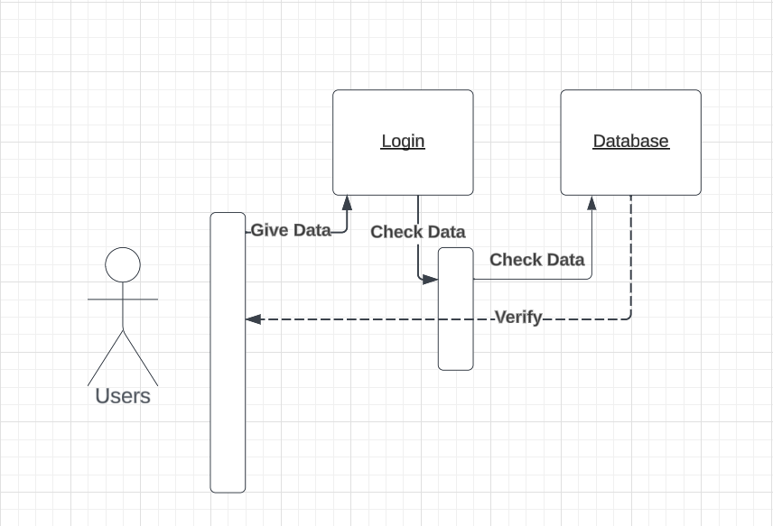
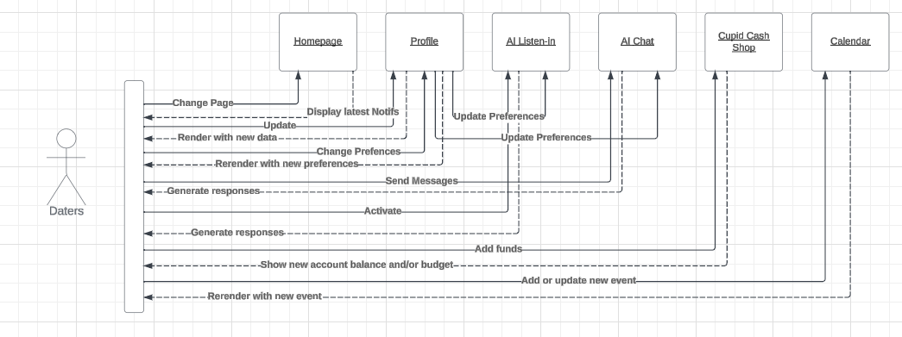
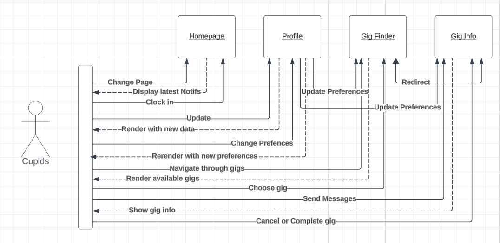
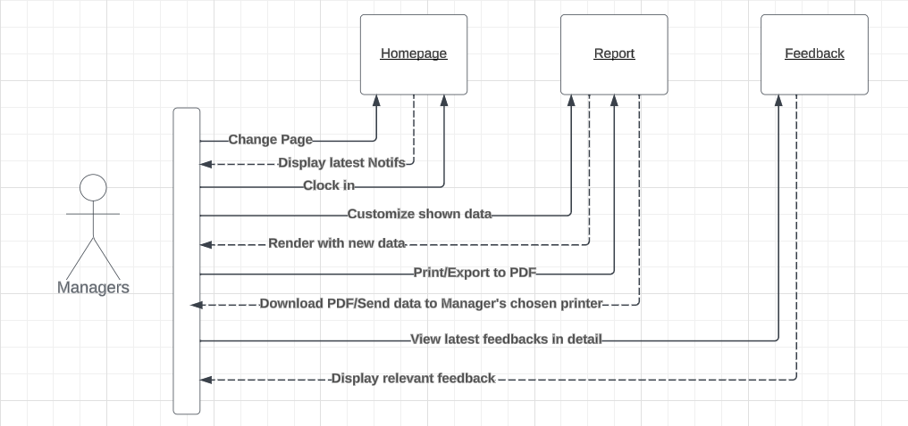
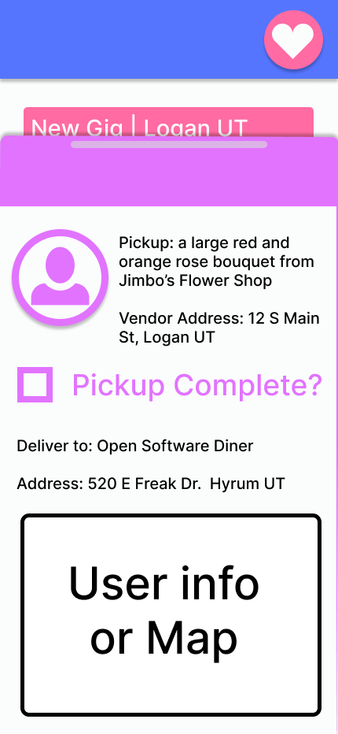
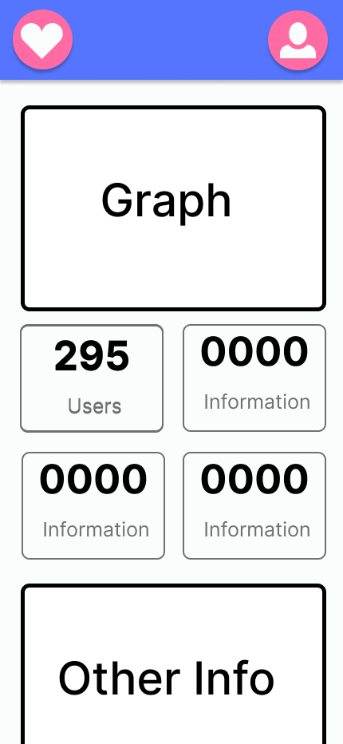

# **Cupid Code**

# **High Level Design Document**

Team 2

Sprint Leader: Nate Stott

Sprint Followers: Emma Wright, Brighton Ellis, Nate McKenzie, Eric DeBloois, Daniel Barfuss, Brandon Herrin

02/03/24

# **Security Considerations**

* Encryption of Sensitive Information
    * All sensitive information, including login credentials for users (Daters, Cupids, Managers), will undergo encryption using the SHA-256 algorithm before being stored in the database. This encrypted data will be decrypted only at the time of login, with the implementation facilitated by available Django and Node modules. Which data is sensitive is described below.
* Secure Handling of Chat Logs
    * Chat logs between Daters and the AI will be safeguarded by individualized access-keys, stored via cookies. This approach ensures that each user can access their chat logs without the need for repeated entry of access-keys, enhancing both security and user convenience.
* Location Privacy
    * The location of a Dater will remain exclusively visible to them until a date crisis occurs. At such a time, an anonymous ping will be sent to nearby Cupids who have accepted the mission. Once accepted, Cupids will receive the live location of the user along with their profile picture for identification purposes.
* Financial Transactions
    * Credit/debit card transactions will be facilitated while adhering to PCI compliance standards. Card information, including numbers, expiration dates, and CVV codes, will be encrypted before transmission over the internet to ensure robust financial data security.
* Frameworks and APIs
    * Utilization of the latest frameworks will be prioritized, and any obsolete features will be addressed proactively. APIs with a strong reputation for security will be preferred to enhance overall application security measures.
* Account Protection
    * A secure login system will be implemented, incorporating strong password requirements, favoring 12+ characters or 8+ characters with a mix of symbols, numbers, and capital letters. The exploration of a timeout system will be approached cautiously to avoid inconveniences during user activity. Consideration will be given to integrating Multi-Factor Authentication (MFA) for an additional layer of security.
* Data Flow
    * Data flow will be encrypted using HTTPS, with specific attention given to framework capabilities. Utilization of AES for symmetric encryption and RSA for asymmetric encryption will be explored. User access to data will be restricted, providing Cupids with limited access for matchmaking purposes, while management retains broader access. Secure Session IDs and CSRF tokens will be implemented, and comprehensive tracking of data flow will be logged and stored.
* Database Security
    * Password hashing within the database, regular data backups, and exploration of data encryption beyond passwords, utilizing AES/RSA for optimum protection, will be priorities in maintaining the security and resilience of the database.

# **Hardware Platform Considerations**

### **Server**

Company-Owned Server
* Pros
    * Full Control
        * Owning a server provides complete control over hardware, software, and configurations, allowing for customization to meet specific needs.
    * Security
        * Companies can implement their security measures and protocols to safeguard sensitive data.
    * Cost Predictability
        * Once the server is purchased, there are no ongoing rental fees, providing cost predictability over the long term.
* Cons
    * High Initial Cost
        * Acquiring and setting up a server can involve significant upfront costs for hardware, software licenses, and infrastructure.
    * Maintenance Responsibility
        * The company is responsible for server maintenance, including updates, repairs, and hardware replacements.

Cloud-Provided Server
* Pros
    * Scalability
        * Cloud servers allow for easy scalability, enabling companies to adjust resources based on demand.
    * Cost Efficiency
        * Cloud services often operate on a pay-as-you-go model, reducing upfront costs and allowing companies to pay only for the resources they use.
    * Global Accessibility
        * Cloud servers can be accessed from anywhere with an internet connection, facilitating remote work and global collaboration.
* Cons
    * Dependency on Service Providers
        * Companies rely on the cloud service provider's infrastructure and services, which could lead to downtime or disruptions if the provider faces issues.
    * Security Concerns
        * While cloud providers implement robust security measures, there can be concerns about the security of sensitive data stored in the cloud.
    * Potential Cost Variability
        * While cloud services can be cost-efficient, usage spikes or unexpected charges may result in variable costs that are harder to predict.

**Server Decision**

In the process of determining the optimal hosting solution for our application, careful consideration was given to both on-premises servers and cloud-based alternatives. After thorough analysis and consultation with the client, we have opted to host our server on local machines. This decision is rooted in several key factors that align with the specific requirements and preferences articulated by our client.

* Cost Considerations
    * Our client expressed concerns regarding the true affordability of cloud solutions, as opposed to what marketing literature may suggest. Cloud services often involve recurring costs, including data storage, bandwidth, and other usage-related fees. By hosting our server locally, we aim to provide a cost-effective solution that minimizes ongoing expenses and provides budget predictability.
* Sensitive Data Handling
    * Given the sensitive nature of the information our application will handle, our client emphasized the need for stringent control over access and usage. Hosting the server on our own machines affords us the ability to implement robust security measures tailored to the specific requirements of the sensitive data. This includes the establishment of firewalls, encryption protocols, and other protective measures that can be customized and closely monitored on-premises.
* Tighter Controls and Customization
    * Opting for on-premises hosting allows us to exercise greater control and customization over the server environment. We can implement security policies, access controls, and configurations that align precisely with the client's security and compliance requirements. This level of control is crucial for maintaining the integrity and confidentiality of the data processed by our application.
* Compliance and Regulatory Considerations
    * Certain industries and regions have stringent compliance and regulatory requirements regarding data handling and storage. Hosting the server locally enables us to adhere more closely to these regulations, ensuring that our application remains in full compliance with industry-specific standards and legal frameworks.

In conclusion, the decision to host our server on local machines is a result of a comprehensive assessment that prioritizes cost-effectiveness, stringent data security, and the ability to tailor the environment to meet the specific needs of our client. This approach reflects our commitment to delivering a reliable, secure, and customizable solution that aligns seamlessly with the client's objectives and concerns.

### **Client**

Our system prioritizes user flexibility by accepting requests from a wide array of Operating Systems and User-Agents. Whether users prefer iOS, Android, macOS, Windows, or various Linux Distros, and choose Chrome, Edge, Firefox, etc. as their preferred User-Agent, our platform is equipped to seamlessly accommodate their preferences.

The linchpin enabling this versatility is the implementation of HTTPS (Hypertext Transfer Protocol Secure). HTTPS plays a pivotal role in ensuring a secure and reliable connection between the Cupid code and our clients. This encryption protocol encrypts the data exchanged between the client and server, safeguarding it from potential threats or unauthorized access.

The use of HTTPS not only provides a secure communication channel, but also enhances the overall stability of connections. It establishes trust between the server and client, mitigating the risk of data interception or manipulation during transit. This commitment to security is fundamental in our approach, allowing users to engage with the Cupid code confidently, regardless of their chosen combination of Operating System and User-Agent.

It's worth noting that as long as users' chosen combination of User-Agent and Operating System supports HTTPS and JavaScript, our application will function seamlessly. This ensures a robust and reliable experience, reinforcing our dedication to providing a secure environment for all users.

# **Software Platform Considerations**

### **Frontend**

React
* Pros
    * Virtual DOM
        * React uses a virtual DOM, which improves performance by updating only the parts of the actual DOM that have changed, reducing the need for full page reloads.
    * Component-Based
        * React's component-based architecture promotes code reusability and maintainability, making it easier to manage and deploy larger-scale applications.
    * Flexibility
        * React is a library for building user interfaces, allowing developers to choose other libraries or tools for state management, routing, etc., offering flexibility in building a tech stack.
* Cons
    * Learning Curve
        * React has a steep learning curve for beginners, especially when it comes to concepts like JSX and the virtual DOM.
    * Boilerplate Code
        * Building larger applications may lead to writing a considerable amount of boilerplate code, which can make the codebase appear verbose.
    * Fast-Changing Ecosystem
        * The React ecosystem evolves rapidly, which may require developers to stay updated with the latest changes and best practices.

Angular
* Pros
    * Full Framework
        * Angular is a full-fledged MVC framework with a comprehensive set of tools and features, providing a consistent development structure for building large-scale applications.
    * Two-Way Data Binding
        * Angular's two-way data binding simplifies the synchronization between the model and the view, reducing the amount of boilerplate code needed for DOM manipulation.
    * Dependency Injection
        * Angular's dependency injection system enhances code modularity, maintainability, and testability.
* Cons
    * Steep Learning Curve
        * Angular has a steeper learning curve compared to other frameworks, primarily due to its comprehensive feature set and complex concepts.
    * Size
        * The framework's size is relatively larger, impacting initial load times, especially for smaller projects where the additional features may not be necessary.
    * Flexibility
        * The opinionated nature of Angular might limit flexibility for some developers who prefer more choices in their tech stack.

Vue.js
* Pros
    * Simple Syntax
        * Vue.js has a simpler and more approachable syntax, making it beginner-friendly and quick to learn.
    * Reactivity
        * Vue.js offers a reactive data binding system, making it easy to manage and update the UI based on changes in data.
* Cons
    * Smaller Ecosystem
        * Vue.js has a smaller ecosystem compared to React and Angular, which may result in fewer third-party libraries and community support.
    * Less Opinionated: 
        * While flexibility is an advantage, Vue's less opinionated nature might require more decisions from developers, potentially leading to less consistency in larger teams.
    * Less Tooling: 
        * There are fewer specialized tools and extensions available for Vue.js compared to React and Angular, which might impact development efficiency in certain scenarios.

### **Backend**

Django
* Pros
    * Batteries Included
        * Django comes with a wide range of built-in features, including an ORM, admin interface, authentication system, and more, reducing the need to integrate third-party tools.
    * High-Level Abstraction
        * Django's high-level abstractions make it easy to get started quickly and follow the "Don't Repeat Yourself" (DRY) principle, promoting code efficiency.
    * Built-in Admin Interface
        * Django provides a powerful and customizable admin interface for managing application data.
* Cons
    * Monolithic
        * Django is often perceived as a monolithic framework, which may be less suitable for microservices architectures or projects requiring more flexibility in choosing components.
    * Opinionated
        * Django follows the "Django way" of doing things, which can be restrictive for developers who prefer more freedom and flexibility in their choices.

Node.js
* Pros
    * Asynchronous I/O
        * Node.js is known for its non-blocking, asynchronous I/O model, making it well-suited for handling numerous concurrent connections.
    * JavaScript Everywhere
        * Using JavaScript on both the server and client sides can simplify development and promote code reuse.
    * Large Ecosystem
        * Node.js has a vast ecosystem of libraries and modules available through NPM, providing solutions for a wide range of functionalities.
* Cons
    * Callback Hell: 
        * The asynchronous nature of Node.js can lead to callback hell, where deeply nested callbacks make the code harder to read and maintain.
    * Single-Threaded: 
        * While the event-driven architecture is efficient for many use cases, Node.js is inherently single-threaded, which may limit performance in CPU-bound tasks.
    * Less Opinionated: 
        * While flexibility is an advantage, Node.js is less opinionated, which can lead to varied project structures and require additional decisions from developers.

Flask
* Pros
    * Lightweight
        * Flask is a microframework, making it lightweight and flexible, allowing developers to choose their components and libraries.
    * Modularity: 
        * Flask follows the principle of modularity, allowing developers to add components as needed, making it suitable for both small and large projects.
    * Jinja2 Templating
        * Flask uses Jinja2 templating, providing a powerful and flexible way to generate dynamic content in web applications.
* Cons
    * Less Built-in Features
        * Being a micro-framework, Flask provides fewer built-in features compared to Django, requiring developers to integrate third-party tools for certain functionalities.
    * Community Size
        * Flask has a smaller community compared to Django, which might result in fewer resources and community-driven plugins.

**Software Stack Decision**

The team extensively deliberated on the merits of various frontend and backend options available for the project. Given our constrained development timeline, it is imperative to adopt a development stack that facilitates rapid learning and building. We want a stack that not only prioritizes swift development, but also ensures inherent security, enabling us to focus more on the application itself. Additionally, we are eager to explore novel technologies and enhance our skill set.

Navigating this decision proved challenging, as each developer on the team had prior experience with either frontend or backend frameworks. Considering these parameters, we reached a consensus to employ Vue.js for the frontend and Django for the backend. While some team members are familiar with these technologies, we view this familiarity as an opportunity to delve deeper and acquire new insights, thereby broadening our expertise within these frameworks.

# **Software Architecture**

Cupid Code will comprise many architectures due to how large it’ll be. The backend will need to be written in modules and classes so it is easy to send data to and from the front end and the database. The frontend will require us to follow the model of event driven programming. Our application will follow the architecture of event driven programming by rendering the pages and sending data to the backend. However, the frontend can also follow a similar modular approach to reduce repeated code.

Since the system as a whole will be composed of three pieces: user interface, processing backend, and a database. We will follow the Client-Server 3-Tier architecture. Notably, we will prioritize a thin client configuration to alleviate backend workload, particularly given the extensive interaction with AI functionalities.

Combining these three architectures will allow us to utilize the best parts of each portion of our system, as well as make it easy to update and maintain the system in the future. This comprehensive approach ensures robustness, scalability, and efficiency throughout Cupid Code's development and deployment phases, promising a seamless user experience and facilitating future enhancements and adaptations as needed.

# **User Interface**

To access Cupid Code, Daters, Cupids, and Managers can utilize any device with a web browser and an internet connection. Given that Daters and Cupids are likely to be mobile users, we prioritize optimizing the user interface for mobile devices such as phones. For Managers who may predominantly operate from desktop or laptop computers, the interface will be tailored to suit that environment. Nonetheless, we are committed to ensuring universal access to Cupid Code across all devices and platforms by designing interfaces that are visually appealing on both large and small screens.

### **Components**
1. Log In/Sign Up
   * Login page for all users that will implicitly know if the user is a Dater, Cupid or Manager
   * Unique Sign Up pages for Daters and Cupids to gather necessary data for each
   * Daters will be able to give required data (address, profile picture, etc.) and optional data for the AI to use (hobbies, interests, past dating experience, etc.)
   * Cupids will be able to give required data to curate the search for gigs that are in their area
2. Profile Viewing/Editing
   * Page for Daters to edit preferences and other necessary data
       * Daters can put in a “safe word” for the AI listen-in to look for
   * Page for Cupids to edit necessary data (ex. they move to a different city)
3. AI Chat 
   * Panic button
   * Ask AI for advice about dating and anything dating related
   * Send a widget to rate a Cupid with 3-5 heart system
4. AI Listen-in
   * Dater can open their microphone and the AI will listen to the current conversation
   * AI can use information from the conversation to either send notifications during the date or hire a Cupid to prevent the date from “crashing and burning”
   * The AI will inform the Dater if a Cupid is on the way
   * Panic button
5. Cupid Main Page
   * Display all gigs in the area of the Cupid on duty with basic information
   * Popup to display more information once gig is accepted
   * Ability to cancel or complete gigs in app
   * Ability to see pay stubs in app
   * Report bugs/give feedback to the app
6. Dater Main Page
   * Display AI chat or latest notifications
   * Option to open/close AI Chat
   * Option to go to the Cupid Cash store to buy more or adjust budget
   * Option to check calendar
   * Option to edit/view profile
   * Report bugs/give feedback to the app
7. Manager Main Page
   * View feedback of Cupids from daters
   * View feedback about bugs/issues
   * View feedback on AI advice
   * Generate and see a report about the app’s statistics (graphs and a summary)
8. Calendar
   * Allow Daters to schedule their dates in-app, so the AI can give relevant advice before and after guaranteed
   * The AI will not give advice during the date unless the listening option is on and active
9. Cupid Cash
   * Ability for the Dater to add funds to account via fake PayPal or fake Credit Card
   * Ability for the Dater to manage budget for the month
10. Manager Report System
    * View a report to give to higher ups
        * The report would include information about Cupids and Daters in the area.
    * Allow to print off or save report as PDF
    * Can modify what data is shown
11. Feedback System
    * Can view latest feedback about Cupids and generally the app
    * Can kick off Cupid’s if their profile has enough strikes/issues
12. Cupid Gig Finder
    * Display gigs in the area for the Cupid
    * Allow the Cupid to click on a gig to see more info and accept the request
13. Cupid Chosen Gig
    * Display all the information needed for the gig
    * Show the option to cancel or complete gig
    * AI will show the Dater’s location for the Cupid as the destination
    * If a gig is completed, the Cupid can rate the Dater on a 3-5 heart rating system.

**How the Components Interact (UML Diagram)**

**General Login**

The user will log in to the system. The login will authenticate the user and redirect them to the correct homepage. If the authentication fails, the user will stay at the login screen.

**Dater Login**

The user will be redirected to a homepage that will allow them to navigate to an AI chat, AI listen-in, a calendar, their profile & settings, Cupid Cash Store and budgeting. It will also display the latest notifications from the AI on the homepage.

**Cupid Login**

The user will be redirected to a homepage allowing them to navigate to their profile & settings or “clock in” and navigate to the Gig Finder to look for jobs. The Gig finder will display gigs in the Cupid’s area and allow the Cupid to choose a gig and display more information. The Cupid will be able to select to cancel or complete the order.

**Manager Login**

The user will be redirected to a homepage that will notify them of any notifications that need immediate attention and allow them to navigate to a report function and navigate to a feedback page. The report function will allow the user to look at statistics from a previous period of time and allow them to customize it and print it off/export as a PDF.

**Login System Design Purpose**

Modularization in software development is an approach that entails breaking down a project into smaller, manageable components. This method facilitates a comprehensive understanding of how each piece functions, and how each piece integrates with others. By isolating each module, developers gain clarity in the development process, making it easier to write, test, and debug code without risking the integrity of the entire system.

Moreover, modularization significantly contributes to the future sustainability of the project.

Modular design simplifies the addition of new features, updates to existing ones, and any debugging that will appear over the project's lifecycle. This structured approach ensures that modifications can be implemented efficiently without causing disruptions to the overall system, ultimately contributing to the longevity and scalability of the software.

By utilizing these concepts and principles, we can break Cupid Code into multiple components, display what each one does, and how they’ll work with one another. This approach is necessary to use our limited development time as efficiently as possible. This approach also allows us as developers to simultaneously code and test multiple parts of the project before gluing them together and delivering a viable product to the customer. It is not only important to code the product like this, but to design it like so as well. This allows us to look at the big picture of the project before coding and make it easier to split up the tasks evenly. It will also allow for others to update the docs without contradicting much of anything else because every piece is isolated enough that the only thing each piece needs to have written down is how it works and how it’s connected. Utilizing this concept throughout the entire process of developing Cupid Code will help us avoid massive time crunches, make updating documentation quick and easy, and get an MVP delivered on time.

### **User Interface Idea Gallery**

Main Login

User Home

AI Chat Page

Cupid Cash

Calendar Page

Cupid Home

Gig Details

Manager Home

Manage Cupids Page

Manage Cupid Page

# **External Interfaces**

### **Considered APIs**

* AI API (Microsoft Copilot)
* Location API (Geolocation)
* Speech To Text API (pyttsx3)
* Text and Email notifications API (Twilio) 
* Nearby Shops API (yelpapi)

### **How to deal with so many APIs**

* Modular Code Design
    * Identify specific areas in our code where external functionality is required. Utilize APIs only in these specific modules or components, keeping the rest of our codebase isolated from external dependencies.
    * By compartmentalizing API usage, we make it easier to manage updates, fixes, or replacements. If an API changes or becomes obsolete, we’ll only need to modify the relevant sections of your code, rather than the entire codebase.
    * Implement clear interfaces or abstraction layers between the code and the APIs we're using. This abstraction shields the code from direct dependencies on API specifics, making it easier to swap out one API for another if needed.
* Documentation Management
    * Keep comprehensive documentation not only of the APIs in use but also any customizations, workarounds, or fixes we’ve implemented to deal with outdated or incorrect API documentation.
    * Document the specific issues encountered with the APIs, such as outdated or incorrect documentation, and provide detailed explanations of how we would resolve these issues within the code.
    * Maintain this documentation alongside our codebase, ensuring that it stays up-to-date with any changes or updates to the APIs we’re integrating.
    * Regularly review and update the documentation to reflect any changes in API usage, ensuring that developers working on the project have accurate information.

By following these strategies, we can effectively manage the challenges of implementing APIs in the code, ensuring modularity, flexibility, and clarity in the development process.

# **Database tables**

1. Dater
   * This data is sensitive because it includes personal identifiable information about the dater.
   * Data:
       * Username
       * Password
       * Email
       * Phone number
       * Profile for AI
           * Describe self
           * Perceived dating strengths
           * Perceived dating weaknesses
           * Interests
           * Preference for degree of AI assistance/intervention
           * Past dating experiences
           * Type of nerd
           * Relationship goals
           * Communication preferences
       * Picture
       * Cupid cash balance
       * Budget
       * AI chat logs
2. Cupid
   * This data is sensitive because it includes details about the cupid’s location and payment information, which could be used by bad actors.
   * Data:
       * Username
       * Email
       * Password
       * isActive (whether a Cupid is accepting gigs)
       * Location
       * Cupid cash balance
       * Average rating
       * Total gigs completed
       * Total gigs failed
       * Date joined
       * Last active time
       * Payment information
       * Status (Not validated, validated, banned)
3. Manager
   * Username
   * Email
   * Password
4. Gig
   * Dater who requested
   * Cupid who claimed - or unclaimed
   * Quest
   * Status (pending, claimed, complete)
   * Date and time of request
   * Date and time of claim by Cupid
   * Date and time of completion
5. Quest (separate for modularity)
   * Gig attached to
   * Message to Cupid
   * Allowed budget
   * Item requested
6. Date
   * This data is sensitive because it tells where a dater will be and when they will be there.
   * Data:
       * Dater who it belongs to
       * Date and time
       * Location
       * Description
       * Status (planned, completed, canceled)
       * Budget
7. Feedback
   * User in question
   * Gig resulting in feedback
   * Message
   * Star rating (hearts)
   * Day and time feedback received
9. Message
    * This is where AI Chat logs will be held
    * owner
    * fromAI, indicates if this message is from AI or to AI
    * message
10. Payment Card
   * This data is sensitive because it includes money information
   * User
   * Card Number
   * CVV
   * Expiration Information
11. Bank Account
   * This data is sensitive because it includes money information
   * Routing Number
   * Account Number

12. Reports
   * Manager dashboard:
       * Revenue
       * Registered dater count
       * Registered Cupid count
       * Current active Cupid count
       * Gigs per day/week/month
       * Cupid feedback and complaints
       * Also see Cupid profiles individually to gauge rating, success/fail ratio, response times.
   * Dater:
       * Can see how far away Cupids are
       * Can see information regarding popular date locations
       * Can see a calendar of their dates
   * Cupid:
       * Can see hotspots of dater activity to stay in the area
       * Can see information regarding common date times and locations
       * Can see statistics on completed gigs, money earned, failed gigs
   * Text and Email notifications API (Twilio) 
   * Nearby Shops API (yelpapi)
