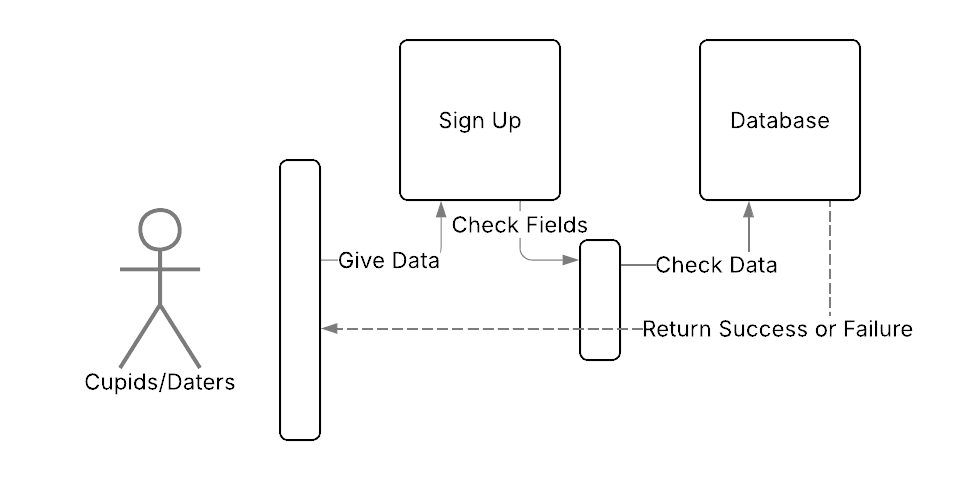
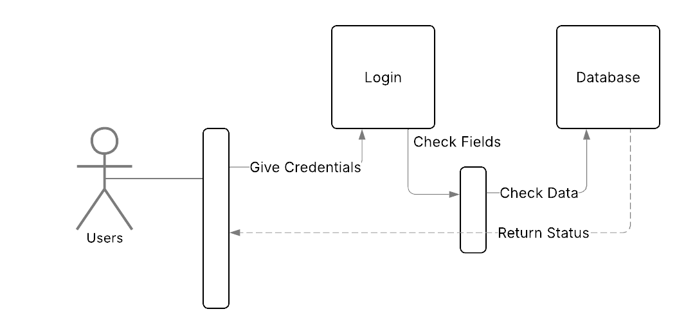
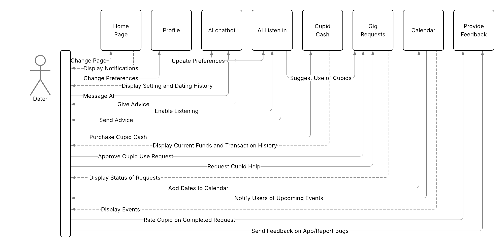
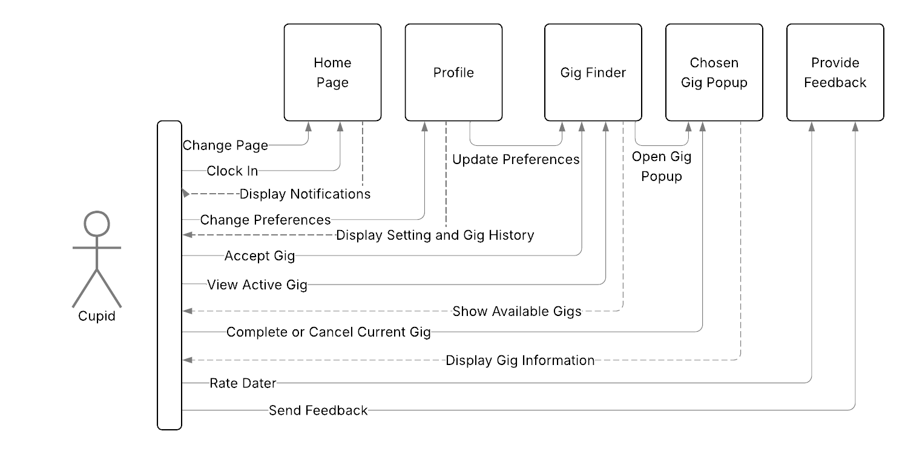
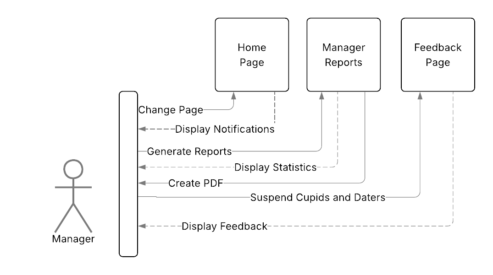
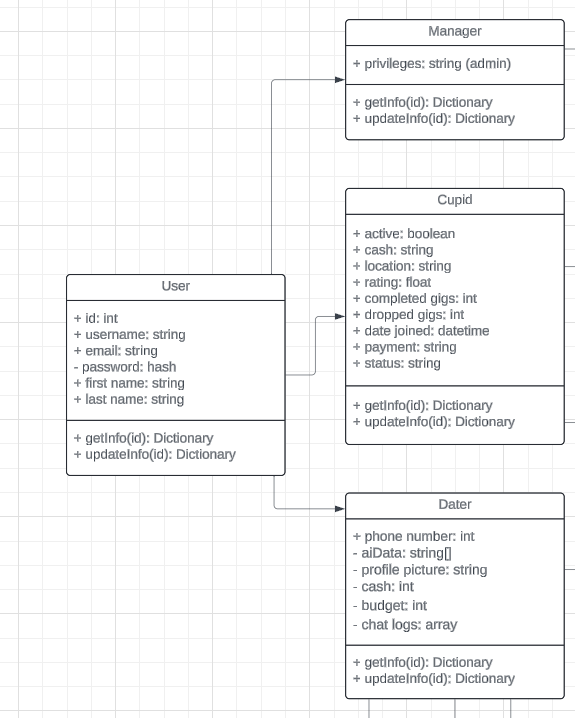
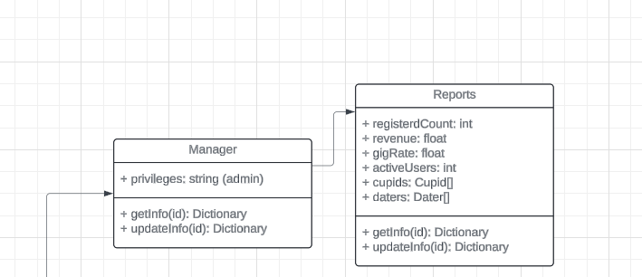
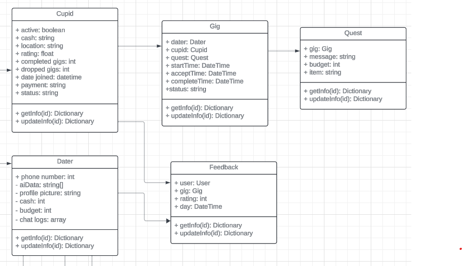
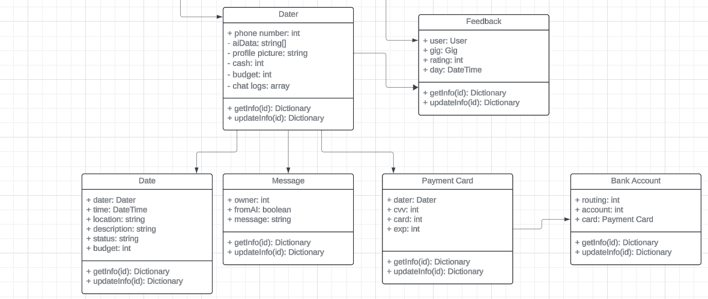

# **New Cupid Code High Level Design**
Team 3: *The Sinister Six*  
Sprint Leader: Tyson Buxton  
Team Members: Benjamin Hickenlooper, Felix Jacob, Saxton Calvert, Garrett Woodhouse, and Reece Nielson  

## Introduction
**Purpose:** TODO write out purpose of document

### Links
0. [Requirements](../Requirements/new-requirements-team3.md)
0. [Low Level Design](../LowLevel/new-low-level-team3.md)
### Table of Contents  
0. [Software Architecture](#0-software-architecture)
0. [Hardware Platform](#1-hardware-platform)
0. [User Interface](#2-user-interface)
0. [External Interfaces](#3-external-interfaces)
0. [Risk Analysis](#4-risk-analysis)
0. [Security and Risk Mitigation](#5-security-and-risk-mitigation)
0. [Data Design](#6-data-design)
0. [Future Proofing](#7-future-proofing)

# 0. Software Architecture
[*Table of Contents*](#table-of-contents)

The existing code base for Cupid Code uses the Client-Server 3-Tier structure with elements of other architectures implemented in both the front and backends. The frontend follows an event based architecture and the backend implements a more component based architecture. Since the main architecture of the program is a 3-Tier Client-Server architecture, the backend is split between the processing portion and the database portion. The Client side of the codebase also makes calls to external API's to gain additional functionality. At this time there are no plans to expose a public facing API for Cupid Code.

We will continue to use the existing architecture for future development as changing the architecture would require a large effort that would not have any meaningful effect on the way the system runs. As we are moving the servers to the cloud, this plays into the Client-Server architecture which is easily scalable and should allow us to set up more resources to act as servers according to demand.

# 1. Hardware Platform
[*Table of Contents*](#table-of-contents)

### **Server**

Company-Owned Server
* Pros
    * Full Control
        * Owning a server provides complete control over hardware, software, and configurations, allowing for customization to meet specific needs.
    * Security
        * Companies can implement their security measures and protocols to safeguard sensitive data.
    * Cost Predictability
        * Once the server is purchased, there are no ongoing rental fees, providing cost predictability over the long term.
* Cons
    * High Initial Cost
        * Acquiring and setting up a server can involve significant upfront costs for hardware, software licenses, and infrastructure.
    * Maintenance Responsibility
        * The company is responsible for server maintenance, including updates, repairs, and hardware replacements.

Cloud-Provided Server
* Pros
    * Scalability
        * Cloud servers allow for easy scalability, enabling companies to adjust resources based on demand.
    * Cost Efficiency
        * Cloud services often operate on a pay-as-you-go model, reducing upfront costs and allowing companies to pay only for the resources they use.
    * Global Accessibility
        * Cloud servers can be accessed from anywhere with an internet connection, facilitating remote work and global collaboration.
* Cons
    * Dependency on Service Providers
        * Companies rely on the cloud service provider's infrastructure and services, which could lead to downtime or disruptions if the provider faces issues.
    * Security Concerns
        * While cloud providers implement robust security measures, there can be concerns about the security of sensitive data stored in the cloud.
    * Potential Cost Variability
        * While cloud services can be cost-efficient, usage spikes or unexpected charges may result in variable costs that are harder to predict.

**Server Decision**

Previously, there was a determination to host the server on local machines to prioritize cost-effectiveness, data security, and the ability to more easily conform to the specific requirements of the client. However, the client's objectives have now focused on attracting more customers, improving the artificial intelligence, and allowing for increased scalability as demand increases. Thus, a cloud provided server has become the option that would best be utilized. Though the local server operation came with its benefits, the abilities offered by a cloud provided server allow us to continue meeting security, customization, and cost needs while addressing new concerns and requirements the client has. To do this, the client and team decided to use Microsoft Azure for web hosting.

* Cost Considerations
    * Microsoft Azure has a free service with a pay-as-you-go model available. This allows for Cupid Code to maintain low costs as long as there is low demand. Once business and use begins to pick up speed, demand will increase but so will revenue. The costs upfront are low and the company is able to avoid immediately high overhead costs upon deployment.
* Global Access
    * Because the server will be hosted on a cloud provided server rather than a local device, more users can access and use the service. This allows for more daters, couples, and cupids. Microsoft Azure has reliable security features that ensure customer and employee data are kept confidential and protected.
* Maintenance Avoidance
    * Though this creates dependency on Microsoft as a service provider, it means the cost to run the server also includes the cost to maintain it. Developers extent of maintenance is to ensure the app runs smoothly on the server, the rest is handled by Microsoft. Microsoft's resources assure users that there will be few if any outages ever.

We conclude that the decision to host the server on Microsoft Azure is a careful result of assessing cost, access, security, and stability. This allows for developers to deliver an app that is reliable, accessible, and cost-effective while still providing excellent service for the client and a good experience for end users.

### **Client**

Our system prioritizes user flexibility by accepting requests from a wide array of Operating Systems and User-Agents. Whether users prefer iOS, Android, macOS, Windows, or various Linux Distributions, and choose Chrome, Edge, Firefox, etc. as their preferred User-Agent, our platform is equipped to seamlessly accommodate their preferences.

The linchpin enabling this versatility is the implementation of HTTPS (Hypertext Transfer Protocol Secure). HTTPS plays a pivotal role in ensuring a secure and reliable connection between Cupid Code and our clients. This encryption protocol encrypts the data exchanged between the client and server, safeguarding it from potential threats or unauthorized access.

The use of HTTPS not only provides a secure communication channel, but also enhances the overall stability of connections. It establishes trust between the server and client, mitigating the risk of data interception or manipulation during transit. This commitment to security is fundamental in our approach, allowing users to engage with the Cupid code confidently, regardless of their chosen combination of Operating System and User-Agent.

It's worth noting that as long as users' chosen combination of User-Agent and Operating System supports HTTPS and JavaScript, our application will function seamlessly. This ensures a robust and reliable experience, reinforcing our dedication to providing a secure environment for all users.

The design and implementation made for the client end of the app, combined with the required features asked for by the client, lead us to believe that no design changes are needed.

# 2. User Interface
[*Table of Contents*](#table-of-contents)

The previous team's high-level design document includes almost everything that we intend to use for our user interface with a few minor changes. 

The UI will be optimized for mobile use for Cupids and Daters, but the manager interface will be optimized for desktop. However, it will be designed to be accessible on all devices. 

## Components
1. Log In/Sign Up
    * The log-in page is accessible to all users, while the sign-up page is available for new Daters and Cupids.
    * Daters and Cupids will input data in order to make their profiles.
    * Some data will be required, such as username and password, while other data will be optional, such as interests.
    * The sign-up page will be updated to indicate which fields are required
    * The sign-up page will allow the user to create an account even if optional fields are left blank.
2. Profile Viewing/Editing
    * Daters and Cupids will both be able to view a profile page which displays their own data and they will be able to edit any of their own data.
    * Dater profiles will show their dating history on the app.
    * Cupid profiles will show their gig history and finances.
3. AI Chat
    * This page will have a messaging feature with the AI chatbot, which will be configured to help with planning dates and other dating advice.
4. AI Listen-in
    * This page will listen to the conversation during the date and give real-time advice to the Dater as needed. 
    * It will also provide real-time information about Cupids or other dating opportunities.
5. Cupid Main Page
    * This will be the home page for Cupids.
    * This is where Cupids will Clock in and out.
    * It will provide links to the following pages
      - Cupid gigs
      - Profile
      - App feedback
6. Dater Main Page
    * This will be the home page for the Daters.
    * It will provide links to the following pages
      - Calendar
      - AI chat
      - Cupid Cash
      - Profile
      - App feedback
      - Gig requests
7. Manager Main Page
    * Managers will be able to see any feedback given by Daters or Cupids
    * They will also have the option to go to the report system page.
8. Calendar
    * Daters will be able to use the calendar to schedule their dates.
9. Cupid Cash
    * Daters will be able to purchase Cupid Cash via PayPal or Stripe.
    * They will be able to view their current amount and spending history.
10. Manager Report System
    * Managers can view statistics on users, such as number of Cupids, number of Daters, user rating, and financial information.
    * They will be able to generate reports with whatever information they select and save it as a PDF.
11. Feedback System
    * Daters will be able to give feedback to the developers on bugs/features and be able to rate and review any Cupids who have done gigs for them.
    * Cupids will be able to give feedback to the developers on bugs/features and be able to rate and review any Daters that they've done gigs for.
    * Managers will be able to review all feedback to developers or between Daters and Cupids.
    * Managers will also be able to remove/warn users with low ratings.
12. Cupid Gig Finder
    * This page will display a list of nearby available gigs.
    * Any gig in progress will be highlighted at the top.
    * Clicking on a gig will open it in a pop-up which will give more information about that gig.
13. Cupid Chosen Gig
    * The gig will display information such as distance, time, and dater rating.
    * The Cupid will be able to accept or reject the gig. Gigs already selected can be cancelled.
14. Dater Gig Requests
    * Daters will be able to request gigs and see the status of each request, including whether it's been picked up and the distance of the Cupid. 

### Component interaction

**General Signup**

Only Daters and Cupids will be able to use the signup page. The system will validate the input and verify that there is not an existing account with the same username. If valid, it will direct them to their respective homepage. Otherwise, it will tell them that the username is already taken.

**General Login**

The user will enter username and password. The system will validate the input. If valid, it will direct them to their respective homepage. Otherwise, it will tell the user that either username or password are incorrect.

**Dater Login**

The Dater homepage will allow them to select one of these pages: Calendar, AI chat, Cupid Cash, Profile, App feedback, or Gig Requests.

**Cupid Login**

The Cupid homepage will allow them to select one of these pages: Cupid gigs, Profile, or App feedback.

**Manager Login**

The Manager homepage will allow them to select one of these pages: Report system, Feedback System.

**Login System Design Purpose**

The system will use modularization in order to break it down into separate components. This makes each component more manageable and easier to change without disrupting the rest of the program. This allows the program to be better suited to future changes and additions. It will also make development simpler and easier to divide tasks between multiple team members.

# 3. External Interfaces
[*Table of Contents*](#table-of-contents)

# 4. Risk Analysis
[*Table of Contents*](#table-of-contents)
## Summary of Old Teams Risk Analysis
They talk about the risks of data interception or manipulation during transit in their [Client Section](./high_level_docs.md#client). The previous team also wrote a bit about the potential risk of using a Cloud-Provided server in the [Server Section](./high_level_docs.md#server) underneath [Hardware Platform Considerations](./high_level_docs.md#hardware-platform-considerations).

Otherwise the previous team's risk analysis is more implied than directly stated, through what they covered in terms of security measures they wanted to implement.

## Current Risk Analysis
### Giving AI more control
Our changes to the application will be giving more power to the AI which will enhance the user experience greatly, however this can also come with risks to the integrity of the system.
* The AI will be able to record conversations which will be stored in our database. This brings a new angle for Bad Actors to steal the private information of our clients, as we will have their written private information as well as their recorded conversations stored in our database.
* AI can be unpredictable at times, it could misunderstand instructions given by a Dater and potentially reveal private data or spend unauthorized funds when performing a task.   
### Dating Life Information
The information we will be holding is extremely private
* Private life details of Daters;
    * Likes
    * Dislikes
    * Dating history
    * Recorded conversations on dates
    * Chats with the AI assistant
* This is information people will want kept secure, meaning there will also be greater incentive for bad actors to target our system as they could use this information for convincing phishing scams, identity fraud, and possibly other malicious attacks.   

### Dependencies, Frameworks, and APIs
* There are already `npm` packages from the old teams project which contain critical security vulnerabilities. Without continual maintenance our application will become less secure as time goes on.  

* There are many packages used for this project in its current state, each new package brings with it the bugs and vulnerabilities of said package. Having many packages creates a lot to keep track of which makes it more difficult to check used packages for vulnerabilities or to keep all packages up to date and still working with the application.
    * 180 packages currently are used for the client. 
    * 75 python packages currently are installed for the Poetry environment.

* There is a similar risk with using APIs and Frameworks as with using other's packages.
    * There must be continual maintenance work to stay up to date on the APIs, ensuring any changes in how one interfaces are implemented to keep the application functioning, research must be done to ensure the APIs used are reputable. In addition, by relying on API's should there service go down for any reason, our applications related service will also be down.
    * For working with different Frameworks the code base must be kept up to date on a likely changing Framework interface to keep the application running and secure as time goes on. There is also a risk that the Framework could lose popularity over time, and thereby the developers stop working on it, leaving vulnerabilities unpatched and bugs unfixed.

# 5. Security and Risk Mitigation
[*Table of Contents*](#table-of-contents)
## Summary of Previous Teams Security Measures
The previous team focused on the following items in their [Security Considerations](./high_level_docs.md#security-considerations)
* Encryption of Sensitive Information
* Secure Handling of Chat Logs
* Location Privacy
* Financial Transactions
* Frameworks and APIs
* Account Protection
* Data Flow
* Database Security
### They did not implement
* A strong password requirement
* 2 factor authentication

## Sinister Six Security Measures and Risk Mitigations
Much of our decided security measures are the same or similar to those of the previous team as our proposed changes and features still bring about many of the same  security risks to be mitigated. Though some of the sections were consolidated so as not to repeat information.

### Location Privacy
* Dater location will only be accessed in the following circumstances:
    * When a Dater creates a job for a Cupid, the Dater can pick for their location to be shared, or they can pick a location where the Cupid will meet them/drop off the item or perform the requested action. 
    * A Dater cancelling the job will revoke the live location permission for the Cupid who had accepted the job.
    * Managers will be able to see general locations for Daters, the closest city to the Dater. 

### Financial Transactions
All applicable [PCI Standards](https://www.pcisecuritystandards.org/standards/) will be followed for the handling of User financial information.
* Point-to-Point Encryption with HTTPS for sending and receiving financial information.
* Encryption of all user's financial payment information stored in our database.
    * Credit Card number, expiration date, CVV code.
    * Name and Billing address.
    * Direct bank account information (alternative to credit card).

### Dependencies, Frameworks, and APIs
* We will go through the `npm` and `python` dependencies removing any we can confidently say are not needed. Thus removing unnecessary risk, and allowing for more focus on vetting the dependencies which are truly needed. 
* Research on new vulnerabilities discoverd, or updates in general in the Frameworks we use will need to be done periodically, and then the subsequent work to update our version of the Frameworks to close said vulnerabilities and ensure we stay capable of running will be done.
* The APIs we choose will be researched and confirmed to have a strong reputation for security and reliability.

### Account Protection
* A strong password will be required for registration
    * At least 10 characters.
    * Containing at least one number.
    * At least one special character.
    * At least one capital letter.
* Session token in database will be invalidated upon logout, and will be invalidated after 14 days, requiring resigning in.
* These measures will help to safeguard User's data; chatlogs, info, history, etc...

### Data Flow
* HTTPS will be used to encrypt all traffic incoming and outgoing.
* CSRF tokens with session IDs facilitated by the Django framework will be used to ensure proper authentication and authorization.
* Daters will only have access to their personal information and the name and photo of Cupids who accept their jobs.
* Cupids will be able to see only the information the Daters give to them and permissions for said information will be revoked upon job completion, Cupid dropping the job, or job timeout. 
* Management will retain broader access to data for statistics and management of users (banning bad users).

### Database Security
* Passwords will be stored as hashes.
* All access to database will go through security middleware for authentication.
* We are going with Azure Cloud Service to host our application and database. Microsoft is very large corporation with years of experience, large talent pools, and many resources. We are confident their services will be up to the latest security standards and will continue to be maintained by them to stay secure as the years go on.

### AI Security
* We will make a summary card that appears to the Dater, showing everything the AI intends to do after the User has requested and action. This will allow the Dater to confirm that the AI understood them correctly before the AI immediately acts (buying tickets, sending messages, hiring cupids, etc...) to ensure Dater privacy, security, and satisfaction with the application.
* All recorded information will be encrypted when stored, only accessible by the Dater and their AI.

# 6. Data Design
[*Table of Contents*](#table-of-contents) 

### Database Tables
1. Dater
   * This data is sensitive because it includes personal identifiable information about the dater.
   * Data:
       * Username
       * Password
       * Email
       * Phone number
       * Profile for AI
           * Describe self
           * Perceived dating strengths
           * Perceived dating weaknesses
           * Interests
           * Preference for degree of AI assistance/intervention
           * Past dating experiences
           * Type of nerd
           * Relationship goals
           * Communication preferences
       * Picture
       * Cupid cash balance
       * Budget
       * AI chat logs
2. Cupid
   * This data is sensitive because it includes details about the cupid’s location and payment information, which could be used by bad actors.
   * Data:
       * Username
       * Email
       * Password
       * isActive (whether a Cupid is accepting gigs)
       * Location
       * Cupid cash balance
       * Average rating
       * Total gigs completed
       * Total gigs failed
       * Date joined
       * Last active time
       * Payment information
       * Status (Not validated, validated, banned)
3. Manager
   * Username
   * Email
   * Password
4. Gig
   * Dater who requested
   * Cupid who claimed - or unclaimed
   * Quest
   * Status (pending, claimed, complete)
   * Date and time of request
   * Date and time of claim by Cupid
   * Date and time of completion
5. Quest (separate for modularity)
   * Gig attached to
   * Message to Cupid
   * Allowed budget
   * Item requested
6. Date
   * This data is sensitive because it tells where a dater will be and when they will be there.
   * Data:
       * Dater who it belongs to
       * Date and time
       * Location
       * Description
       * Status (planned, completed, canceled)
       * Budget
7. Feedback
   * User in question
   * Gig resulting in feedback
   * Message
   * Star rating (hearts)
   * Day and time feedback received
9. Message
    * This is where AI Chat logs will be held
    * owner
    * fromAI, indicates if this message is from AI or to AI
    * message
10. Payment Card
   * This data is sensitive because it includes money information
   * User
   * Card Number
   * CVV
   * Expiration Information
11. Bank Account
   * This data is sensitive because it includes money information
   * Routing Number
   * Account Number
12. Reports
   * Manager dashboard:
       * Revenue
       * Registered dater count
       * Registered Cupid count
       * Current active Cupid count
       * Gigs per day/week/month
       * Cupid feedback and complaints
       * Also see Cupid profiles individually to gauge rating, success/fail ratio, response times.
   * Dater:
       * Can see how far away Cupids are
       * Can see information regarding popular date locations
       * Can see a calendar of their dates
   * Cupid:
       * Can see hotspots of dater activity to stay in the area
       * Can see information regarding common date times and locations
       * Can see statistics on completed gigs, money earned, failed gigs
   * Text and Email notifications API (Twilio) 
   * Nearby Shops API (yelpapi)

**UML Class Diagrams**

These show the connections between different models that will be within the database.

The User model will encompass data of the User that is shared through all types of users. 
Then we'll split up into different models for each type of user to hold all the necessary data that will hold everything that pertains only to that type of user.

The Manager model will have a Reports model that will pull the data needed for meetings about the system and other users to ensure if any need to get suspended or blocked. 

The Cupid model will have access to the Gigs model. This will hold all of the gigs created by the AI or the user in emergency. The Gigs model will also extend a Quest model that will hold additional information related to the Gig created. The Cupid model will also have feebacks in the Feedback model. This will hold any ratings and feedback comments from Daters the Cupid has done a gig for.

The Dater model will have access to the Date, Message, and Payment Cards models. The Date model will hold any dates the dater schedules to inform the app. It will help the AI to send appropriately timed notfications. The Message model will hold all of the information of each message sent to and from the AI and will be linked to the dater. The Payment Cards model will securely hold all of the data for the dater's payment method. It also extends the Banking Account information that will be held securely and separately to better protect it.

# 7. Future Proofing
[*Table of Contents*](#table-of-contents)

To ensure Cupid Code remains robust, scalable, and maintainable as technology and user needs evolve, we have adopted several future-proofing strategies:

* **Modular Architecture:** The system is designed with modular components, allowing for easier updates, replacements, and additions without affecting unrelated parts of the codebase.
* **Cloud Scalability:** Hosting on Microsoft Azure enables dynamic scaling of resources to meet changing demand, minimizing downtime and performance bottlenecks.
* **Dependency Management:** Regular audits and updates of third-party packages and frameworks will be performed to address vulnerabilities and maintain compatibility.
* **API Flexibility:** External APIs are integrated in a way that allows for easy substitution or upgrades, reducing risk from vendor changes or outages.
* **Security Updates:** Security protocols and encryption standards will be reviewed and updated periodically to address emerging threats.
* **Documentation:** Comprehensive documentation is maintained for all major components, facilitating onboarding of new developers and smooth transitions during team changes.
* **Testing and CI/CD:** Automated testing and continuous integration pipelines will be used to catch regressions early and streamline deployment of new features.
* **User Feedback:** Mechanisms for collecting and analyzing user feedback are in place to guide future enhancements and ensure the system continues to meet user needs.

By following these practices, Cupid Code will remain adaptable and resilient in the face of future challenges.

