# **Cupid Code**

# **Low Level Design Document**

Team 2

Sprint Leader: Nate Stott

Sprint Followers: Emma Wright, Brighton Ellis, Nate McKenzie, Eric DeBloois, Daniel Barfuss, Brandon Herrin

02/19/24

<!--toc:start-->
- [**Cupid Code**](#cupid-code)
- [**Low Level Design Document**](#low-level-design-document)
    - [Subteams](#subteams)
      - [Frontend Team](#frontend-team)
      - [Middleend Team](#middleend-team)
      - [Backend Team](#backend-team)
    - [Team Conventions and Standards](#team-conventions-and-standards)
      - [Branching Conventions](#branching-conventions)
      - [Coding Standards](#coding-standards)
      - [Commenting Standards](#commenting-standards)
      - [Testing Standards](#testing-standards)
  - [Frontend Design](#frontend-design)
    - [Security](#security)
    - [UI](#ui)
      - [User flow:](#user-flow)
      - [Screen designs:](#screen-designs)
      - [Navigation Structure:](#navigation-structure)
      - [Layout guidelines:](#layout-guidelines)
      - [Color Palette:](#color-palette)
      - [Icon Use:](#icon-use)
      - [Responsive design:](#responsive-design)
      - [Making accounts and logging in](#making-accounts-and-logging-in)
      - [Dater](#dater)
      - [Cupid](#cupid)
      - [Manager](#manager)
    - [UX](#ux)
    - [Templates](#templates)
    - [Vue Router](#vue-router)
      - [How the Router works](#how-the-router-works)
    - [Testing](#testing)
  - [Connecting Vue and Django](#connecting-vue-and-django)
    - [Summary](#summary)
      - [Poetry](#poetry)
      - [Vite Config](#vite-config)
      - [Node.js](#nodejs)
      - [npm](#npm)
      - [Serverside](#serverside)
        - [Files to Add](#files-to-add)
        - [Environment](#environment)
        - [Middleware](#middleware)
        - [In Server Settings](#in-server-settings)
        - [In Core views.py](#in-core-viewspy)
        - [In Core index.html](#in-core-indexhtml)
      - [Clientside](#clientside)
      - [Pseudocode](#pseudocode)
  - [Backend Design](#backend-design)
    - [Backend Summary](#backend-summary)
      - [Resources for the Backend](#resources-for-the-backend)
    - [Django Project Structure](#django-project-structure)
    - [URL Mapping](#url-mapping)
      - [static endpoints](#static-endpoints)
      - [dynamic endpoints](#dynamic-endpoints)
    - [Django Models](#django-models)
    - [Django Migrations](#django-migrations)
    - [Django Settings](#django-settings)
    - [Django Admin](#django-admin)
    - [Unit Tests](#unit-tests)
    - [Quick Tutorial on how to use the Django Rest Framework](#quick-tutorial-on-how-to-use-the-django-rest-framework)
    - [Backend Pseudocode](#backend-pseudocode)
<!--toc:end-->

-----------
### Subteams

#### Frontend Team
Eric, Brighton, Brandon

* Security
  * Validate all input and output
  * Make sure the app is secure
* Design the UI
  * Use Figma to design the UI
* Design the UX
  * Make sure the app is easy to use
* Design the frontend code
  * Use Vue.js
  * Use Vue Router
* Design the Django templates
  * Welcome page
  * Login page
  * Signup page
  * 404 page
* Design the Vue Router
  * Map the URLs

#### Middleend Team
Emma

* Work with both teams to ensure that the frontend and backend work together
* Do work as requested by either team
  * A team could be falling behind and need help
* Quality Assurance
  * Ensure that both teams are following the conventions and standards
  * Ensure that both teams are testing their code
  * Ensure that both teams are documenting their code

#### Backend Team
Nate Stott, Nate McKenzie, Daniel

* Security
  * Make sure the backend is secure
  * Make sure the backend api is only accessible by the frontend
  * Secure the database
  * Secure Django Admin
  * Design user authentication
* Design the backend code
  * Use Django
  * Use Django Rest Framework
  * Use Django Rest Framework Serializers
  * Use Django Rest Framework Views
  * Use Django Rest Framework Authentication
* Design the database
  * Use Django Models
  * Use Django Migrations
* Design Django Admin
  * What will we do with it?
  * Who will have access to it?
* Design the Django settings
  * What will we need to change?
* Design the Django URL Mapping
  * What endpoints will we need?
  * What will the endpoints do?
* Design the endpoints
  * What will the frontend need?
  * What will the backend need?
* Design the Django Unit Tests
  * What will we test?
  * How will we test it?

-----------
### Team Conventions and Standards

Our code should be clean and easy to read. Our code should tell a story. 
Constant git branching will be used to make the history of the code speak for itself.
This section is about how we will achieve these goals.

#### Branching Conventions

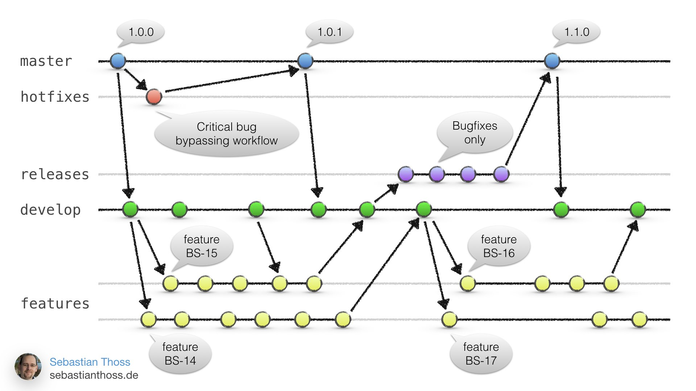

* *master*
  * Working code
  * What users will use
  * Very little commits
* *release*
  * Working code
  * What users will use once all the new features are worked out
* *hotfix*
  * Used to quickly fix issues in *master* or *release*
  * Do as little as possible to fix bugs
* development
  * Get code ready to merge with *release*
  * Code should be mostly working but It's ok to break things
* feature
  * There should be many of theses
  * This is where new ideas will be experimented with
  * If working merge with *development*

#### Coding Standards

How will we name our variables?
  * Descriptive names
  * No single letter variables
  * No abbreviations
  * No numbers in names
  * No special characters in names other than _ to separate words
    * lowerCamelCase for frontend/Vue
    * underscore_naming for backend/Django

How will we format our code?
  * Use PEP8 for python
    * https://peps.python.org/pep-0008/
  * Use Vue Style Guide for Vue
    * https://v2.vuejs.org/v2/style-guide/?redirect=true
  * Use Django Style Guide for Django
    * https://docs.djangoproject.com/en/dev/internals/contributing/writing-code/coding-style/

How long can a line be?
  * No horizontal scrolling allowed
    * Keep lines to around 200 charters
  * Every line should only do 1 thing normally

How long can a function be?
  * No limit but try to keep efficient (if it's too long, it's probably doing too much)
  * Every function should only do 1 thing normally
    * If giving the function a name is hard that means its either doing to much or to little

Will we use type annotation in python?
  * Yes, all functions and variables should have type annotations

When nesting code how many levels deep can we go?
 * Ideally 3, but no more than 5
   * If it's more than 5, it's probably doing too much
     * [CodeAesthetic Video](https://www.youtube.com/watch?v=CFRhGnuXG-4)
     * Extraction
       * Pull code into its own function
     * Inversion
       * Invert the condition and get rid of blocks

#### Commenting Standards

When will we use comments?
  * Can make notes on code, but clean up before merging
  * Can use TODO comments to mark things that need to be done

When will we use docstrings?
  * Ideally for every function and class
  * Should annotate the I/O of a function
  * Should annotate the purpose of a function or class

#### Testing Standards

Every function should have a test
  * Test with good and bad input
  * Test with edge cases

-----------
## Frontend Design

Subsections
- [Frontend Design](#frontend-design)
- [Security](#security)
- [UI](#ui)
- [UX](#ux)
- [Templates](#templates)
- [Vue Router](#vue-router)
  - [Implementation](#implementing-the-router)
- [Testing](#testing)

### Security
While a majority of the security will occur on the back, the front will do a little bit to ensure good data is being passed through. This will primarily be validating input and output. 
If there is bad input, we will visually inform the user of it with sufficient detail. This gives them the opportunity to change it and comply with our standards.
For example, if someone sends a chat to the AI, we will verify that there is no code injection or other malicious works inserted that would jeopardize the app. If bad input is given, we will inform the user (either via toast or other means) that something went wrong.
This will also be done for requests from the backend to make sure the given json is correct and valid. This can be done as simple as a check between who the frontend considers the user and who the backend considers the user. This could be done with ids or other unique keys.

The general pseudocode format + a pseudocode example for each to further display how each will be used.
``` javascript
async function get<Data>() {
  await the results from getting the profile 
    - this will make a call to the external apis
    - also will use the make requests function referenced in connection
  validate the results
    - if good, set the data to the on screen refs and rerender
    - if bad, put up error on screen for user (toast or otherwise)
}

async function getUser() {
  results = await makeRequest(`/api/user/${id}`)
  if results is valid (has all expected data)
    render the home page or profile page // This one can be used for both to ensure the user is logged in, real, and has their data
  if not
    render an error page saying something went wrong.
}

async function post<Data>() {
  check the data to be sent to ensure it is valid
  if valid 
   - await the request with the method "post" & a body with the information to send
   - navigate elsewhere OR rerender page
  if not valid
    - Display an error for the User (toast or otherwise)
}

async function updateUser() {
  if all necessary data has valid updates to it
    await makeRequest(`/api/dater/profile/`, 'post', 
    {
      dict of new data to be sent
    })
    rerender page or navigate back to home
  if data is not valid
    display an error about updating (a toast would make sense here)
}
```
Note that this will be the ONLY time there will be any calls made to the backend's APIs. The calls will use the URLs written and described in the backend section of the document. We are building it like this so that data is only called in a few secure places. This will help narrow any data leaks or exploits that may come from these calls and help in the debugging process and maintain good, safe code.

### UI
This application is intended to be used as a dating aid for individuals with above average difficulty levels interacting in social environments, specifically romantic encounters. For this purpose we have developed the application to allow for smooth transition between elements and pages, soft visual appearances to be ease on eye-fatigue, and clear usage instructions so that anybody could pick up the app and understand how to use it. 

#### User Flow:
The user will be immediately directed to the login page, where they will be given the opportunity to either create an account based on their intended use on the app, or to sign in to a previously created account. Each user type has a home page relative to the features that are pertinent to them. Ie. Daters will have access to info about scheduling their date, adding cash to their online wallet, chatting with our dating assistive bot while cupids will have access to available gigs in their area as well as an earnings page to view their coming payments. Each page will provide a navigation panel in the upper portion to access account details and other necessary features. Tap-sensitive buttons on each page will dynamically redirect the specific user to their desired destination. 

#### Screen Designs:
Proper contrast between content and backgrounds is maintained across each panel on the application. The color tone is soft, so as not to be too "loud" for the user. All screens are suited with a navigation bar in the upper portion of the screen that is locked in place during scrolling. Content is situated below the navigation bar and will have content centered on the screen, keeping appropriate margin distances between each component and the screen. 

#### Navigation Structure:
The navigation bar will will always contain an icon in the upper right corner that will access the current user's account.  Once off of the home page, it will display an arrow which will redirect the user back to their appropriate home page. 

#### Layout Guidelines:
The padding between visual elements will differ based on the screen size of the user, however keeping a pixel distance of no less than 12px and no more than 24px will allow for each of the components and buttons to be displayed on the device in such a manner that the components do not appear crowded nor too spaced apart. All content will be displayed within the size of the content-background color, which allows for strong contrast between black font and the color, as well as not overwhelm the user with bright and flashing pages as they go from feature to feature. Content boxes on pages with scrolling will each have shadows, assisting with the overall visually distinctive and appealing aspects of the app. 

#### Color Palette:
- **primary-blue**: `#46ADF0`
- **secondary-blue**: `#10194B`
- **primary-red**: `#F02A69`
- **secondary-red**: `#802446`
- **content-background**: `#FCEBFF`


#### Icon Use:
Our Icon use will come from that of the Google Fonts library, which has many simple to use/implement icons available. These icons are already widely used and will allow for ease of comprehension for the user as to what their purpose is. 

#### Responsive Design:
The app will primarily be designed for portrait orientation for mobile devices. Capabilities will also be adapted for desktop usage. This is because the use-case for this app will be primary for messaging our AI-bot or seeking local gigs. In either of these situation, providing a landscape function would not create any ease to the user, but rather would inhibit them from seeing important details on their screen because of their keyboard pop-up. Border and other styling designs will respond with each screen size it is displayed on. 


#### Making accounts and Logging in
From the login/User creation page, the user will be able to enter their information with respect to their use-case for the app (Dater or Cupid). Should the user receive several poor ratings from their counterpart, and upon the discretion of the manager, a user can be suspended from the app for a time or indefinitely. 

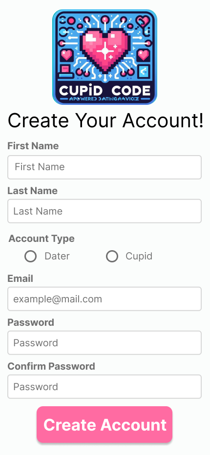
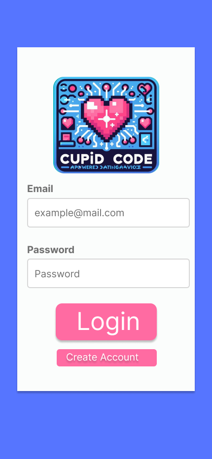
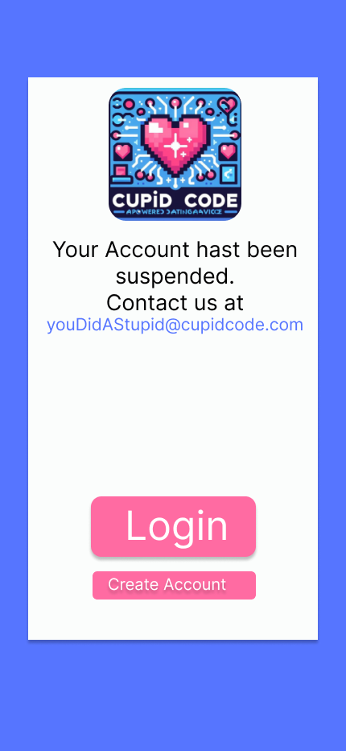

#### Dater
The Dater will have access to 5 features from the app. They can enable the listening function for our AI-bot to determine how well the date is going, texting with the chat-bot to help them get prepared for the date, add cash to their online account to be utilized for purchasing gigs and paying the delivery of the cupid, and a calendar to schedule their date so our system knows how best to assist the dater leading up to the date. Once a delivery is completed, the user will have the ability to rate the experience between them and the cupid. 

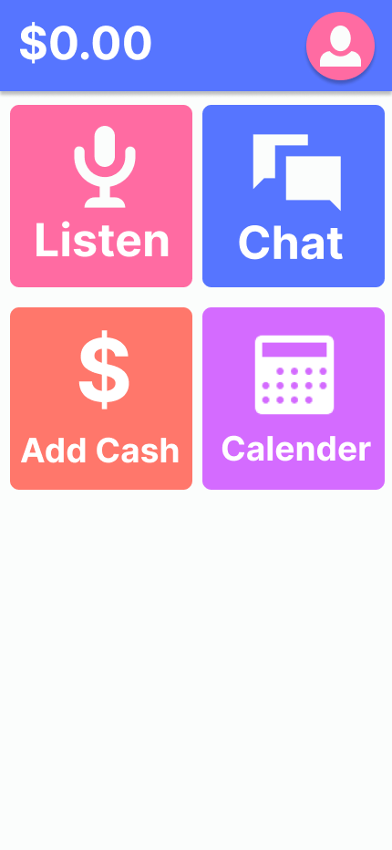
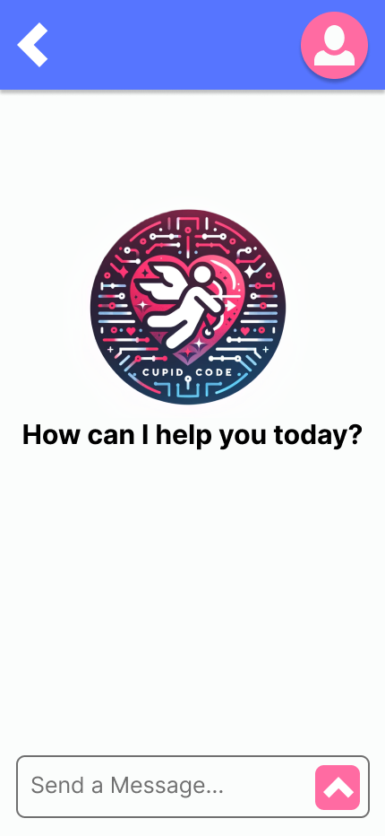
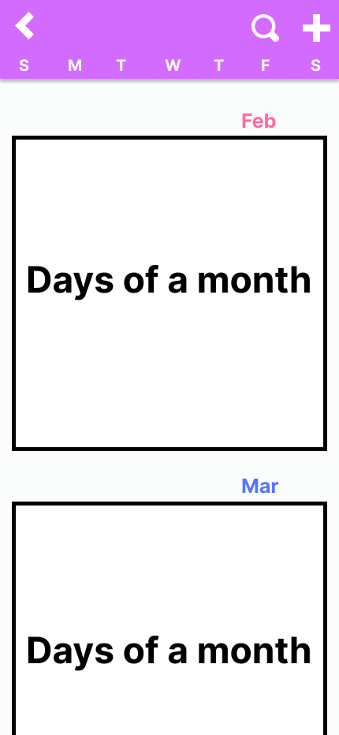
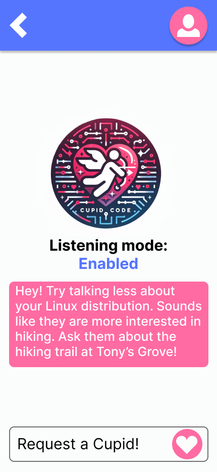
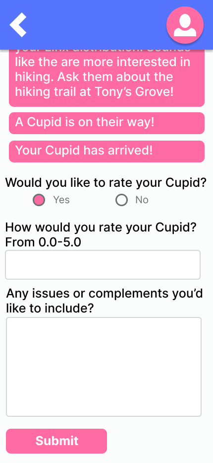
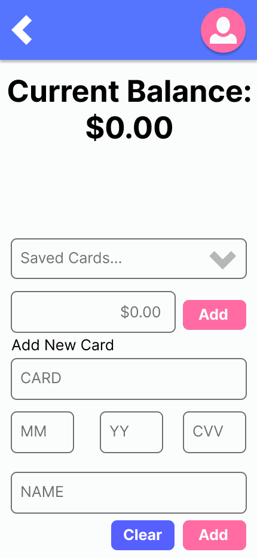


#### Cupid
The Cupid home page will display their personal rating on a scale to 5, as well as a running list of gig offers to accept delivery for. They will be displayed to them based on their location. From there, the cupid can either accept a gig delivery or drop an already accepted delivery. Once a gig is selected, it will show all of the information for the delivery as well as the ability to update the completion status. Once a gig is completed, the Cupid will be provided a screen to supply their feedback for the Dater they were delivering for. The cupid will also be able to acces their earnings page (which will be synonymous with their account info page) to see their running earnings as well as the next pay date. 

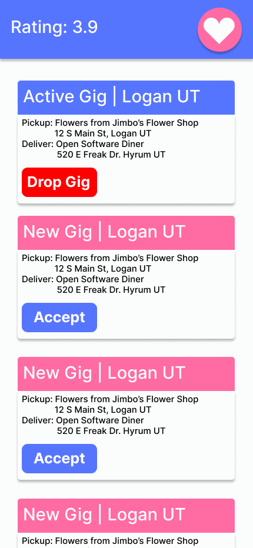
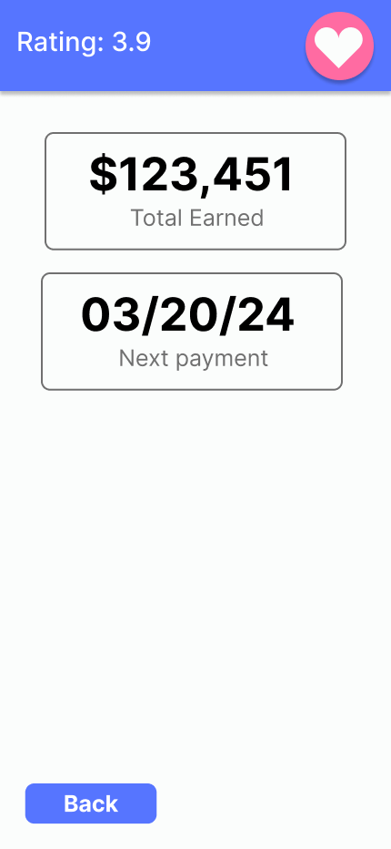
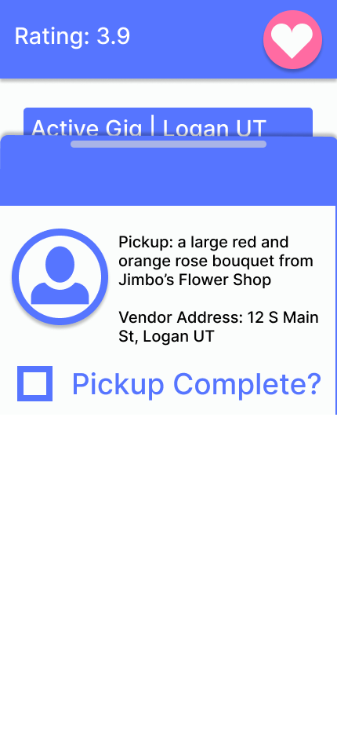
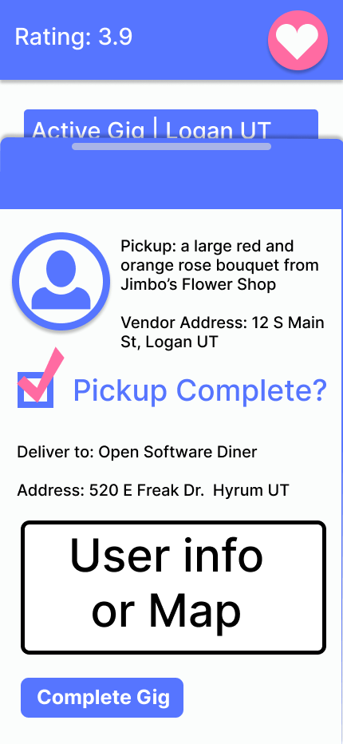
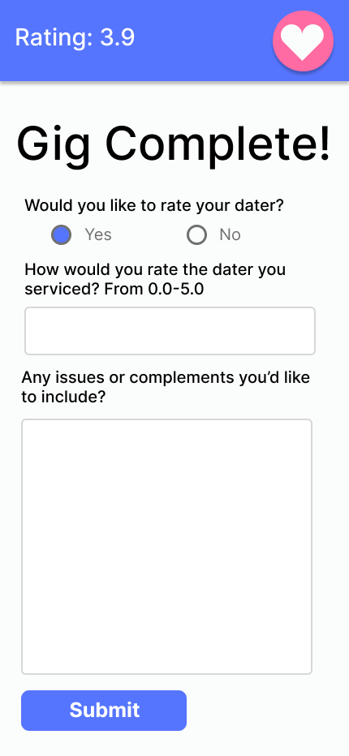

#### Manager
The manager page will work very similarly to that of the cupid page, however they will have access to lists of current users (Daters and Cupids) as well as their ratings and usage info. Their home screen will allow them to select between viewing Daters, Cupids, or Statistical information with respect to app usage. The manager will be able to make the decision of whether or not to suspend another user from their account based on inappropriate usage of the app or conduct during a delivery/date. 

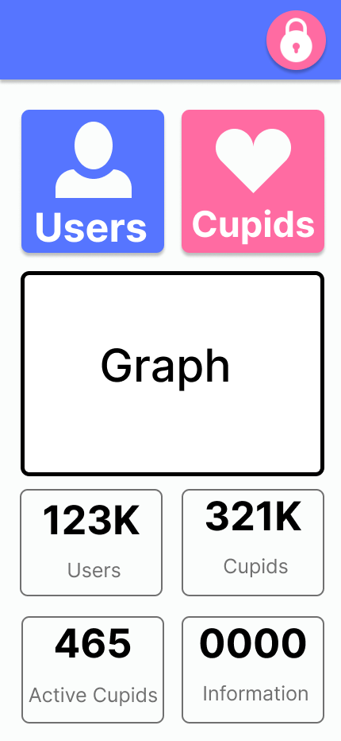
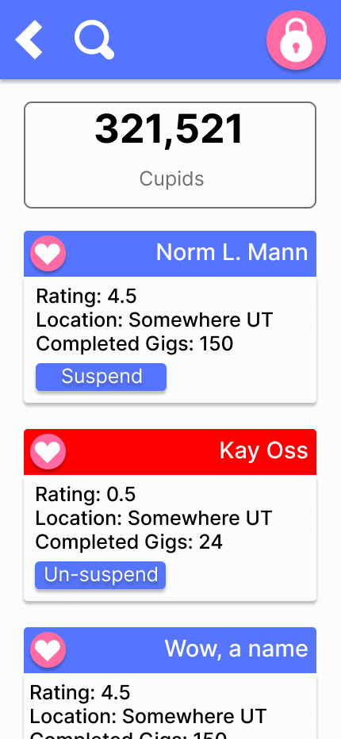
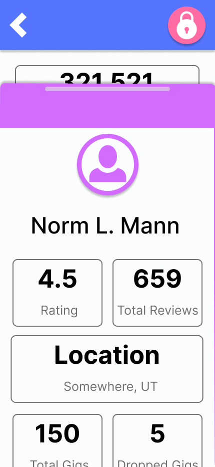
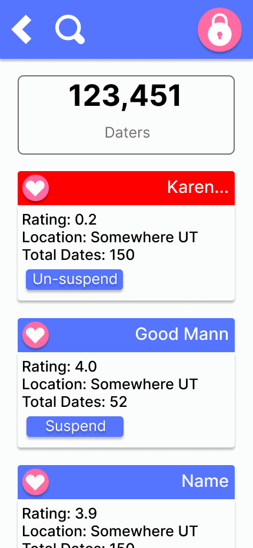
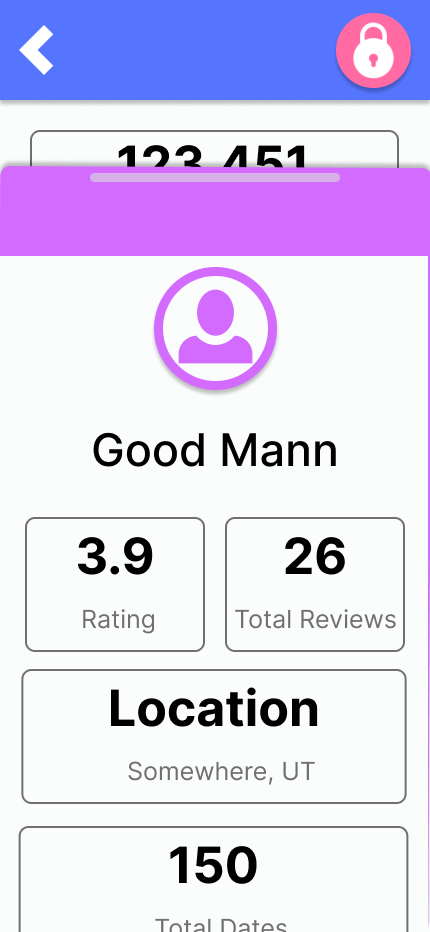

### UX
Crafting a seamless user experience is at the forefront of our app development mission. Through meticulous attention to detail, we are committed to ensuring a smooth and intuitive journey for every user. Our strategy centers around maintaining a cohesive and polished aesthetic, characterized by consistent color schemes that resonate throughout the app. Clear, easily discernible buttons and text inputs are prioritized, enhancing usability and reducing friction in navigation. Leveraging widely adopted formats and design conventions, we empower users to effortlessly engage with our app, fostering familiarity and ease of use. With our unwavering dedication to excellence in UX design, we are poised to deliver an exceptional digital experience that exceeds expectations and leaves a lasting impression.

### Templates
A majority of the frontend design will occur in Vue, but we will want to implement Django Templates for 2 cases. 
  Case 1: A Django template is needed to connect the back to the front.
  Case 2: To protect the system, we can make the sign-up/login process its own Django app that will authenticate logging in so that you must be a verified user to use the rest of the app. This method will utilize the Django `settings.py` variables as well since you can tell it what the login page will be.

This won't deal with many of the external links since it will be an isolated app whose sole purpose is to add & validate users and redirect them based off of the type of account they are.

``` html

<head>
  <style>
    /* Write inline styles here */
  </style>  
</head>
<body>
  <div>
    Welcome to Cupid Code landing page here
  </div>
  <button> Login </button>
  <button> Sign up </button>
</body>  
```
### Vue Router

We will be using the Vue Router to route the user to the correct page. Using information about the user from the backend and reusable components, we can direct the user to the correct page based upon user type.

We will be using hash routing since the frontend and backend will be using different URLs. This will keep the frontend lighter and not be as tied into the backend for rendering every page. 

  Example Vue Router (simple example):
```javascript
import create web history, web hash history from 'vue-router';

import Home from './components/Home.vue';
import About from './components/Dater.vue';
import Contact from './components/Cupid.vue';

const routes = [
  { path: '/', name: 'Home', component: Home },
  { path: '/dater/:id', name: 'Dater', component: Dater },
  { path: '/cupid', name: 'Cupid', component: Cupid }
];

const router = create web history({
  history: web hash history,
  routes
});

export default router;
```
The ':' in "path: '/dater/:id'" symbolizes a parameter to be passed through the path. This will allow us to pass through necesary data for us to use when making calls to the backend.

#### Implementing the router
  Implementing the router into each file will be as follows:

**main.js**

  This will include the router into the building of the app itself.
```javascript
import { createApp } from 'vue';
import './style.css';
import App from './App.vue';
import router from './router/index.js';


createApp(App).use(router).mount('#app')
```

**App.vue**

  This is what the template tag file will look like
``` html
<template>
  <div id=app>
    <router-link :to="{name: 'Path name', params: {param: given param}}">
      Go here!
    </router-link>
    <router-link to="/path/name">
      Or here!
    </router-link>
  </div>
  <router-view></router-view>
<template>
```
This will be in the script tag
``` javascript
const user_id = parseInt(window.location.hash.split('/')[3])
```
**More on :to**

This syntax will allow us to specify the parameters in the path. Vue Router prefers to do it this way instead of doing something like `/path/name/${param}` that you would normally do in other frameworks or plain javascript. 

In some cases we won't use this, like for the welcome page or signup pages. We will instead use to="/path". This is a good shorthand for any path that doesn't require a parameter.

**Other files**

  Any other file that needs to use the router can do so in a variety of ways. 
  
  They can import the router to use programmatic routing
``` javascript
import router from './router/router.js'

router.go(1) // Forward 1
router.forward() // ^
router.go(-1) // Back 1
router.back() // ^

// Route the user to this path with the given params.
router.push({name: "Path Name", params: {param: given param}})
```

And they can use the router-link tag in any component too
```html
  <nav>
    <router-link :to="{name: 'Path name', params: {param: given param}}">
      Go here!
    </router-link>
    <router-link :to="{name: 'Path name', params: {param: given param}}">
      Or here!
    </router-link>
  </nav>
  <div>
    Other components from the page get displayed here.
  </div>  
<template>
```

### Vue URLs
The Vue app will live at URL `/app/`. The following pages will be available through the Vue Router.

| URL                | Notes                                |
|--------------------|--------------------------------------|
| /                  | Welcome page                         |
| /login             | Login page                           |
| /register          | Signup page                          |
| /dater/home/:id    | dater homepage                       |
| /dater/chat/:id    | dater chat page                      |
| /dater/listen/:id  | dater listen page                    |
| /dater/balance/:id | dater cash page                      |
| /dater/calendar/:id| dater calendar page                  |
| /dater/profile/:id | dater profile page                   |
| /cupid/home/:id    | cupid homepage                       |
| /cupid/gigs/       | cupid gigs                           |
| /cupid/balance/:id | cupid balance                        |
| /cupid/profile/:id | cupid profile                        |
| /manager/home/:id  | manager homepage                     |
| /manager/cupids/   | manager reports                      |
| /manager/daters/   | manager reports                      |

The :id syntax is using the params syntax from the Vue Router. These are the URLs that are going to need an id of some sort.

### Testing
These are some easy to implement methods to test our product before release:

1. **Unit Testing**: Begin by writing unit tests for individual components using frameworks like Jest or Mocha. Unit tests focus on testing isolated units of code, such as methods, computed properties, and components, ensuring they behave as expected.

2. **Component Testing**: Utilize Vue Test Utils to write tests for Vue components. These tests simulate user interactions and verify component behavior, such as rendering correctly, responding to user input, and emitting events.

3. **Integration Testing**: Test how different components work together by performing integration tests. Integration tests verify interactions between multiple components and ensure they integrate seamlessly within the application.

4. **Mocking**: Use mocks and stubs to isolate components or services from dependencies during testing. Mocking allows you to control the behavior of external dependencies and focus solely on testing the component or functionality in question.

By incorporating these testing practices into our Vue application development workflow, we can enhance its quality, reliability, and maintainability, ultimately delivering a robust and user-friendly experience to our users.

Unit Test Example

*Note that these will live in their own javascript file*
```javascript
import { mount } from '@vue/test-utils';
import GetBalance from '@/components/GetBalance.vue';

describe('GetBalance', () => {
  it('Display the original balance', async () => {
    const wrapper = mount(GetBalance);
    
    // Initially, the balance should mimic whats in the DB
    expect(wrapper.find('p').text()).toContain('Balance: <TesterBalance>');
    
    // Simulate a click on the button to add funds
    await wrapper.find('button').trigger('click');
    
    // After clicking, the balance should increase
    expect(wrapper.find('p').text()).toContain('Balance: <AddedBalance>');
  });
});
```

-----------
## Connecting Vue and Django

Subsections
- [Summary](#summary)
- [Poetry](#poetry)
- [Vite Config](#vite-config)
- [Node.js](#nodejs)
- [npm](#npm)
- [Serverside](#serverside)
- [Files to Add](#files-to-addy)
- [Environemnt](#environment)
- [Middleware](#middleware)
- [In Server Settings](#in-server-settings)
- [In core views](#in-core-viewspy)
- [In core index](#in-core-viewspy)
- [Clientside](#clientside)
- [Pseudocode](#pseudocode)


### Summary
We will be using these tools: Vite, NVM, NPM, and Poetry. 
The frontend will be setup using NVM & NPM for Vite and Vue. The backend will be using Poetry for Django. This section details what each version manager & configuration file needs to have as well as every additional file necessary and what each of those files needs to have in it. 

#### Poetry
These are all of the dependencies we'll install
* Python 3.11+
* Django 5.0.2+
* Requests 2.31.0+
* Python-dotenv 1.0.1+

#### Vite Config

This is what the vite config file will need to look like.
``` javascript
  plugins: [vue()],
  build: {
    manifest: true,
    rollupOptions: {
      input: "./src/main.js"
    },
    outDir: "../<server>/core/static/core"
  },
  base: "/static"
```

#### Node.js

The [current LTS version](https://nodejs.org/en) (20.11.1 as of 2/18/2024) of Node.js will be used for project development. `nvm` (Node Version Manager) will be used to manage the version of Node.js being used.

`nvm` commands for selecting Node.js version:
```
$ nvm install -lts
$ nvm use --lts
```

#### npm

`npm` will be used for package management
These are the dependencies we'll install
* Vue 3.3.11+
* Cookie 0.6.0+

#### Serverside

*Note: Before doing this, make sure you've started a vite project, django project and started at least one app in the django project*
*The Django app will be referred to as 'core' here*

##### Files to Add

* `middleware.py` in core app
* .env & .env.example in server directory
* templates/core folder with an `index.html` file in core app

##### Environment

* Add "ASSET_URL=http://localhost:5173" to both.
* Change the url to whatever the client is being hosted on.
* Port 5173 is the default of vite so we'll be using that.

##### Middleware

* Add the asset middleware here
* We already have a written one
* An example is in the psuedocode

##### In Server Settings

* Import load_dotenv from dotenv (python-dotenv)
* Add a Debug check for asset middleware:
  * if DEBUG: MIDDLEWARE.append('core.middleware.asset_proxy_middleware')
  * Note: This is the middleware we added/wrote earlier

##### In Core views.py

* Import django.conf settings, json, and os
* Create the MANIFEST variable ({}) and setup loading the manifest.
* Create the index view
  * Create context:
    * asset_url: Use os to get the ASSET_URL from .env
    * debug: Use settings to get the debug
    * manifest: MANIFEST variable
    * js_file: Set to emptry string is in debug mode otherwise set to the manifest file
    * css_file: Follow same protocol as js_file.
  * return a render of the request, `index.html`, and the context.

##### In Core index.html

* Generate a default, basic html file
* Using Django Template, add an if/else statement to the head tag.
  * If debug
    * Two scripts. One points to /@vite/client and one points to src/main.js
      * These will point towards the asset_url from the view as well
    * The else will hold a link and a script using the css and js file from the manifest
* Add an empty div with id "app" do the body tag. This will connect it to vue's "app" div in its generated index.html file.


#### Clientside

For running the server by default, you won't need to add anything. However, if you want to make some actual requests then this is where Cookie comes in. 
Add a utils folder in your src folder, and make a file called `make_requests.js` here. Here you'll write a function to send and receive json from the server.

#### Pseudocode
``` javascript
import cookie

makeRequest(uri, method, body):
  cookies = parse the cookies 
  options = create a dictionary of what to send to server
    method, headers, credentials
  if the method is post then turn the body into valid JSON

  result = fetch to serverside
  json = the results json
  return the json
```
``` python
import requests, os, and an http response tool

assetMiddleware(next):
middleware(req):
  if there is a .in the path:
    set response to the asset url with full path
    return a response (consists of the response, content type, status, and reason)
  return next in chain
return middleware
```

-----------
## Backend Design

Subsections
- [Backend Summary](#backend-summary)
- [Django Project Structure](#django-project-structure)
- [URL Mapping](#url-mapping)
- [Django Models](#django-models)
- [Django Migrations](#django-migrations)
- [Django Settings](#django-settings)
- [Django Admin](#django-admin)
- [Unit Tests](#unit-tests)
- [Backend Pseudocode](#backend-pseudocode)

### Backend Summary

The backend will be built using Django and the Django REST Framework. As a result much of the needed security is already implemented. 
A majority of the work will be in the models, views, and serializers. The models will be the database, the views will be the API, and the serializers will be the conversion of the models to JSON and vice versa.
The frontend will communicate with the backend using HTTP GET and POST requests. The backend will respond with JSON data. This will be made easy by the Django Rest Framework.
Mapping what endpoints the frontend needs is helpful for the backend to know what to build. This will be done in the URL Mapping section.

#### Resources for the Backend
* [Django Rest Framework Quickstart](https://www.django-rest-framework.org/tutorial/quickstart/)
* [Django Rest Framework API Reference](https://docs.djangoproject.com/en/5.0/ref/)
* [Django Rest Framework Serializers](https://www.django-rest-framework.org/api-guide/serializers/)
* [Django Rest Framework Views](https://www.django-rest-framework.org/api-guide/views/)
* [Django Rest Framework Permissions](https://www.django-rest-framework.org/api-guide/permissions/)
* [Django Rest Framework Authentication](https://www.django-rest-framework.org/api-guide/authentication/)

### Django Project Structure

This is what our project structure will look like:

* _server/
  * _server/ - Main project settings.
    * settings.py - Main settings file.
    * urls.py - Main url file.
    * wsgi.py - Web server gateway interface.
  * api/ - App for the api.
    * admin.py - Admin configuration.
    * apps.py - App configuration.
    * geodata/ - Used by GeoLite to look up location by IP
    * migrations/ - Migrations for the api app.
    * models.py - Define the models.
    * serializers.py - Define the serializers.
    * tests.py - Write unit tests.
    * urls.py - Map the urls to the views.
    * views.py - Define and implement the views.
  * core/
    * admin.py - Admin configuration.
    * apps.py - App configuration.
    * middleware.py - Captures requests for static files and redirects to Vue server
    * static/ - Contains some images
    * templates/ - Contains the base template
  * manage.py - Command line utility for managing the project.
  * db.sqlite3 - The database. We can change this to another database if we want.

### URL Mapping

#### static endpoints

The following endpoints do not need any user data to be used.

| URL      | Method    | View Function | Notes                                                                                          |
|----------|-----------|---------------|------------------------------------------------------------------------------------------------|
| /        | GET       | welcome       | Welcome page                                                                                   |
| /login/  | GET, POST | login         | Login page, Send form                                                                          |
| /signup/ | GET, POST | signup        | Signup page, Send form                                                                         |
| /app/    | GET       | NA            | Vue Router takes over from here. Only if they are authenticated will they be able to call this |
| /get_*/  | GET       | get_*         | Variours icon images for the front end                                                         |

Additional pages offered by [Vue Router](#vue-router)

#### dynamic endpoints

The following endpoints will need user data to be used. Authentication will be required for all of these endpoints.

| URL                              | Method    | View Function         | Notes                                               |
|----------------------------------|-----------|-----------------------|-----------------------------------------------------|
| /api/user/create/                | POST      | create_user           | Create user and cupid/dater if necessary            |
| /api/user/sign_in/               | POST      | sign_in               | Signs in a user and returns their data              |
| /api/user/<int:pk>/              | GET       | get_user              | Get user data                                       |
| /api/chat/                       | POST      | send_chat_message     | Send message, return the AI's response              |
| /api/chat/<int:pk>/              | GET       | get_five_messages     | Return the last five chat messages                  |
| /api/dater/calendar/<int:pk>/    | GET, POST | calendar              | Get the dater's calendar (date list), create a date |
| /api/dater/rate/                 | POST      | rate_dater            | Cupid rate Dater                                    |
| /api/dater/ratings/<int:pk>/     | GET       | get_dater_ratings     | Get list of dater's ratings                         |
| /api/dater/avg_rating/<int:pk>/  | GET       | get_dater_avg_rating  | Get dater's average rating                          |
| /api/dater/transfer/             | POST      | dater_transfer        | Initiate transfer in                                |
| /api/dater/balance/<int:pk>/     | GET       | get_dater_balance     | Get account balance                                 |
| /api/dater/profile/<int:pk>/     | GET       | get_dater_profile     | Get dater's profile                                 |
| /api/dater/profile/              | POST      | set_dater_profile     | Set dater's profile                                 |
| /api/dater/save_card/            | POST      | save_card             | Save a new card for the dater                       |
| /api/dater/get_cards/<int:pk>/   | GET       | get_cards             | Return the cards ther dater has saved.              |
| /api/dater/gigs/<int:pk>         | GET       | get_dater_gigs        | Returns all gigs the dater has created.             |
| /api/cupid/rate/                 | POST      | rate_cupid            | Dater rating a Cupid                                |
| /api/cupid/ratings/<int:pk>/     | GET       | get_cupid_ratings     | Get list of cupid's ratings                         |
| /api/cupid/avg_rating/<int:pk>/  | GET       | get_cupid_avg_rating  | Get cupid's average rating                          |
| /api/cupid/transfer/             | POST      | cupid_transfer        | Initiate transfer out                               |
| /api/cupid/balance/<int:pk>/     | GET       | get_cupid_balance     | Get account balance                                 |
| /api/cupid/profile/<int:pk>/     | GET       | get_cupid_profile     | Get cupid's profile                                 |
| /api/cupid/profile/              | POST      | set_cupid_profile     | Set cupid's profile                                 |
| /api/cupid/save_bank_account/    | POST      | save_bank_account     | Save a new bank account for the cupid               |
| /api/cupid/accepting             | POST      | cupid_accepting       | Updates whether the cupid is accepting gigs         |
| /api/gig/create/                 | POST      | create_gig            | Create gig                                          |
| /api/gig/accept/                 | POST      | accept_gig            | Accept gig                                          |
| /api/gig/complete/               | POST      | complete_gig          | Complete gig                                        |
| /api/gig/drop/                   | POST      | drop_gig              | Drop gig                                            |
| /api/gig/cancel/                 | POST      | cancel_gig            | Cancel (delete) gig                                 |
| /api/gig/<int:count>/            | GET       | get_gigs              | Return number of gigs around cupid                  |
| /api/geo/stores/<int:pk>/        | GET       | get_stores            | List of nearby stores                               |
| /api/geo/activities/<int:pk>/    | GET       | get_activities        | Nearby activities                                   |
| /api/geo/events/<int:pk>/        | GET       | get_events            | Nearby events                                       |
| /api/geo/attractions/<int:pk>/   | GET       | get_attractions       | Nearby attractions                                  |
| /api/geo/user/<int:pk>/          | GET       | get_user_location     | Get a user's location                               |
| /api/manager/cupids/             | GET       | get_cupids            | Get a list of cupids                                |
| /api/manager/daters/             | GET       | get_daters            | Get a list of daters                                |
| /api/manager/dater_count/        | GET       | get_dater_count       | Manager reports                                     |
| /api/manager/cupid_count/        | GET       | get_cupid_count       | Manager reports                                     |
| /api/manager/active_cupids/      | GET       | get_active_cupids     | Manager reports                                     |
| /api/manager/active_daters/      | GET       | get_active_daters     | Manager reports                                     |
| /api/manager/gig_rate/           | GET       | get_gig_rate          | Manager reports                                     |
| /api/manager/gig_count/          | GET       | get_gig_count         | Manager reports                                     |
| /api/manager/gig_drop_rate/      | GET       | get_gig_drop_rate     | Manager reports                                     |
| /api/manager/gig_complete_rate/  | GET       | get_gig_complete_rate | Manager reports                                     |
| /api/manager/suspend/            | POST      | suspend               | suspend cupid / dater                               |
| /api/manager/unsuspend/          | POST      | unsuspend             | unsuspend cupid / dater                             |
| /api/manager/delete_user/<int:pk>| POST      | delete_user           | Delete specified user                               |
| /api/stt/                        | POST      | speech_to_text        | Convert speech to text                              |
| /api/notify/                     | POST      | notify                | Send a message according to pref.                   |

### Django Models

We will use the Django built-in User model, but add roles to it by extending `AbstractUser`. This comes with authentication functionality and the following fields. Details available in 
[Django docs](https://docs.djangoproject.com/en/5.0/ref/contrib/auth/#django.contrib.auth.models.User).

* User
  * **id**
  * *role added by us {Dater, Cupid, Manager}*
  * *phone_number added by us*
  * username
  * first_name
  * last_name
  * email
  * password
  * groups
  * user_permissions
  * is_staff
  * is_active
  * is_superuser
  * last_login
  * date_joined

Each model will correspond to a table. Bold denotes a primary key. For most tables,
this is the default id provided by Django. For certain one-to-one tables they will use that
relationship as their primary key. 

* Dater
    * **User : OneToOne Field (As provided by Django)**
    * Budget : Decimal Field
    * Communication preferences : IntegerChoices(EMAIL,TEXT)
    * Profile Picture : Image Field 
    * Text available to AI
        * Description of self : Text Field
        * Dating strengths : Text Field
        * Dating weaknesses : Text Field
        * Interests : Text Field
        * Past dating experiences : Text Field
        * Type of nerd : Text Field
        * Relationship goals : Text Field
        * Degree of AI assistance : Integer Field
    * Common with Cupid
        * Cupid Cash Balance : Decimal Field
        * Location : Text Field (Containing geo coordinates) 
        * Average Rating : Decimal Field
        * Suspended : Boolean Field
* Cupid
    * **User : OneToOne Field (As provided by Django)**
    * Accepting Gigs : Boolean Field (Is cupid accepting gigs)
    * Total gigs completed : Integer Field
    * Total gigs failed : Integer Field
    * Status : Text Choices (OFFLINE, GIGGING, AVAILABLE)
    * Gig Range : Integer Field
    * Common with Dater
        * Cupid Cash Balance : Decimal Field
        * Location : Text Field (Containing geo coordinates) 
        * Average Rating : Decimal Field
        * Suspended : Boolean Field
* Manager doesn't need anything more than a Django User in the manager role
* Message
    * **id : Auto Field**
    * Owner : Foreign Key (User)
    * Text : Text Field
    * fromAI : Boolean Field (Indicates which side of the convo this message belongs to)
* Gig
    * **id : Auto Field**
    * Dater : Foreign Key
    * Cupid : Foreign Key
    * Quest : OneToOne Field
    * Status : Text Choices (UNCLAIMED, CLAIMED, COMPLETE)
    * DateTime of request : DateTime Field
    * DateTime of claim : DateTime Field
    * DateTime of completion : DateTime Field
    * Dropped Count : Integer Field
    * Accepted Count : Integer Field
* Quest (separate for modularity)
    * **Gig : *Established by OneToOne Field on Gig***
    * Budget : Decimal Field
    * Items Requested : Text Field 
    * Pickup location : Text Field (address or geolocation to get object from)
* Date
    * **id : Auto Field**
    * Dater : Foreign Key
    * Date & Time : DateTime Field
    * Location : Text Field (Containing geo coordinates) 
    * Description : Text Field
    * Status : Text Choices (PLANNED, OCCURRING, PAST, CANCELED)
    * Budget : Decimal Field
* Feedback
    * **id : Auto Field**
    * Owner : Foreign Key (User)
    * Target : Foreign Key (User)
    * Gig : Foreign Key
    * Message : Text Field
    * Star Rating : Integer Field (bound to 1-5)
    * DateTime : DateTime Field 
* Payment Card
    * **User : Foreign Key**
    * Name On Card : Text Field
    * Card Number : Text Field
    * CVV : Text Field
    * Expiration : Text Field
* Bank Account
    * **User : Foreign Key**
    * Routing Number : Text Field
    * Account Number : Text Field

### Django Migrations

* Dummy Daters
  * username:dater1, email:bob@cupidcode.com, password:password, 200 cupid coin balance, budget of 50
  * username:dater2, email:Manny@cupidcode.com, password:password, 20 cupid coin balance, budget of 50
* Dummy Cupids
  * username:cupid1, email:joe@mail.com, password:password, 54 completed gigs, 12 failed
  * username:cupid2, email:really@me.com, password:password, 4 completed gigs, 16 failed
* Dummy Manager
  * username:manager, email:manager@cupidcode.com, password:password
* Dummy messages
  * Create a few dummy conversation for each dater.
* Dummy Gigs
  * Unclaimed gig with a unique quest
  * Unclaimed gig with a unique quest
  * Claimed gig
* Dummy Dates
  * A dummy location, date is june 17th, so it will never come during this semester.
* Feedback
  * A couple positive reviews for each cupid
  * A couple negative reviews for each cupid
  * A couple positive reviews for each dater
  * A couple negative reviews for each dater

### Django Settings

The `settings.py` file is used to apply settings to the entire Django project. The following adjustments will be made to the `settings.py` file:

* `DEBUG` will be set to `False` in production
* `ALLOWED_HOSTS` will be set to the domain name of the production server
* django.contrib.admin will be added to `INSTALLED_APPS` to enable the Django admin site
* api will be added to `INSTALLED_APPS` to enable the API
* `MIDDLEWARE` will be adjusted to include the asset middleware
* `STATIC_URL` will be set to the asset url
* `TEMPLATES` will be adjusted to include the `welcome.html` file
* `SECURE_SSL_REDIRECT` will be set to `True`
* `SESSION_COOKIE_SECURE` will be set to `True`

### Django Admin

The Django admin site adds the possibility to have admin accounts with levels of management and control. The main functions this account can provide are the following:
* Easy creation, management, and deletion of user accounts
* Easy creation, management, and deletion of data
* Easy adjustment to permissions on user accounts
* Ability to export data (if needed)
* Logging and history of changes made to data

There are some concerns with the admin site and admin accounts:
* Security concerns 
  * Admin accounts are a prime target for hackers
  * Admin accounts could be used to access sensitive data
  * Admin accounts could be used to modify data in a way that could be harmful
  * Admin accounts could be used to delete data
  * Admin accounts could be used improperly or maliciously
* Resource usage 
  * Admin accounts take a lot of resources to maintain
  * Admin accounts could be used to do intensive work that could slow down the software

The Django admin site will be used to create the initial Manager accounts to manage the site.

While the admin site is a powerful tool, it is not the best tool for day-to-day operations. While the server is in production, the admin site will be disabled. Instead, the API will be used to manage the data.

### Unit Tests

Each view will have a corresponding unit test. The unit tests will be used to verify that the views are functioning as expected.
* Good input will be used to verify that the views are functioning as expected
* Bad input will be used to verify that the views are functioning as expected
* Edge cases will be used to verify that the views are functioning as expected

The following tools will be used to create unit tests for the software:
* Django test framework will be used to create unit tests for the software.
  * https://docs.djangoproject.com/en/3.2/topics/testing/
* Django debug toolbar will be used to monitor the performance of the software and to identify any potential issues.
  * https://django-debug-toolbar.readthedocs.io/en/latest/

Pseudocode can be found at the bottom of the [Pseudocode](#pseudocode) section.

### Quick Tutorial on how to use the Django Rest Framework

* Create a new app in the project
``` 
$ python manage.py startapp example
```

* In the project `settings.py` file, add the following to the INSTALLED_APPS list:
  * 'rest_framework'
  * 'example'
``` python
INSTALLED_APPS = [
    ...
    'rest_framework',
    'example',
    ...
]
```

* In the `example/models.py` file, create the models that will be used by the API
``` python

from django.db import models

class User(models.Model):
    username = models.CharField(max_length=100)
    email = models.EmailField()
    password = models.CharField(max_length=100)
    is_suspended = models.BooleanField()
    is_cupid = models.BooleanField()
```

* In the `example/serializers.py` file, create the serializers that will be used by the API (serializers are used to convert model instances to JSON and vice versa)
  * ReaderUserSerializer will be used to convert User instances to JSON
  * WriterUserSerializer will be used to convert JSON to User instances
``` python
from rest_framework import serializers
from .models import User

class UserSerializer(serializers.ModelSerializer):
    class Meta:
        model = User
        fields = ['id', 'username', 'email', 'password']
    
    def validate(self, data):
        if data['password'] == data['confirm_password']:
            return serializers.ValidationError('Password cannot be "password"')
        return data
    
    def create(self, validated_data):
        user = User(**validated_data)
        user.is_suspended = False
        user.save()
        return user
        
    def update(self, instance, validated_data):
        instance.username = validated_data.get('username', instance.username)
        instance.email = validated_data.get('email', instance.email)
        instance.password = validated_data.get('password', instance.password)
        instance.save()
        return instance
```

* In the `example/views.py` file, create the views that will be used by the API
``` python
from rest_framework.decorators import api_view
from rest_framework.response import Response
from rest_framework import status
from .models import User
from .serializers import UserSerializer

@api_view(['GET'])
def user_list(request):
    users = User.objects.all()
    serializer = UserSerializer(users, many=True)
    return Response(serializer.data)
    
@api_view(['GET'])
def user_detail(request, pk):
    try:
        user = User.objects.get(pk=pk)
    except User.DoesNotExist:
        return Response(status=status.HTTP_404_NOT_FOUND)
    serializer = UserSerializer(user)
    return Response(serializer.data)
    
@api_view(['POST'])
def user_create(request):
    serializer = UserSerializer(data=request.data)
    serializer.is_valid(raise_exception=True):
    serializer.save()
    return Response(serializer.data, status=status.HTTP_201_CREATED)
    
@api_view(['PUT'])
def user_update(request, pk):
    try:
        user = User.objects.get(pk=pk)
    except User.DoesNotExist:
        return Response(status=status.HTTP_404_NOT_FOUND)
    serializer = UserSerializer(user, data=request.data)
    serializer.is_valid(raise_exception=True):
    serializer.save()
    return Response(serializer.data)

@api_view(['DELETE'])
def user_delete(request, pk):
    try:
        user = User.objects.get(pk=pk)
    except User.DoesNotExist:
        return Response(status=status.HTTP_404_NOT_FOUND)
    user.delete()
    return Response(status=status.HTTP_204_NO_CONTENT)
```

* In the `example/urls.py` file, create the URLs that will be used by the API
``` python
from django.urls import path
from . import views

urlpatterns = [
    path('/user/', views.user_list),
    path('/user/<int:pk>/', views.user_detail),
    path('/user/create/', views.user_create),
]
```

* In the project's `urls.py` file, include the api's urls
``` python
from django.urls import path, include

urlpatterns = [
    ...
    path('/api/', include('api.urls')),
]
```


### Backend Pseudocode

cupid_code/urls.py
``` python
path("", include("api.urls")),
path("api/", include("api.urls")),
path("admin/", admin.site.urls),
```

cupid_code/settings.py
``` python
# Very little will change from the settings.py initial configuration made on generation.
# Here are some adjustment(s)

INSTALLED_APPS = [
  ...
  'django.contrib.admin',
  rest_framework,
  'api',
  ...
]
```

api/urls.py
``` python

from django.urls import path
from . import views

urlpatterns = [
    path("/"), views.welcome, name="welcome"),
    path("/login/"), views.login, name="login"),
    path("/signup/"), views.signup, name="signup"),
    path("/app/"), views.app, name="app"),
    path("/api/user/create/", views.create_user, name="create_user"),
    path("/api/user/<int:id>/", views.get_user, name="get_user"),
    path("/api/chat/", views.send_chat_message, name="send_chat_message"),
    path("/api/chat/<int:id>/"), views.get_five_messages, name="get_five_messages"),
    path("/api/dater/calendar/<int:id>/"), views.calendar, name="calendar"),
    path("/api/dater/rate/"), views.rate_dater, name="rate_dater"),
    path("/api/dater/ratings/<int:id>/"), views.get_dater_ratings, name="get_dater_ratings"),
    path("/api/dater/avg_rating/<int:id>/"), views.get_dater_avg_rating, name="get_dater_avg_rating"),
    path("/api/dater/transfer/"), views.dater_transfer, name="dater_transfer"),
    path("/api/dater/balance/<int:id>/"), views.get_dater_balance, name="get_dater_balance"),
    path("/api/dater/profile/<int:id>/"), views.get_dater_profile, name="get_dater_profile"),
    path("/api/dater/profile/"), views.set_dater_profile, name="set_dater_profile"),
    path("/api/cupid/rate/"), views.rate_cupid, name="rate_cupid"),
    path("/api/cupid/ratings/<int:id>/"), views.get_cupid_ratings, name="get_cupid_ratings"),
    path("/api/cupid/avg_rating/<int:id>/"), views.get_cupid_avg_rating, name="get_cupid_avg_rating"),
    path("/api/cupid/transfer/"), views.cupid_transfer, name="cupid_transfer"),
    path("/api/cupid/balance/<int:id>/"), views.get_cupid_balance, name="get_cupid_balance"),
    path("/api/cupid/profile/<int:id>/"), views.get_cupid_profile, name="get_cupid_profile"),
    path("/api/cupid/profile/"), views.set_cupid_profile, name="set_cupid_profile"),
    path("/api/gig/create/"), views.create_gig, name="create_gig"),
    path("/api/gig/accept/"), views.accept_gig, name="accept_gig"),
    path("/api/gig/complete/"), views.complete_gig, name="complete_gig"),
    path("/api/gig/drop/"), views.drop_gig, name="drop_gig"),
    path("/api/gig/<int:count>/"), views.get_gigs, name="get_gigs"),
    path("/api/geo/stores/"), views.get_stores, name="get_stores"),
    path("/api/geo/activities/"), views.get_activities, name="get_activities"),
    path("/api/geo/events/"), views.get_events, name="get_events"),
    path("/api/geo/attractions/"), views.get_attractions, name="get_attractions"),
    path("/api/geo/user/<int:id>/"), views.get_user_location, name="get_user_location"),
    path("/api/manager/cupids/"), views.get_cupids, name="get_cupids"),
    path("/api/manager/daters/"), views.get_daters, name="get_daters"),
    path("/api/manager/dater_count/"), views.get_dater_count, name="get_dater_count"),
    path("/api/manager/cupid_count/"), views.get_cupid_count, name="get_cupid_count"),
    path("/api/manager/active_cupids/"), views.get_active_cupids, name="get_active_cupids"),
    path("/api/manager/active_daters/"), views.get_active_daters, name="get_active_daters"),
    path("/api/manager/gig_rate/"), views.get_gig_rate, name="get_gig_rate"),
    path("/api/manager/gig_count/"), views.get_gig_count, name="get_gig_count"),
    path("/api/manager/gig_drop_rate/"), views.get_gig_drop_rate, name="get_gig_drop_rate"),
    path("/api/manager/gig_complete_rate/"), views.get_gig_complete_rate, name="get_gig_complete_rate"),
    path("/api/manager/suspend/"), views.suspend, name="suspend"),
    path("/api/manager/unsuspend/"), views.unsuspend, name="unsuspend"),
    path("/api/stt/"), views.speech_to_text, name="speech_to_text"),
    path("/api/notify/"), views.notify, name="notify"),
]

```

api/models.py
``` python

from django.db import models
from django.contrib.auth.models import AbstractUser

class User(AbstractUser):
    class Role(models.TextChoices):
        DATER = 'Dater'
        CUPID = 'Cupid'
        MANAGER = 'Manager'

    role = models.CharField(choices=Role.choices, max_length=7)

class Dater(models.Model):
    user = models.OneToOneField(User, on_delete=models.CASCADE, primary_key=True)
    phone_number = models.CharField(max_length=10)
    budget = models.DecimalField(max_digits=10, decimal_places=2)
    communication_preference = models.IntegerField()
    profile_picture = models.ImageField()
    description = models.TextField()
    dating_strengths = models.TextField()
    dating_weaknesses = models.TextField()
    interests = models.TextField()
    past = models.TextField()
    nerd_type = models.TextField()
    relationship_goals = models.TextField()
    ai_degree = models.TextField()
    cupid_cash_balance = models.DecimalField(max_digits=10, decimal_places=2)
    location = models.TextField()
    average_rating = models.DecimalField(max_digits=10, decimal_places=2)
    suspended = models.BooleanField()

class Cupid(models.Model):
    class Status(models.IntegerChoices):
        OFFLINE = 0
        GIGGING = 1
        AVAILABLE = 2

    user = models.OneToOneField(User, on_delete=models.CASCADE, primary_key=True)
    accepting_gigs = models.BooleanField()
    gigs_completed = models.IntegerField()
    gigs_failed = models.IntegerField()
    payment = models.TextField()
    status = models.IntegerField(choices=Status.choices)
    cupid_cash_balance = models.DecimalField(max_digits=10, decimal_places=2)
    location = models.TextField()
    average_rating = models.DecimalField(max_digits=10, decimal_places=2)
    
class Message(models.Model):
    owner = models.ForeignKey(User, primary_key=True, on_delete=models.CASCADE)
    text = models.TextField()
    from_ai = models.BooleanField()

class Gig(models.Model):
    class Status(models.IntegerChoices):
        UNCLAIMED = 0
        CLAIMED = 1
        COMPLETE = 2
        DROPPED = 2

    dater = models.ForeignKey(Dater, on_delete=models.CASCADE)
    cupid = models.ForeignKey(Cupid, on_delete=models.CASCADE)
    quest = models.OneToOneField(Quest, on_delete=models.CASCADE)
    status = models.IntegerField(chioces=Status.choices)
    date_time_of_request = models.DateTimeField()
    date_time_of_claim = models.DateTimeField()
    date_time_of_completion = models.DateTimeField()

class Quest(models.Model):
    gig = models.OneToOneField(Gig, on_delete=models.CASCADE, primary_key = True)
    budget = models.DecimalField(max_digits=10, decimal_places=2)
    items_requested = models.TextField()
    pickup_location = models.TextField()
    
class Date(models.Model):
    dater = models.ForeignKey(Dater, on_delete=models.CASCADE)
    date_time = models.DateTimeField()
    location = models.TextField()
    description = models.TextField()
    status = models.TextField()
    budget = models.DecimalField(max_digits=10, decimal_places=2)

class Feedback(models.Model):
    user = models.ForeignKey(User, on_delete=models.CASCADE)
    gig = models.ForeignKey(Gig, on_delete=models.CASCADE)
    message = models.TextField()
    star_rating = models.IntegerField()
    date_time = models.DateTimeField()
    
class PaymentCard(models.Model):
    user = models.ForeignKey(User, on_delete=models.CASCADE)
    card_number = models.TextField()
    cvv = models.TextField()
    expiration = models.TextField()

class BankAccount(models.Model):
    user = models.ForeignKey(User, on_delete=models.CASCADE)
    routing_number = models.TextField()
    account_number = models.TextField()

```

api/serializers.py
``` python

from rest_framework import serializers

# Still learning how to use serializers

```

api/views.py
``` python

from rest_framework.decorators import api_view
from rest_framework.response import Response
from rest_framework import status
from .models import Dater, Cupid, Message, Manager, Gig, Quest, Date, Feedback, PaymentCard, BankAccount
from .serializers import DaterSerializer, CupidSerializer, MessageSerializer, ManagerSerializer, GigSerializer, QuestSerializer, DateSerializer, FeedbackSerializer, PaymentCardSerializer, BankAccountSerializer

def welcome(request):
    return render(request, "welcome.html")
    
def sign_up(request):
    if request.method == "POST":
        validate the form
        return redirect("/login/")
    else:
        return render(request, "sign_up.html")
        
def login(request):
    if request.method == "POST":
        username = request.POST.get("email")
        password = request.POST.get("password")
        user = authenticate(request, username=username, password=password)
        if user is not None:
            login(request, user)
            return redirect("/app/")
        else:
            return render(request, "login.html", {"message": "Incorrect Password"})
    else:
        return render(request, "login.html")

def create_user(request):
  for each profile data for user:
    create a variable = request.{specific data}

  dater = Dater(
    model_column = request.POST[matching variable]
  )

  dater.save()
  
  return redirect("/app/")


def get_user(request, id):
  user = {flag that identifies who the user is (Dater/Cupid/Manager)}.objects.get(id=id)

  response = user.json()

  return response

def send_chat_message(request):
  forward_message = request.{name of message in body}
  save forward_message to DB as Message

  response = {method call to send to external AI chat API}
  save response to DB as Message

  return response.json()

def get_five_messages(request, id):
  dater = Dater.objects.get(id=id)

  list_of_messages = Message.objects.filter(owner=id)

  ordered_most_recent_messages = reorder list_of_messages from newest to oldest

  list_of_messages = first five of ordered_most_recent_messages

  response = list_of_messages.json()

  return response

def calendar(request, id):
    if request.method == "POST":
        dater = Dater.objects.get(id=id)
        date = Date(
            dater = dater,
            date_time = request.date_time,
            location = request.location,
            description = request.description,
            status = request.status,
            budget = request.budget,
        )
        date.save()
        return JsonResponse({'message': 'Date has been created'})
    else:
        dater = Dater.objects.get(id=id)
        calendar = Date.objects.filter(dater=id)
        response = calendar.json()
        return response

def rate_dater(request):
  dater_id = request.dater_id
  dater = Dater.get(id=dater_id)
  rating = request.POST["rating"]

  feedback = Feedback(
    user = rating.user,
    intervention_request = rating.intervention_request, 
    message = rating.message,
    star_rating = request.star_rating,
    datetime = rating.datetime, 
  )

  feedback.save()

  new_rating = avg_rating(rating, dater_id)
  dater.avg_rating = new_rating

  dater.save()

  return JsonResponse({'message': 'Rating has been submitted'})

def get_dater_ratings(request, id):
  dater = Dater.objects.get(id=id)

  ratings = Feedback.objects.get(user=id)
  
  response = ratings.json()

  return response

def get_dater_avg_rating(request, id):
  dater = Dater.objects.get(id=id)

  avg_rating = dater.avg_rating

  response = avg_rating.json()

  return response

def dater_transfer(request):
  dater_id = request.user_id
  card_on_file = Payment_Card.objects.get(user=dater_id)

  transfer_amount = request.transfer_amount
  
  result = way to transfer money from card(card_on_file, transfer_amount)

  dater.balance = dater.balance + result

  send result to company bank account

  dater.save()

  return JsonResponse({'message': 'Payment successful'})

def get_dater_balance(request, id):
  dater = Dater.objects.get(id=id)

  response = dater.balance.json()

  return response

def get_dater_profile(request, id):
  dater = Dater.objects.get(id=id)

  response = dater.json()

  return response

def set_dater_profile(request):
  dater_id = request.user

  dater = Dater.objects.get(dater_id)

  for each dater profile property sent in request:
    dater.property = profile property sent    

  dater.save()

  return JsonResponse({'message': 'Profile saved'})

def rate_cupid(request):
  cupid_id = request.cupid_id
  cupid = Cupid.get(id=cupid_id)
  rating = request.POST["rating"]

  feedback = Feedback(
    user = rating.user,
    intervention_request = rating.intervention_request, 
    message = rating.message,
    star_rating = request.star_rating,
    datetime = rating.datetime, 
  )

  feedback.save()

  new_rating = avg_rating(rating, cupid_id)
  cupid.avg_rating = new_rating

  cupid.save()

  return JsonResponse({'message': 'Rating has been submitted'}) 
  
def get_cupid_ratings(request, id):
  cupid = Cupid.objects.get(id=id)

  ratings = Feedback.objects.get(user=id)
  
  response = ratings.json()

  return response

def get_cupid_avg_rating(request, id):
  cupid = Cupid.objects.get(id=id)

  avg_rating = cupid.avg_rating

  response = avg_rating.json()

  return response

def cupid_transfer(request):
  cupid_id = request.cupid_id
  bank_account = Bank_Account.objects.get(user=cupid_id)

  transfer_amount = request.transfer_amount
  
  send transfer_amount to bank_account
  
  cupid.balance = dater.balance - transfer_amount

  cupid.save()

  return JsonResponse({'message': 'Deposit successful'})

def get_cupid_balance(request, id):
  dupid = Cupid.objects.get(id=id)

  response = cupid.balance.json()

  return response

def get_cupid_profile(request, id):
  cupid = Cupid.objects.get(id=id)

  response = cupid.json()

  return response

def set_cupid_profile(request):
  cupid_id = request.user

  cupid = Cupid.objects.get(cupid_id)

  for each cupid profile property sent in request:
    cupid.property = profile property sent    

  cupid.save()

  return JsonResponse({'message': 'Profile saved'})
  
def create_gig(request):
    
    dater_id = request.dater_id
    dater = Dater.get(id=dater_id)
    quest = request.quest
    
    gig = Gig(
        dater = dater,
        cupid = None,
        quest = quest,
        status = 0,
        date_time_of_request = request.date_time_of_request,
        date_time_of_claim = None,
        date_time_of_completion = None,
    )
    
    gig.save()
    
    return JsonResponse({'message': 'Gig has been created'})
  
def accept_gig(request):

    cupid_ip_address = request.META.get('REMOTE_ADDR')
    cupid_id = request.cupid_id
    cupid = Cupid.get(id=cupid_id)
    cupid.location = cupid_ip_address

    gig_id = request.gig_id
    gig = Gig.get(id=gig_id)
    cupid_id = request.cupid_id
    cupid = Cupid.get(id=cupid_id)
    
    gig.cupid = cupid
    gig.status = 1
    gig.date_time_of_claim = request.date_time_of_claim
    
    gig.save()
    
    return JsonResponse({'message': 'Gig has been accepted'})
    
def complete_gig(request):

    cupid_ip_address = request.META.get('REMOTE_ADDR')
    cupid_id = request.cupid_id
    cupid = Cupid.get(id=cupid_id)
    cupid.location = cupid_ip_address
    
    gig_id = request.gig_id
    gig = Gig.get(id=gig_id)
    
    gig.status = 2
    gig.date_time_of_completion = request.date_time_of_completion
    
    gig.save()
    
    return JsonResponse({'message': 'Gig has been completed'})
    
def drop_gig(request):

    cupid_ip_address = request.META.get('REMOTE_ADDR')
    cupid_id = request.cupid_id
    cupid = Cupid.get(id=cupid_id)
    cupid.location = cupid_ip_address
    
    gig_id = request.gig_id
    gig = Gig.get(id=gig_id)
    
    gig.status = 1
    gig.date_time_of_claim = None
    gig.cupid = None
    
    gig.save()
    
    return JsonResponse({'message': 'Gig has been dropped'})
    
def get_gigs(request, count):
    gigs = Gig.objects.all()[:count]
    
    response = gigs.json()
    
    return response
    
def get_stores(request):
    
    dater_ip_address = request.META.get('REMOTE_ADDR')
    dater_id = request.dater_id
    dater = Dater.get(id=dater_id)
    dater.location = dater_ip_address
    
    stores = method call to get stores
    
    response = stores.json()
    
    return response
    
def get_activities(request):
    
    dater_ip_address = request.META.get('REMOTE_ADDR')
    dater_id = request.dater_id
    dater = Dater.get(id=dater_id)
    dater.location = dater_ip_address

    activities = method call to get activities
    
    response = activities.json()
    
    return response
    
def get_events(request):
    
    dater_ip_address = request.META.get('REMOTE_ADDR')
    dater_id = request.dater_id
    dater = Dater.get(id=dater_id)
    dater.location = dater_ip_address
    
    events = method call to get events
    
    response = events.json()
    
    return response
    
def get_attractions(request):

    dater_ip_address = request.META.get('REMOTE_ADDR')
    dater_id = request.dater_id
    dater = Dater.get(id=dater_id)
    dater.location = dater_ip_address
    
    attractions = method call to get attractions
    
    response = attractions.json()
    
    return response
    
def get_user_location(request, id):
    user = User.objects.get(id=id)
    
    location = user.location
    
    response = location.json()
    
    return response
    
def get_cupids(request):
    cupids = Cupid.objects.all()
    
    response = cupids.json()
    
    return response
    
def get_daters(request):
    daters = Dater.objects.all()
    
    response = daters.json()
    
    return response
    
def get_dater_count(request):
    dater_count = Dater.objects.count()
    
    response = dater_count.json()
    
    return response
    
def get_cupid_count(request):
    cupid_count = Cupid.objects.count()
    
    response = cupid_count.json()
    
    return response
    
def get_active_cupids(request):
    active_cupids = Cupid.objects.filter(status=2)
    
    response = active_cupids.json()
    
    return response
    
def get_active_daters(request):
    active_daters = Dater.objects.filter(status=2)
    
    response = active_daters.json()
    
    return response
    
def get_gig_rate(request):
    dates = Gig.objects.filter(status=1).count()
    gig_rate = Gig.objects.filter(status=1).count()
    
    rate = gig_rate / dates
    
    response = rate.json()
    
    return response

def get_gig_count(request):
    gig_count = Gig.objects.count()
    
    response = gig_count.json()
    
    return response
    
def get_gig_drop_rate(request):
    dates = Gig.objects.filter(status=3).count()
    gig_drop_rate = Gig.objects.filter(status=3).count()
    
    rate = gig_drop_rate / dates
    
    response = rate.json()
    
    return response
    
def get_gig_complete_rate(request):
    dates = Gig.objects.filter(status=2).count()
    gig_complete_rate = Gig.objects.filter(status=2).count()
    
    rate = gig_complete_rate / dates
    
    response = rate.json()
    
    return response
    
def suspend(request):
    user_id = request.user_id
    user = User.get(id=user_id)
    user.suspended = True
    
def unsuspend(request):
    user_id = request.user_id
    user = User.get(id=user_id)
    user.suspended = False
    
def speech_to_text(request):

    dater_ip_address = request.META.get('REMOTE_ADDR')
    dater_id = request.dater_id
    dater = Dater.get(id=dater_id)
    dater.location = dater_ip_address
    
    file = request.file
    text = api call to convert speech to text
    
    message = Message(
        owner = dater,
        text = text,
        from_ai = False,
    )
    
    ai_response = api call to convert text to speech
    ai_message = Message(
        owner = dater,
        text = ai_response,
        from_ai = True,
    )
    
    message.save()
    ai_message.save()
    
    return ai_message.json()
    
def notify(request):
    user_id = request.user_id
    user = User.get(id=user_id)
    message = request.message
    
        message = Message(
        owner = user,
        text = message,
        from_ai = True,
    )
    
    communication_preference = user.communication_preference
    
    if communication_preference == 1:
        send message to user's phone
    elif communication_preference == 2:
        send message to user's email
    elif communication_preference == 3:
        send message to user's phone and email
        
    message.save()
    
    return message.json()

```

api/tests.py
``` python

from django.test import TestCase
from unittest.mock import MagicMock

class APITestCase(TestCase):

    def test_sign_in(self):
        mock_request = MagicMock()
        mock_request.method = "POST"
        mock_request.POST.get = MagicMock(return_value="{
            "status": "success",
            "message": "User has been signed in"
            "code": 200
        }")
        response = sign_in(mock_request)
        self.assertEqual(response.status_code, 200)
        
        mock_request.POST.get = MagicMock(return_value="{
            "status": "failure",
            "message": "Incorrect Password"
            "code": 400
        }")
        response = sign_in(mock_request)
        self.assertEqual(response.status_code, 400)
        
    def test_login(self):
        mock_request = MagicMock()
        mock_request.method = "POST"
        mock_request.POST.get = MagicMock(return_value="{
            "status": "success",
            "message": "User has been logged in"
            "code": 200
        }")
        response = login(mock_request)
        self.assertEqual(response.status_code, 200)
        
        mock_request.POST.get = MagicMock(return_value="{
            "status": "failure",
            "message": "Incorrect Password"
            "code": 400
        }")
        response = login(mock_request)
        self.assertEqual(response.status_code, 400)
        
    def test_create_user(self):
        mock_request = MagicMock()
        mock_request.method = "POST"
        mock_request.POST.get = MagicMock(return_value="{
            "status": "success",
            "message": "User has been created"
            "code": 200
        }")
        response = create_user(mock_request)
        self.assertEqual(response.status_code, 200)
        
        mock_request.POST.get = MagicMock(return_value="{
            "status": "failure",
            "message": "User has not been created"
            "code": 400
        }")
        response = create_user(mock_request)
        self.assertEqual(response.status_code, 400)
    
    # etc ...
```
