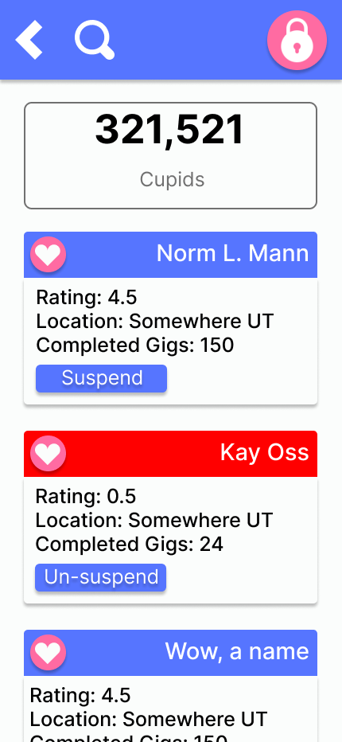
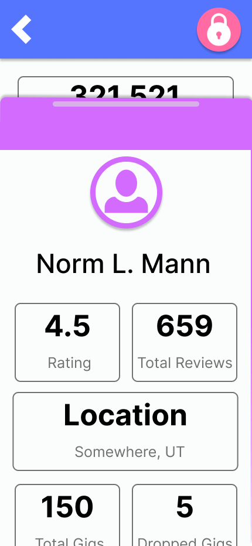
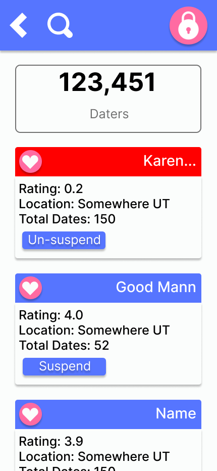
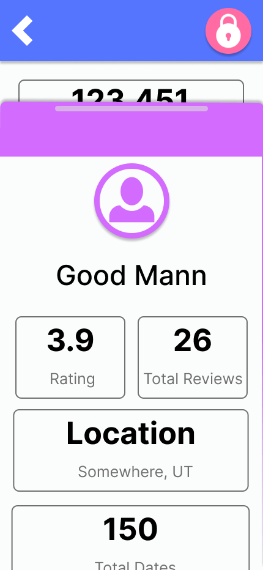

# **New Cupid Code Low Level Design**
* Team 3, *The Sinister Six*
* Sprint Leader: Tyson Buxton
* Frontend Design
    * Reece Nielson
    * Saxton Calvert
* Middleend Design
    * Tyson Buxton
* Backend Design
    * Garrett Woodhouse
    * Felix Jacob
    * Benjamin Hickenlooper

### Links
0. [Requirements](../Requirements/new-requirements-team3.md)
0. [High Level Design](../HighLevel/new-high-level-team3.md)
### Table of Contents
0. [Team Conventions](#0-team-conventions)
0. [Frontend Design](#1-frontend-design)
    - [Security](#security)
    - [Performance](#performance)
    - [UI](#ui)
      - [User flow:](#user-flow)
      - [Screen designs:](#screen-designs)                                                         
      - [Navigation Structure:](#navigation-structure)
      - [Layout guidelines:](#layout-guidelines)
      - [Color Palette:](#color-palette)
      - [Icon Use:](#icon-use)
      - [Responsive design:](#responsive-design)
      - [Making accounts and logging in](#making-accounts-and-logging-in)
      - [Dater](#dater)
      - [Cupid](#cupid)
      - [Manager](#manager)
    - [UX](#ux)
    - [Templates](#templates)
    - [Vue Router](#vue-router)
      - [How the Router works](#how-the-router-works)
    - [Testing](#testing)
0. [Middleend Design](#2-middleend-design)
0. [Backend Design](#3-backend-design)  

# 0. Team Conventions
[*Table of Contents*](#table-of-contents)

The Sinister-six will be following all of the same conventions outlined by the previous team, see [previous team's conventions](./low_level_docs.md#team-conventions-and-standards), except for the following changes outlined below.

## Branching
We will classify our branches into these four types, to keep our version control workflow consistent and coherent.
* *master*
  * Always working; whenever merges are done we do not get up/stop working until we are confident *master* is functioning with the new code that was merged in.
  * The actual application Users are using will be built/deployed with this code.
* *hotfix*
  * Branched off of *master*.
  * For fixing issues we missed when merging into *master* from *development*
* *development*
  * Branched off of *master*.
  * Get code ready to merge with *master*.
* *feature/fixes*
  * Branched off of *development*.
  * Development of features and experimentation of ideas which will merge into *development* once they are functioning.

## Coding Standards
We will follow all of the same coding standards, see [previous code standards](./low_level_docs.md#coding-standards), except for the following:
* New lines of code will be limited to 100 columns or less rather than the previous limit of 200 to increase code readability.
* Attention will be made to import only the methods, attributes, objects, etc...which we actually use from a package rather than blanket imports of entire packages. I.e. use `from _ import _, _, ...` rather than `import _`.


# 1. Frontend Design
[*Table of Contents*](#table-of-contents)
## Frontend Design

Subsections
- [Frontend Design](#frontend-design)
- [Security](#security)
- [UI](#ui)
- [UX](#ux)
- [Templates](#templates)
- [Vue Router](#vue-router)
  - [Implementation](#implementing-the-router)
- [Testing](#testing)

### Security
The previous team had done a good job in maintaining security within the app. They did not implement a strong password system, which we will implement by... 

If a user loses their account information, a form of Two-Step Authentication will be provided to allow them to reset their password and enter their account. Managers will also require Two-Step Authentication every time they log in. We will do this by...

We also intend to make calls to external APIs and thus we need to ensure that we safeguard any response that could be malicious. We will do this by...

### Performance
The frontend will verify any inputs that it can before making requests to the backend to lower the amount of requests made to the backend. For example, the frontend will check that an entered email is valid before making a request. Since the page is a single page application, we are also able to reduce the number of requests to the backend.

By reducing how many requests we make to the server, the user is able to interact with the app more without having to wait for constant responses from the server.

### UI
The application as handed to us was well designed for intuitive clicking and use for the features it had. We intend to make more features immediately accessible on the landing page and make some changes to the color scheme. There will be a dark scheme and a light theme to make it more accessible. Clear instructions will continue to be provided as needed

#### User Flow:
The user flow as handed to us in the application was well designed. There will be slight changes to the home page relative to new features pertinent to the type of user. Daters will be able to see upcoming dates and their Cupid Cash balance. They will also be able to, from the home page, access their date calendar, an AI chatbot for advice and plans, the new Plan-a-Date feature, their Cupid Cash wallet and history, all their Gig requests, their profile page, a feedback page, and the ability to allow the AI to start listening and provide live feedback. Cupids will be able to clock in and out and see how many available gigs there are, how many gigs they've completed, and how much they've earned. Cupids will have home page access to the list of nearby gigs and how many are active, their active gig(s) and status(es), their profile page, and a feedback page. A recent activity list and a weekly earnings report will also be on the page. Platform admin managers will be able to see metrics on how many total and active daters, total and active cupids, total and monthly revenue, and critical issues including those that are pending. A general platform health dashboard with key performance indicators will also be displayed with recent platform activity. Access to a report system, the feedback reviews, user management, financial reports, analytics, and cupid schedule reports will also be available with a status page. Each of these buttons are tap sensitive and dynamically redirect the specific user to the destination indicated.

#### Screen Designs:
Creating a dark theme while also maintaining the contrast present as handed to us across the application is important. Important information will be made more easily accessible with no need to scroll or swipe, the most important being locked at the top of the screen in the case of a scroll. Our main customer is a mobile user, so all screen designs will be designed as "mobile-first" architecture.

#### Navigation Structure:
The existing design for the navigation structure will be kept in place.

#### Layout Guidelines:
The existing design for the layout guidelines will be kept in place.

#### Color Palette:
This represents the primary set of colors that will be used across the application in both its light and dark themes.
- **Black**: `#0A0908`
- **Salmon Pink**: `#E5989B`
- **Old Rose**: `#B5838D`
- **Gunmetal**: `#22333B`
- **Walnut Brown**: `#5E503F`
- **White**: `#FFFFFF`

#### Icon Use:
The existing design for the use of icons will be kept in place.

#### Responsive Design:
The app's portrait orientation and general "mobile-first" design principles will be maintained as the app will primarily be used in mobile settings. Desktop functionality and scalability will be maintained.

#### Making accounts and Logging in
The existing design for making accounts and logging in will be maintained. The pages will be updated to reflect the updated visual interface. 


#### Dater
The Daters will be able to access the 8 following features from their home pages:
- Date calendar from which to schedule and manage their dates.
- AI Chat for chatting and advice.
- Plan A Date for having AI-powered date planning and itineraries.
- Cupid Cash dashboard for getting credits and viewing their history.
- Gig Request dashboard to request Cupid assistance and see the status of their requests.
- Profile to view and edit their information.
- App Feedback to submit reviews and report app issues.
- AI Listening to get real-time date support.


#### Cupid
The Cupids will be able to access the following 5 features from their home pages:
- Clock-in and Clock-out mechanism to make themselves available to receive gig notifications.
- Nearby and active Cupid gigs.
- Gigs currently active and their status.
- Profile to view gig history, manage finances, and edit information.
- App Feedback to submit reviews and report app issues.


#### Manager
The Manager users who act as administrators for the platform will be able to access the following features:
- Analytics Report System
- Inter-user Feedback
- User Management
- Financial Reports
- Cupid Schedule Reports
- System Status


NEEDS A PAGE?





### UX
The existing design for the user experience will be maintained, striving to ensure that they enjoy the app and find a helpful tool to shoulder their dating burdens.

### Templates

A Django Template is used to connect the Vue frontend to the backend. A second Django Template is used to make the sign-up/login process its own separate app to improve security. The sign-up/login process is only responsible for adding/validating users and then redirecting them to the appropriate homepage depending on what type of user they are.

Django templates take the following form:

``` html

<head>
  <style>
    /* Write inline styles here */
  </style>  
</head>
<body>
  <div>
    Welcome to Cupid Code landing page here
  </div>
  <button> Login </button>
  <button> Sign up </button>
</body>  
```

### Vue Router

The previous team used Vue Router to switch between pages in the frontend. They used hash routing to control which page the user is on which allows the frontend to switch pages without contacting the server every time. We will continue to use this routing method and take care to keep track of the state of the application to keep the frontend light and responsive.

The following is an example of how Vue Router is used in the application:
```javascript
import create web history, web hash history from 'vue-router';

import Home from './components/Home.vue';
import About from './components/Dater.vue';
import Contact from './components/Cupid.vue';

const routes = [
  { path: '/', name: 'Home', component: Home },
  { path: '/dater/:id', name: 'Dater', component: Dater },
  { path: '/cupid', name: 'Cupid', component: Cupid }
];

const router = create_web_history({
  history: web hash history,
  routes
});

export default router;
```
The ':' in "path: '/dater/:id'" symbolizes a parameter to be passed through the path. This was used to pass the user id when making calls to the backend. We are unsure as to why the previous team passed the id in way as it is possible to accomplish this using state variables. As we work on the routing, if we discover that passing the id through the state instead of the url is more efficient, then we will make the necessary changes.

#### Implementing the router

In the **main.js** file we include the router and mount it. Other pages can import the router to use programmatic routing or use the router-link tag in components:

``` javascript
import router from './router/router.js'

router.go(1) // Forward 1
router.forward() // ^
router.go(-1) // Back 1
router.back() // ^

// Route the user to this path with the given params.
router.push({name: "Path Name", params: {param: given param}})
```

```html
  <nav>
    <router-link :to="{name: 'Path name', params: {param: given param}}">
      Go here!
    </router-link>
    <router-link :to="{name: 'Path name', params: {param: given param}}">
      Or here!
    </router-link>
  </nav>
  <div>
    Other components from the page get displayed here.
  </div>  
<template>
```

### Vue URLs
The Vue app will live at URL `/app/`. The following pages will be available through the Vue Router. 

| URL                 | Notes               |
|---------------------|---------------------|
| /                   | Welcome page        |
| /login              | Login page          |
| /register           | Signup page         |
| /dater/home/:id     | dater homepage      |
| /dater/chat/:id     | dater chat page     |
| /dater/listen/:id   | dater listen page   |
| /dater/balance/:id  | dater cash page     |
| /dater/calendar/:id | dater calendar page |
| /dater/planner/:id  | dater planner page  |
| /dater/feedback/:id | dater feedback page |
| /dater/gigs/:id     | dater gigs page     |
| /dater/profile/:id  | dater profile page  |
| /cupid/home/:id     | cupid homepage      |
| /cupid/gigs/        | cupid gigs          |
| /cupid/balance/:id  | cupid balance       |
| /cupid/profile/:id  | cupid profile       |
| /cupid/feedback/:id | cupid feedback page |
| /manager/home/:id   | manager homepage    |
| /manager/cupids/    | manager reports     |
| /manager/daters/    | manager reports     |

The :id syntax is using the params syntax from the Vue Router. These are the URLs that are going to need an id of some sort. If the id is not valid for the page that is being accessed (i.e. dater user trying to access a manager page), a 404 page will be served instead.

### Testing
We intend to continue using and building upon the existing testing framework going forward in the development of the product. Testing is done in the following ways:

0. **Unit Testing**: Unit tests isolate functions and methods and verify that it outputs the way it is intended. Focus on testing edge cases and potential invalid inputs.

0. **Component Testing**: Vue Test Utils is used to test Vue components and simulate user interactions.

0. **Integration Testing**: Integration tests will verify that multiple components work together and ensure the entire application can work.

0. **Mocking**: Mocking is a technique used in testing to isolate a component that may rely on other components. By using mocking you can "mock" what a function should return and thereby control the behavior of external dependencies to focus entirely on the component under test.

The tests will be run in a CICD pipeline to ensure that changes to the app do not break working functionality. If a change to the code alters what a function inputs and outputs, the developer who made the change is in charge of fixing the corresponding test and ensuring that it works.

# 2. Middleend Design
[*Table of Contents*](#table-of-contents)
* This section for design how to connect the frontend and backend

# 3. Backend Design
[*Table of Contents*](#table-of-contents)