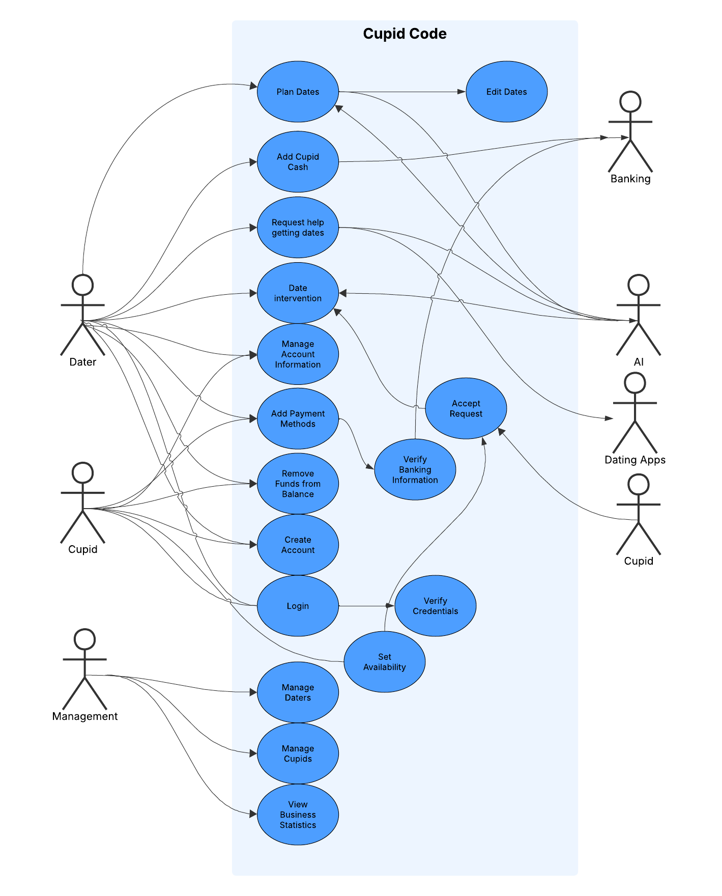

# CS3450 Fall 2025 Team 3 Requirements Document

**Team Members: Tyson Buxton, Saxton Calvert, Benjamin Hickenlooper, Felix Jacob, Reece Nielson, Garrett Woodhouse**

## Summary of Previous Teams Requirements

The previous team’s requirements document for Cupid Code details a dating assistance platform built around artificial intelligence, human “Cupid” helpers, and robust user management. The app addresses the unique social and logistical challenges faced by its user base, especially those who may find dating intimidating or unfamiliar. Core functionalities include role-based features for Daters, Cupids, and Managers, such as scheduling, budgeting, AI-driven advice (before, during, and after dates), secure payments, and structured feedback. AI integrates tightly with the experience, offering real-time tips and summoning assistance during dates if needed.

In addition to essential features like authentication, calendar management, and budget controls, the platform places a strong emphasis on user privacy, data security, and responsive support systems for all parties. The business logic prioritizes quality of service, continuous innovation, and compliance with legal requirements, with mechanisms for revenue generation through subscriptions and service fees. The requirements also distinguish between must-have baseline features and more advanced, optional enhancements, supporting phased development as resources and feedback allow. The document’s user stories and structured priorities lay a foundation for an adaptable, user-focused, and secure dating solution.

### Problem Statement

Dating poses challenges due to the high stakes of forming a romantic relationship with someone unfamiliar. There are many social pitfalls to fall into, and often, people find that there is little outside help available. This difficulty is especially pronounced for computer scientists and "nerd" types, who already have a reputation for struggling with interpersonal relationships. There is a need for a solution that addresses these common dating hurdles by providing tailored support for individuals in this demographic, enhancing their ability to form meaningful connections.

### Solution

Preparing for a date can be intimidating, and it can be tough to know what to say or how to act. Cupid Code is a revolutionary dating assistance platform that utilizes artificial intelligence to help individuals through that process. Cupid Code supplies the user with an artificial intelligence (AI) partner that the user can ask questions and get tips for the date. It can even listen in on the conversation and provide immediate assistance when it senses trouble. If a planned activity falls through, then the AI can pay for an item or service and call for a “Cupid”, a hired assistant, to deliver it right to you during the date.

### Functional Requirements

The last team specified the following categories of functional requirements:

0. User Authentication: Users verify their identity through email.
0. Roles: Users include Daters, Cupids, and Managers.
    * Daters manage their dating profile page, funds, scheduling, cupid feedback, and AI chats.
    * Cupids interact with requests, complete jobs, manage their earnings, and review feedback.
    * Managers interact with application analytics and monitor policy violations.
0. AI integration: AI listens when asked to, gives dating and conversational advice, and summons Cupids when appropriate.
0. Budget Management: Daters must be able to control spending, allowing the AI to spend only within their budget.
0. Date Scheduling: There should be a user friendly scheduling interface for daters.
0. Payment system: Daters deposit money and cupids are paid for their work.

### Non-Functional Requirements

The last team specified the following categories for non-functional requirements:

0. Security: Include necessary encryption and access restriction controls.
0. Scalability: The app is able to handle growth in its user base.
0. Availability: Target uptime of "five nines."
0. Performance: Low latency perceived by users.
0. Usability: Intuitive interface for all user roles.
0. Compatibility: Responsive across machines and platforms.
0. Compliance: Adheres to ethical codes and guidelines.
0. Documentation: Manuals tailored for each user role are accessible to the users.

### Business Requirements

The last team specified the following high level business requirements:

0. Mission: Combine AI and human support to make dating more approachable and meaningful.
0. Revenue: Monthly subscriptions for Daters and percentage fees on funds deposited by Daters.
0. User Retention: Features that build loyalty and incentivize retention.
0. Technology Infrastructure: Invest in scalability early on.
0. Quality of Service: Reviews and reputation management system for Daters and Cupids.
0. Financial Management: Careful collection, reporting, and disbursement of funds.
0. Compliance: Meet all associated legal standards.
0. Innovation: Stay on the cutting edge of the industry.
0. Brand/Marketing: Have targeted campaigns to build share of voice in the relevant domain.
0. Partnerships: Collaborate with date venues or related applications.
0. Customer Support: Fast support and conflict resolution mechanisms.
0. Social Responsibility: Contribute positively to the community.

### User Requirements

The last team specified the following high level user requirements:

0. Simple Registration & Profile Management for Daters.
0. Cupid Service: On-demand delivery.
0. AI Chat for dating advice.
0. Manager Panel: Analytics and system authority.
0. Privacy & Security
0. Feedback & Ratings for Daters and Cupids.
0. User Support
0. Preferences: Customization for users.
0. Calendar/Scheduling Interface
0. Emergency Advice: Real time tips from a live-listening AI model.
0. Push Notifications

### Requirement Priority Levels

The last team's document included specification of levels of priority for each requirement, including the following:

* Must-haves.
* Should-haves.
* Could-haves.
* Won't-haves.

These specs help to set and keep expectations transparent between the customer and the developing team. They also help to prioritize tickets when time is a factor, and we won't be able to complete all tasks.

### User Stories

The last team included a long list of user stories for each of the established user roles.

### Use Case Diagrams

Included in the documentation are use case diagrams that outline visually the relationships between the users, the system, and external systems.

### What Previous Team Did Not Complete
#### Cupid Pages
* Range in profile update has no units on it, 20 what?
* Feedback page says undefined, does not work.
* No indication that updates to profile info actually saved.
* Gigs do not show how far away they are, we already (supposedly I have not
checked) calculate that to offer it to them within the cupid's desired range,
we should display it on the card.

#### Dater Pages
* Sign Up
    * Does not work. I filled out all the fields first with stuff that did not
    make sense for the field, then stuff that should work but when I click
    create account nothing happens on the page.
    * No password requirements enforced on sign up
    (at least 12 chars, has a symbol, etc...)

#### Non-Functional Requirements
* There was no requirements for strong passwords on signup, this goes against
their requirement for strong security.
* The documentation is unclear in some ways, following what they had 
written for project setup I have been unable to get the Dater signup page to 
work.

### Conclusion to summary of previous requirements

The last teams requirements specification is thorough and a great starting point for our team. They have outlined in great detail what precisely the users and customers should and should not expect. Our team will build on top of these requirements to enhance the existing application, add features, remove bugs, and create an application that implements agentic AI to a greater degree, giving the application a degree of autonomy that it didn't have before.

## Current Project Team 3 Requirements
### User Role Definitions
0. *Dater* is defined as the regular user of our application. They are using 
the application for help to have successful dates and achieve a happy
relationship.
0. *Cupids* are workers who sign up to help out daters, not for themselves.
Similar to Uber Eats workers, but for more than just food, they fulfill jobs
created by the Dater/the Dater's AI.
0. *Business Leaders* are defined as any high level decision making
leadership at Duckiecorp and of course our esteemed customer 
Cowboy Erik Falor.

#### Daters will be able to:
* Receive notifications from the webapp for:
    * Updates or help on date plans
    * Cupid order status
    * Get an advice message from the AI listening when the date is going 
    poorly.
* Use Stripe and/or PayPal to add funds to their CupidCash balance.
* Plan out a date's activities, costs, and location in our web application 
interface with smart assistance from the AI.
* Chat with the AI for help, ideas, or practicing for an upcoming date.
* Get occasional advice from the AI when dates are becoming sparse 
based on the user's profile, preferences, and what the AI learns about the user 
over time. 
* Create a work order for a Cupid
    * Choose how much Cupid cash to dedicate to the order.
    * Fill in instructions for Cupid.
    * Set time must be completed by. 

#### Cupids will be able to:
* Accept a job from a list displayed based on their chosen filters:
    * mile radius
    * level of difficulty/estimated time to complete
* See the jobs in priority order based on when they expire. 
* Sign-up as a Cupid so their app interface is different.

#### Business Leadership will be able to:
* Access metrics boards for Daters showing the following
    * Current number registered.
    * Current number online (in an active session on the webapp)
    * Current number in an active date.
    * Locations of all Daters.
* Access metrics boards for Cupids showing the following
    * Current number registered.
    * Current number online (in an active session on the webapp)
    * Current number in an active job.
    * Number of jobs fulfilled
    * Number of jobs expired (no cupid accepted)

### Functional Requirements
#### Must-Have
##### Rebranding Requirements
- Cupid Code shall provide a dark mode theme. 
- Cupid Code shall provide a light mode theme. 

##### Push Notification Requirements
- Cupid Code shall send push notifications to Daters with reminders about planned dates. 
- Cupid Code shall send push notifications to Daters with conversation suggestions. 
- Cupid Code shall send push notifications to Daters with weather alerts. 
- Cupid Code shall send push notifications to Daters with date tips prior to a planned date. 
- Cupid Code shall send push notifications to Daters with date tips during a planned date. 
- Cupid Code shall send push notifications to Daters with date tips after a planned date. 
- Cupid Code shall send push notifications to Daters with encouragement to set up more dates. 
- Cupid Code shall send push notifications to Daters when a service is successfully ordered for a planned date. 
- Cupid Code shall send push notifications to Daters when a Cupid has arrived 
- Cupid Code shall send push notifications to Cupids with new job appearances. 
- Cupid Code shall integrate with a texting service to send messages to Daters. 
- Cupid Code shall integrate with a texting service to send messages to Cupids. 
- Cupid Code shall integrate with an email service to send messages to Daters. 
- Cupid Code shall integrate with an email service to send messages to Cupids. 
- Cupid Code shall allow a Dater to opt-in or opt-out of receiving specific types of push notifications. 
- Cupid Code shall allow a Cupid to opt-in or opt-out of receiving specific types of push notifications. 
- Cupid Code shall aggregate related notifications to avoid notification fatigue. 
- Cupid Code shall allow a Dater to set preferences for notification timing and frequency. 
- Cupid Code shall allow a Cupid to set preferences for notification timing and frequency. 
- Cupid Code shall use multiple methods of delivery for notifications supporting push, SMS, and email. 
- Cupid Code shall provide a notification center within the app for Daters to view all past notifications. 
- Cupid Code shall provide a notification center within the app for Cupids to view all past notifications. 
- Cupid Code shall prevent sending redundant notifications by deduplicating similar events. 
- Cupid Code shall integrate with the Weather Channel API to provide weather forecast data. 

##### Payment Processer APIs
- Cupid Code shall integrate with Stripe APIs to process payments. 
- Cupid Code shall integrate with PayPal APIs to process payments. 
- Cupid Code shall allow a Dater to connect a bank account to their Cupid Code CupidCash funds using Stripe APIs. 
- Cupid Code shall allow a Dater to connect a bank account to their Cupid Code CupidCash funds using PayPal APIs. 
- Cupid Code shall allow a Dater to make a request to withdraw funds from a bank account to their CupidCash funds using Stripe APIs. 
- Cupid Code shall allow a Dater to make a request to withdraw funds from a bank account to their CupidCash funds using PayPal APIs. 
- Cupid Code shall allow a Dater to make a request to deposit funds to a bank account from their CupidCash funds using Stripe APIs. 
- Cupid Code shall allow a Dater to make a request to deposit funds to a bank account from their CupidCash funds using PayPal APIs. 
- Cupid Code shall not allow a Dater to make a request to deposit funds to a bank account from their CupidCash funds if the amount exceeds their current balance of CupidCash. 
- Cupid Code shall display transaction history within the Dater's account dashboard. 
- Cupid Code shall display transaction history within the Cupid's account dashboard. 
- Cupid Code shall allow a Dater to set a default payment method for processing payments made by the Dater. 
- Cupid Code shall allow a Dater to set a default payment method for processing payments made by the AI. 
- Cupid Code shall not make use of microtransactions. 

##### Agentic AI
- Cupid Code shall allow the Dater to customize the autonomy of the AI in their preferences. 
- Cupid Code shall allow the AI to edit a date's activity. 
- Cupid Code shall allow the AI to edit a date's estimated cost. 
- Cupid Code shall allow the AI to edit a date's address. 
- Cupid Code shall allow the AI to edit a date's partner. 
- Cupid Code shall allow the AI to edit a date's start time. 
- Cupid Code shall allow the AI to edit a date's date. 
- Cupid Code shall allow the AI to edit a date's estimated end time. 
- Cupid Code shall allow the AI to delete a date. 
- Cupid Code shall allow the AI to create a date. 
- Cupid Code shall implement a jobs queue for managing third-party service requests and Cupid-specific errands. 
- Cupid Code shall allow the AI to place food orders via UberEats API. 
- Cupid Code shall allow the AI to arrange rides via Uber API. 
- Cupid Code shall allow the AI to purchase movie tickets via Megaplex API. 
- Cupid Code shall allow the AI to fetch and recall Dater-specific preferences and history from the Dater database to personalize decisions and recommendations. 
- Cupid Code shall allow the AI to cancel previously arranged food orders via UberEats API. 
- Cupid Code shall allow the AI to cancel previously arranged rides via Uber API. 
- Cupid Code shall allow the AI to cancel previously arranged movie tickets via Megaplex API. 
- Cupid Code shall allow the AI to access weather forecast data. 

##### Cloud Deployment
- Cupid Code shall be deployed using Azure 

##### Plan-A-Date Feature
- Cupid Code shall implement a Plan-A-Date service. 
- Cupid Code Plan-A-Date service shall allow the Dater to make a request to the AI to build a date based on past interests. 
- Cupid Code Plan-A-Date service date interface shall allow the Dater to edit the date's activity. 
- Cupid Code Plan-A-Date service date interface shall allow the Dater to edit the date's estimated cost. 
- Cupid Code Plan-A-Date service date interface shall allow the Dater to edit the date's address. 
- Cupid Code Plan-A-Date service date interface shall allow the Dater to edit the date's partner. 
- Cupid Code Plan-A-Date service date interface shall allow the Dater to edit the date's start time. 
- Cupid Code Plan-A-Date service date interface shall allow the Dater to edit the date's date. 
- Cupid Code Plan-A-Date service date interface shall allow the Dater to edit the date's estimated end time. 
- Cupid Code Plan-A-Date service date interface shall allow the Dater to edit the date's prior notification with the default set to thirty minutes. 
- Cupid Code Plan-A-Date service date interface shall allow the Dater to disable the date's prior notification with the default set to enabled. 
- Cupid Code Plan-A-Date service date interface shall allow the Dater to delete a date. 
- Cupid Code Plan-A-Date service date interface shall allow the Dater to create a date. 
- Cupid Code Plan-A-Date service date interface shall allow the Dater to rate previous dates. 

#### Should-Have
##### Agentic AI
- Cupid Code shall allow the AI to make weather-based suggestions for date activities. 
- Cupid Code shall allow the AI to ask the Daters about how their date went and what could be improved. 
- Cupid Code shall allow the AI to provide Daters with actionable feedback after a date. 
- Cupid Code shall allow the AI to provide Dater profile completion to fill in missing interests, hobbies, or preferences. 
- Cupid Code shall allow the AI to build a dream partner profile for a Dater. 
- Cupid Code shall allow the Daters to enable conversation listening during a planned date. 
- Cupid Code shall allow the Daters to enable integration with the device microphone. 
- Cupid Code shall allow the AI to listen during planned dates when conversation listening is enabled. 

#### Could-Have
##### Agentic AI
- Cupid Code shall allow the AI to provide an estimated time until relationship/marriage. 
- Cupid Code shall allow the AI to dream partner profile with the profiles of other Daters. 

##### Plan-A-Date Feature
- Cupid Code shall enable integration with Tinder API. 
- Cupid Code shall enable integration with Google Maps API to display real-time locations of Cupids. 
- Cupid Code shall enable integration with Google Maps API to display real-time locations of Daters. 
- Cupid Code shall allow Cupids to disable their location sharing, with the default set to enabled. 
- Cupid Code shall allow Daters to disable their location sharing, with the default set to enabled. 

### Non-Functional Requirements
#### Must-Have
##### Security
- Encrypting data at rest and in transit
- Only Daters, Cupids, and Managers with a valid login can enter the system. 
- User data will only be available to those who are authorized to view it.
    - Cupids can only see the minimum of what they need to help the User on a date, after accepting the job.
    - Managers will see general data trends but not specific User information
 - Data Integrity
    - The system must not corrupt data, even in the event of a network outage.
##### Usability
The user interfaces for Daters, Cupids, and Managers will be intuitive and user-friendly.
- Learnability: The website will be intuitive allowing even new users to navigate the website without training
- Efficiency: A task that is performed frequently should take a maximum of three clicks to complete.
##### Compatibility
- It will be fully functional on Google Chrome, Mozilla Firefox, and Safari.
- The website must work on most screen sizes and device options. 
##### Compliance
- Our website will comply with the General Data Protection Regulation (GDPR), and the California Consumer Privacy Act (CCPA). 
- The system will follow the Web Content Accessibility Guidelines (WCAG)
- ACM codes of ethics are applied to keep confidentiality of Daters and Cupids.
##### Documentation
* Comprehensive and clear documentation will be available for Daters, Cupids, and Managers via user manuals for each individual user type.

#### Should-Have
##### Security
- A Two-Factor authentication will allow Users and Cupids to recover their login information
- Managers will need to use Two-Factor Authentication to login every time. 
##### Scalability
- The system will be built upon itself so the addition of new features will not require significant changes to existing architecture. 
##### Availability
- The system will run on all browsers, with a **webpage mobile version**
- A high level of uptime is crucial, with a target of 99.9% uptime to minimize disruptions and ensure continuous availability
to users.
##### Performance:
The platform will have low latency communication between Daters, Cupids, and the AI.
- Login should take less than 3 seconds
- Once in Cupid Code, the app should run smoothly and with minimal delays
    - No response time should exceed 1 second while on the website. Ex.switching pages, buying Cupid Cash, submitting a form.
##### Maintainability
- Modularity
    - The system must be organized into separate modules by function. 
- Bug Reports
    - Bugs should be fixed within 24 hours of a bug being reported

#### Could-Have
##### Scalability
- The system will be scalable to accommodate a growing user base.

### Non-Functional Requirements for the Server
#### Must-Have
##### Performance
- The server should be able to handle at least 1,000 concurrent orders per second during peak times to meet high demand.
##### Availability 
- The server should have an uptime of 99.99%, with robust failover systems in place to handle any unexpected outages. 
##### Security 
- Passwords must be encrypted both in transit and in the database to protect sensitive information. 
- The server must comply with industry standards when handling payment data. 
- Regular security patches and continuous monitoring should be implemented to detect and mitigate potential threats.
##### Compliance
- The server must comply with data protection regulations, such as GDPR, if the business serves customers in regions with strict data privacy laws.
- Proper management of user consent should be implemented for data collection and usage, ensuring compliance with legal requirements.

#### Should-Have
##### Scalability
- The server’s architecture should support horizontal scaling, meaning it can handle an increasing number of users by adding more resources, such as load balancers.
- It should be able to dynamically scale up or down based on traffic surges, especially during special events or promotions.
##### Availability 
- Regular backups and disaster recovery measures should be implemented to prevent data loss in case of a server failure.
##### Monitoring and Logging
- Comprehensive logging must be implemented to track user activities, server performance, and order transactions for future analysis and troubleshooting.
##### Latency 
- The system should be designed to ensure low latency for real-time order updates and status tracking, providing users with a seamless experience.

#### Could-Have
##### Performance
- API response times should be below 300 milliseconds for standard requests to ensure a fast and responsive system.
##### Maintainability
- The server architecture should be modular, allowing for easier updates and modifications without disrupting service.

#### Wont-Have
##### Monitoring and Logging
- Real-time monitoring tools should be in place to detect issues with server load, latency, or failures, allowing for prompt response to any problems.

### Business Requirements
#### Must-have
- The application must accommodate three types of users: Daters, Cupids, and admin managers.
- Daters and Cupids must be able to create an account which they can log back into.
- Admins must be able to access user information of daters and cupids.
- Payments must be properly processed from the correct source to the correct destination, whether that be the cupid, the third party business, or to the company.
- The application must be able to connect to a payment-processing API such as Stripe or Paypal in order to process all payments.
- The application must comply with data privacy laws.
- The application must comply with state-specific recording laws.
- The application must align with the company's design requirements, such as colors, fonts, and logo.
- The application must be completed by December 7th, 2025.

#### Should-have
- The application should be able to process payment from daters.
- The application should be able to provide payment to cupids for their services.
- The application should be able to process payments to third party business in order to purchase food, tickets, or any other items needed for dates.
- The application should be profitable.
- The daters' accounts should store information about them and their dating history.
- The cupids' accounts should store information about previous cupid jobs they've done in the app.
- Admins should be able to track statistics, such as 
  - number of registered users, broken down into daters and cupids
  - number of current users (both daters and cupids) at any given time
  - number of dates within a certain time frame
- Updates should be to be easily implemented so that users don't need to reinstall the application.
- The user interface for daters and cupids should be simple and intuitive, such that users can navigate the app quickly and with no confusions.
- The application should have response times of less than three seconds.

#### Could-have
- The daters' locations could be tracked by the app in order to connect them with local opportunities for date activities and nearby cupids.
- The cupids' locations could be tracked by the app in order to connect them with local daters and give estimates as to their arrival times to dates.
- The cupid's accounts could store their financial information, such as how much money they've earned from each job, total income, and income that has not been transferred to an external money app.
- Daters and Cupids could be able to provide feedback to the developers to improve user experience.
- Admins could have access to ratings and feedback given by users through the application.
- The application could connect to other dating app APIs in order to assist daters in finding dates.
- The application could be able to allow up to a billion users in the database.
- The application could be able to allow potentially thousands of people to use the application concurrently.

#### Won't-have
- The application won't have any microtransactions.
- The application and server won't crash.

### User Requirements
####  Must-have
- Cupid Code shall send push notifications to Daters with reminders about planned dates.
- All users can create an account on the Cupid Code app.
- All Daters and Cupids can create an account on the Cupid Code app.
- The registration process will be user-friendly and require basic information (email, password, full name, etc.).
- Daters will be able to create a detailed profile with information about their interests, preferences, and past dating experiences.
- The dater will be able to hire a "Cupid" to purchase and deliver items during a date.
- Cupids can be available on-demand, and Daters can specify the items they need.
- The app will feature an AI-powered chat where Daters can seek dating advice.
- The AI chat can provide relevant and helpful advice based on Dater queries.
- Managers will have the ability to see a cupid's stats.
- Managers will have the ability to take appropriate actions based on cupid stats.
- Daters will be able to provide feedback and ratings Cupids' services.
- Cupids will be able to provide feedback and ratings Daters' services.
- Cupids and Daters will be able to see feedback written about them.
- The app will have a user support system that includes chat, email, or an online help center to assist users with any issues they encounter.
- Daters will be able to customize their preferences for AI advice and Cupid services.
- Daters can set up when dates are, using an in-app calendar.
- The app will have a feature to enable the AI to listen in on dates when activated by the Dater.
- Emergency advice will be provided in real-time during dates to assist Daters in navigating challenging situations.
- Daters will have the option to receive notifications before, during, and after scheduled dates.
- Notifications may include reminders, suggestions, and post-date feedback.
- Cupid Code shall display transaction history within the Dater's account dashboard.

#### Should-have
- A panel for managers to access and review complaints and feedback related to Cupids.

### User stories
#### Daters
##### As a dater I want to
0.  have the AI to coach me before and during dates, with adaptive advice and respectful notifications, so I get support without distraction.
0.  see my Cupid Cash balance easily so I do not end up running out at a bad time.
0.  get location specific help with planning a date so I can have an easier experience planning out a good date.
0.  schedule payments into my Cupid Cash account so I never run out of funds to plan good dates.
0.  to have the AI to recognize when the date is going well and not be messaging me so I am not distracted.
0.  see when a Cupid has picked up my work request so I can relax knowing it is getting done.
0.  be able to get funds out of my Cupid Cash balance, so I do not end up in financial trouble if I accidentally send too much money to my Cupid Code account.
0.  have an interactive UI, so I know that actions I perform were successful and I do not worry that my work did not save.
0.  be able to input data about my potential date so my AI will help me remember important details that I tend to forget.
0.  be able to create profiles for different potential dates so that I can tailor the date ideas to a particular person and have a more successful date.
0.  be able to record how dates with particular people went so that I can have a better idea of how things are going with the people I am going on dates with.
0.  be able to update the potential date profiles that I have created so that the AI has access to any information about the potential date that may have come about during any non-date activities in order to get better advice from the AI
0.  be able to tell the AI companion when a particular date is important so that the AI helps me prepare a better date than normal.
0.  be able to specify how I receive different types of push notifications so that I can be present on my date and not have to constantly check my phone to see if the AI companion thinks that I am doing a good job.
0.  be able to have easily navigable pages so that I access the tools that I need efficiently.
0.  be able to connect my Cupid Code profile to other dating apps so that I can have the AI companion's help on securing dates in the first place.
0.  be able to specify the types of food that the AI agent is allowed to order so that the AI companion does not order something from a Cupid that my date or I are allergic to.
0.  be able to approve or deny the AI agent's requests to use Cupid Cash to purchase something so that I do not feel like the AI agent is wasting money on things that I do not want it to.
0.  be able to specify the types of events that the AI agent can purchase tickets to so that I do not have to go to an event that my date or I do not want to go to.
0.  be able to see an estimated time of when a Cupid will arrive with my request so that I will not be surprised when they arrive and can prepare accordingly.
0.  be able to specify a pickup location for a request so that if I am currently going somewhere with my date, then I will not have to stop and wait for a Cupid to arrive, but can instead meet them at the place we are going.
0.  be able to cancel Cupid requests before the Cupid purchases anything so that I do not waste any money if my date "starts feeling sick" partway through the date and has to go home unexpectedly.
0.  be able to receive advice on what to wear on my date so that I can look fashionable on my date and wear something appropriate for the venue that we are going to.
0.  be able to view the transaction history of things that the AI agent has purchased so that I can see how much I am spending on dates and budget for future dates.
0.  be able to set up multi factor authentication so that my banking information is more secure.
0.  be able to add multiple payment options so that when I add more Cupid Cash to my account, I don't need to re-enter my payment information every time and I can select from an account with money.
0.  be able to receive reminders from the AI agent for when I should contact my date so that I can keep in contact with my potential partner without being overbearing.
0.  be able to have the AI agent plan dates that have branching possibilities so that depending on how my date reacts to a particular thing, then I will be ready to pivot to a backup plan.
0.  be able to get advice from the AI agent on ways to meet new people so that I can go to places where I am more likely to meet someone that I would like to date.
0.  be able to enter information about myself and my interests so that the AI agent can provide input on what types of people I am likely to be compatible with.
0.  be able to get tips from the AI agent for my steady relationship so that I can keep things going well in my relationship and go on meaningful dates for important anniversaries.
0.  be able to control what information Cupid Code gathers about me and can sell to third party sources so that Cupid Code can only use the information that I want them to be able to use.

#### Cupid Stories
##### As a Cupid, I want to...
0.  filter job listings by distance, difficulty, or time required so that I can accept jobs that match my preferences and availability.
0.  see jobs prioritized by their expiration time so that I fulfill the most urgent requests first.
0.  accept or decline available jobs directly through my app interface so that I can efficiently manage my workload.
0.  track my active, pending, and completed jobs in an organized dashboard so that I remain on top of my assignments.
0.  get notified when a Dater cancels a request before I make a purchase or start the job so that I do not waste time or resources.
0.  have access to my earnings and be able to transfer them to my bank account seamlessly so that I am paid promptly for my work.
0.  have my personal location only be shared when necessary for active jobs so that my privacy is protected.
0.  have clear confirmation when my job actions (accept, complete, transfer earnings) have been processed successfully so that I trust the platform's reliability.
0.  get notifications for changes to active jobs, such as updated instructions or deadlines, so I can adjust quickly if plans change.
0.  receive reminders about upcoming jobs I’ve accepted so I never miss a pickup or delivery.
0.  decline jobs I’m unable to complete without penalty, so I can maintain a positive gig history while managing my workload.
0.  have the ability to report abusive or inappropriate behavior by Daters so that I feel safe while working.
0.  have the ability to report abusive or inappropriate behavior between Daters so that I can alert local authorities before problems arise.
0.  have app notifications to arrive in real time and be reliably delivered so I never miss an urgent update or Dater message.
0.  see which jobs offer higher payouts based on urgency or complexity so I can prioritize high-value work.
0.  add and verify multiple bank accounts so I can transfer earnings flexibly and securely.
0.  be able to make an account which I can log back into so that I can have my user data saved within the app each time for future use.
0.  be able to see active jobs near me while in the app, so that I can find jobs easily and when I need them.
0.  be notified when new potential jobs are available, so that I have more opportunities to work.
0.  be able to view information about each job, such as distance, difficulty, payout, and estimated time for completion so that I can have enough information to decide whether to accept the job.
0.  be able to set my preferences for available times and the maximum distance I am willing to travel to complete a job, so that I can save time in filtering jobs myself.
0.  be able to get feedback or a rating from daters so that I can improve and be able to show other daters that I have a history of reliability.
0.  be able to give feedback or a rating to daters so that they can improve and that other cupids can know what to expect, good or bad, before accepting a job.
0.  be able to see information and ratings of dater that each job is assigned to so that I can decide whether to take the job and be able to provide better and more personalized assistance to them.
0.  get paid for my services from a steady rate as well as tips, so that I am incentivize to keep working and do a good job.
0.  track my earnings in the app and be able to transfer the money out of the app so that I can use the money that I earn outside of the app.
0.  view my job history and any information connected to those jobs, such as earnings and ratings or feedback from the respective dater for that job so that I can use that information to improve and help choose jobs in the future.
0.  be able to provide feedback and suggestions to the app developers, so that my user experience can continue to improve.
0.  have a user-friendly experience with an app which is intuitive and easy to use, so that I can use the app without frustration and want to continue to use it.
0.  ensure my data and financial information is kept secure, so that I am not a victim of identity fraud.
0.  be able to communicate with the dater in real time, either through the app or otherwise, so that I can know about any changes or to be able to inform the dater about any problems that arise.
0.  have accurate and up-to-date information on the current location of the user so that I can know the estimated time it will take to complete the job and be able to complete it as quickly and efficiently as possible.

#### As a Business Leader, I want to 
0.  view the number of registered Daters so that I can assess the growth of the platform.  
0.  see the number of Daters currently online so that I can monitor platform activity in real-time.  
0.  track the number of Daters in active dates so that I can evaluate engagement levels.  
0.  view the locations of all Daters so that I can analyze geographic trends.  
0.  access the number of registered Cupids so that I can measure the growth of the workforce.  
0.  see the number of Cupids currently online so that I can ensure adequate workforce availability.  
0.  monitor the number of Cupids in active jobs so that I can evaluate workforce engagement.  
0.  track the number of jobs fulfilled by Cupids so that I can measure service success rates.  
0.  see the number of jobs expired without Cupid acceptance so that I can identify potential service gaps.  
0.  analyze trends in Dater activity over time so that I can make informed business decisions.  
0.  analyze trends in Cupid activity over time so that I can optimize workforce management.  
0.  compare Dater and Cupid activity metrics so that I can ensure platform balance.  
0.  view historical data on fulfilled jobs so that I can identify patterns in service demand.  
0.  view historical data on expired jobs so that I can address recurring issues.  
0.  access demographic data of Daters so that I can tailor marketing strategies.  
0.  access demographic data of Cupids so that I can improve recruitment efforts.  
0.  receive alerts for significant changes in platform metrics so that I can respond proactively.  
0.  generate reports on platform performance so that I can share insights with stakeholders.  
0.  identify peak activity times for Daters and Cupids so that I can optimize platform operations.  
0.  monitor the overall health of the platform so that I can ensure long-term success.  
0.  have a survey feature so I can know how the users and Cupids enjoy the software.
0.  have a monthly subscription so I can have a consistent way to make money.

### Use Case UML Diagram
