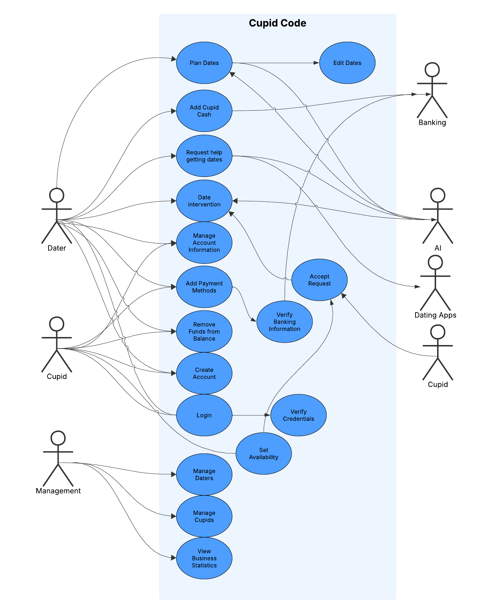

## User Stories
### Daters
1. As a Dater, I want to be able to create profiles for different potential dates so that I can tailor the date ideas to a particular person and have a more successful date.
1. As a Dater, I want to be able to record how dates with particular people went so that I can have a better idea of how things are going with the people I am going on dates with.
1. As a Dater, I want to be able to update the potential date profiles that I have created so that the AI has access to any information about the potential date that may have come about during any non-date activities in order to get better advice from the AI
1. As a Dater, I want to be able to tell the AI companion when a particular date is important so that the AI knows to lock in and help me prepare a better date than normal.
1. As a Dater, I want to be able to receive coaching from the AI companion before the date so that I can be prepared for general situations that I may not know how to handle.
1. As a Dater, I want to be able to specify how I receive different types of push notifications so that I can be present on my date and not have to constantly check my phone to see if the AI companion thinks that I am doing a good job.
1. As a Dater, I want to be able to have easily navigable pages so that I access the tools that I need efficiently.
1. As a Dater, I want to be able to connect my Cupid Code profile to other dating apps so that I can have the AI companion's help on securing dates in the first place.
1. As a Dater, I want to be able to receive advice on what to say when I need to check my phone to communicate with the AI agent so that my date is not bothered by the fact that I am checking my phone and so that they do not think that I am weird.
1. As a Dater, I want to be able to specify the types of food that the AI agent is allowed to order so that the AI companion does not order something from a Cupid that my date or I are allergic to.
1. As a Dater, I want to be able to approve or deny the AI agent's requests to use Cupid Cash to purchase something so that I do not feel like the AI agent is wasting money on things that I do not want it to.
1. As a Dater, I want to be able to specify the types of events that the AI agent can purchase tickets to so that I do not have to go to an event that my date or I do not want to go to.
1. As a Dater, I want to be able to see an estimated time of when a Cupid will arrive with my request so that I will not be surprised when they arrive and can prepare accordingly.
1. As a Dater, I want to be able to specify a pickup location for a request so that if I am currently going somewhere with my date, then I will not have to stop and wait for a Cupid to arrive, but can instead meet them at the place we are going.
1. As a Dater, I want to be able to cancel Cupid requests before the Cupid purchases anything so that I do not waste any money if my date "starts feeling sick" partway through the date and has to go home unexpectedly.
1. As a Dater, I want to be able to receive advice on what to wear on my date so that I can look fashionable on my date and wear something appropriate for the venue that we are going to.
1. As a Dater, I want to be able to view the transaction history of things that the AI agent has purchased so that I can see how much I am spending on dates and budget for future dates.
1. As a Dater, I want to be able to set up multi factor authentication so that my banking information is more secure.
1. As a Dater, I want to be able to add multiple payment options so that when I add more Cupid Cash to my account, I don't need to re-enter my payment information every time and I can select from an account with money.
1. As a Dater, I want to be able to receive reminders from the AI agent for when I should contact my date so that I can keep in contact with my potential partner without being overbearing.
1. As a Dater, I want to be able to have the AI agent plan dates that have branching possibilities so that depending on how my date reacts to a particular thing, then I will be ready to pivot to a backup plan.
1. As a Dater, I want to be able to get advice from the AI agent on ways to meet new people so that I can go to places where I am more likely to meet someone that I would like to date.
1. As a Dater, I want to be able to enter information about myself and my interests so that the AI agent can provide input on what types of people I am likely to be compatible with.
1. As a Dater, I want to be able to get tips from the AI agent for my steady relationship so that I can keep things going well in my relationship and go on meaningful dates for important anniversaries.
1. As a Dater, I want to be able to control what information Cupid Code gathers about me and can sell to third party sources so that Cupid Code can only use the information that I want them to be able to use.

## Use Case UML Diagram
