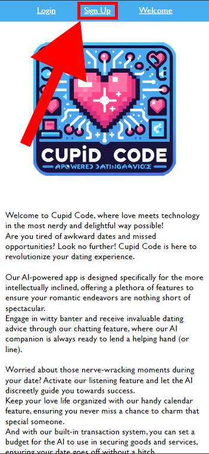
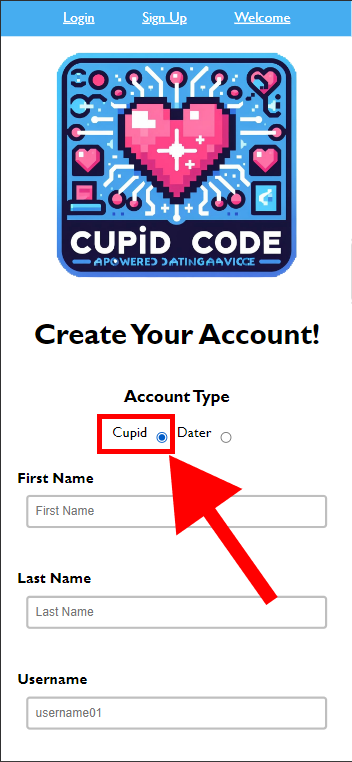
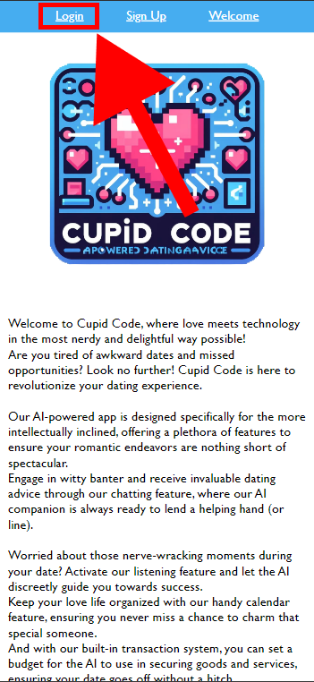
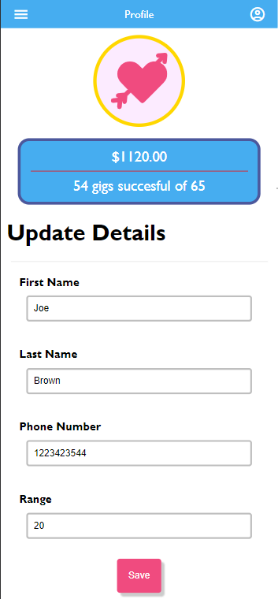
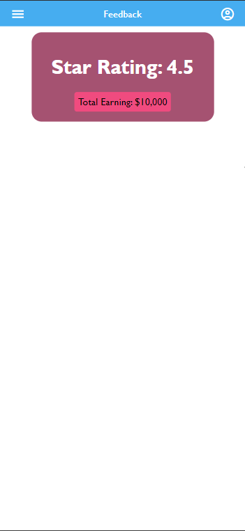
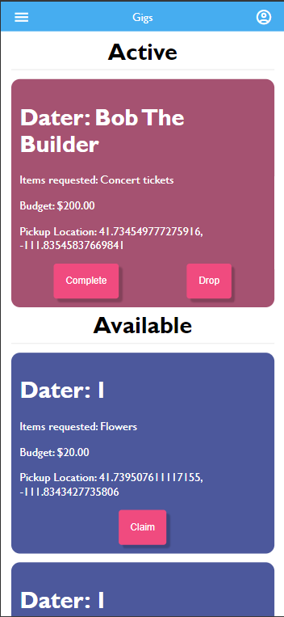
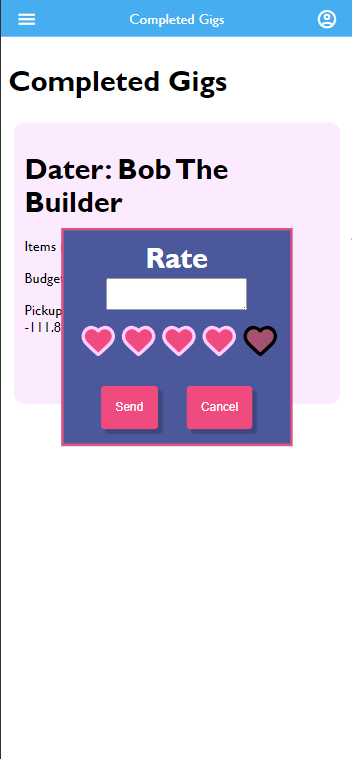

# Cupid Code Cupid Manual

## Table of Contents
1. [Introduction](#introduction)
2. [Usage](#usage)
3. [Signing Up](#signing-up)
4. [Logging In](#logging-in)
5. [Navigating the Site](#navigating-the-site)
    - [Profile Page](#profile-page)
    - [Feedback Page](#feedback-page)
    - [Gigs Page](#gigs-page)
    - [Past Gigs Page](#past-gigs-page)
6. [Common Issues](#common-issues)
7. [FAQ](#faq)

## Introduction

Welcome to Cupid Code! 
This manual is your guide to joining Cupid Code as a new Cupid. 
Here, you'll learn about your role, how to create and log into your account, and how to use the Cupid Code app to earn money by saving awkward daters.

So, what is a Cupid? Just like the name implies, Cupids for Cupid Code are like little gods of love sent to help daters using our platform have successful dates. 
If a date is going south, a Gig is created for Cupids in the area. These Gigs are simple item pickup requests to help the date go more smoothly. You might be asked to pick up anything from flowers to movie tickets. 
Your job is to accept these Gigs, pick up the requested item, and deliver it to the date. 
Then, you can rate the dater you serviced and, most importantly, get paid for your efforts.

## Usage

To get started, sign up or log in to your account. Once logged in, you'll have access to the features detailed below.

- Toggle your availability 
- View available Gigs
- View new, current, and past Gigs
- Accept New Gigs
- Drop Current Gigs
- Complete Gigs 
- Rate Daters after a Gig is completed
- View your reviews from daters
- View income statistics and history

## Signing Up

To sign up, go to the sign-up page by clicking "Sign up" at the top of the welcome page, as shown in the image below.

On the sign-up page, select "Cupid" as the account type and fill out the form. Once you click "Create Account," your account will be created, and you can log in.

## Logging In

You can access the login screen from the welcome page by clicking "Login" at the top of the page as shown below. To log in, simply enter your email and password, then click "Login In". 

## Navigating the Site
Once logged in, you can access four different pages: Profile, Feedback, Gigs, and Past Gigs.

### Profile Page 

Here, you can edit your profile and set your availability. The example below shows what this page looks like.

#### Editing your Profile
To edit your profile, simply edit the text fields and click "Save."

#### Going Online

Click the heart and arrow coin at the top of the page to go online. A white coin indicates you're online, while a dark blue one means you're offline. The example page above demonstrates an online profile. 

### Feedback Page

This page displays feedback users have given about the services you've provided, showing your average rating out of five.

### Gigs Page

This page is where most of your work will be done. It displays your active Gigs and potential Gigs you can claim.

#### Claiming a Gig

Under the "Available" section, various Gigs in your area will be listed. To claim a Gig, click the pink "Claim" button in the blue box containing the Gig information. This will transfer the Gig to the "Active" section of this page. 

#### Dropping a Gig

If you've claimed a Gig but can't complete it, click the "Drop" button on the active Gig to unassign it from yourself.

#### Completing a Gig

After picking up the requested items and delivering them, click the "Complete" button on the active Gig.

### Past Gigs Page

Once you've completed a Gig, it will be moved here. This page records your past work and allows you to rate the daters you serviced.

#### Rating a Dater

To rate a dater, find the Gig associated with them and click the "Rate Dater" button. You can give them a score out of five and leave any comments needed to explain the rating. 

Keep in mind that while ratings are anonymous, daters you rate can see the rating they've received. As such, we ask that you be mindful of the dater you are rating and provide feedback in a constructive and respectful manner. 

## Common Issues

- When rating a dater, the hearts are not contained in the rating box. 
    - This is a known bug that does not affect your ability to rate a date. A fix will be released soon. 

## FAQ

- How are gigs created? 
    - Gigs are created by either the app's AI or by daters needing help on their date. 
- I don't know how to use coordinates. How do I find where I need to deliver the item? 
    - Currently, non-coordinate locations are not supported. We recommend using navigation systems like gps-coordinates.net for deliveries.
- You don't require banking information when signing up to be a Cupid. How am I supposed to get paid? 
    - We are working on adding this feature soon! 

