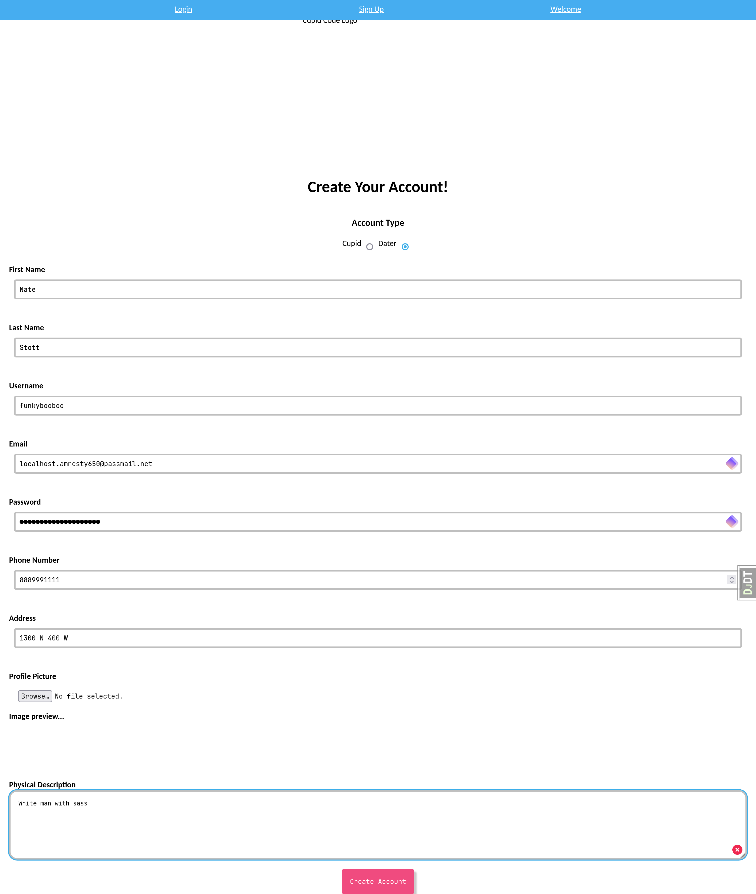
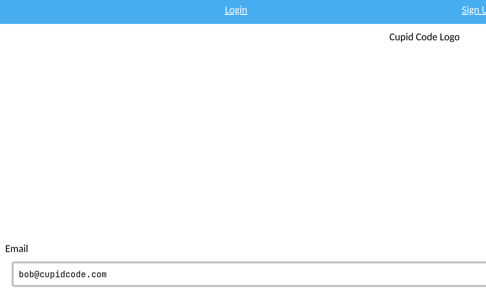
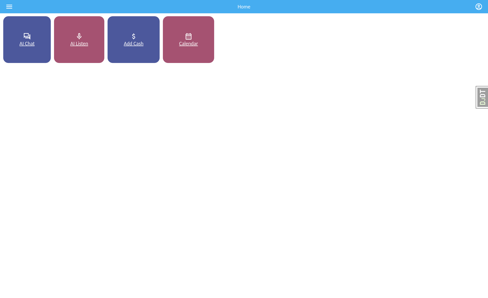
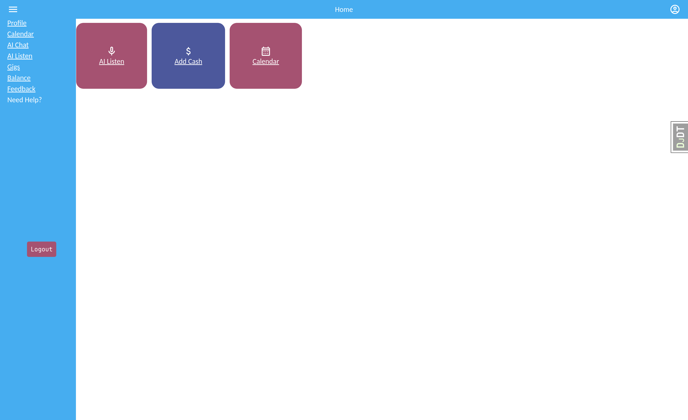
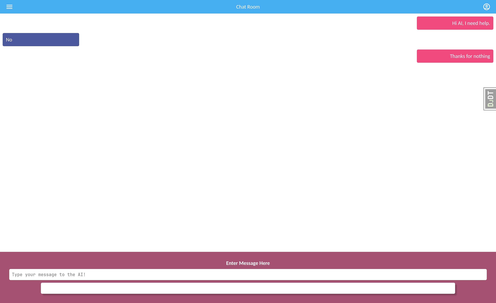
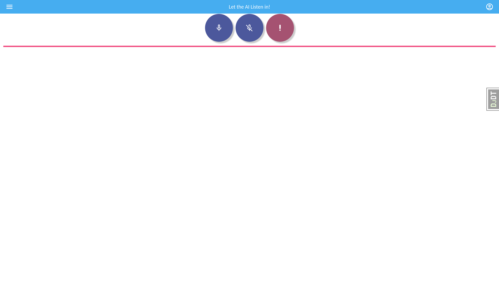
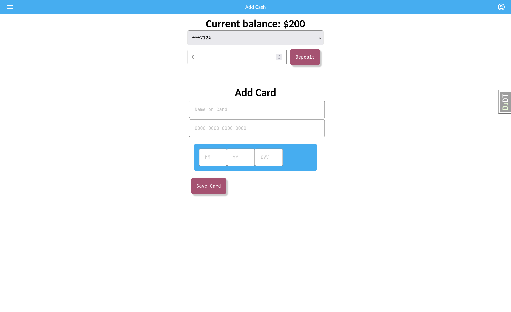
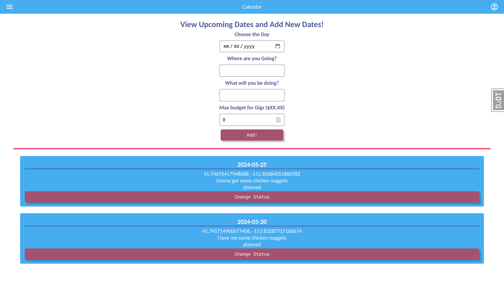

# Cupid Code Dater Manual

## Table of Contents
1. [Introduction](#introduction)
2. [Usage](#usage)
3. [Signing Up](#signing-up)
4. [Logging In](#logging-in)
5. [Navigating the Site](#navigating-the-site)
6. [Common Issues](#common-issues)
7. [FAQ](#faq)

## Introduction

The Cupid Code Dater Manual is a guide for Daters who are using the Cupid Code system. This manual will provide information on how to sign up, log in, and navigate the site as a Dater.

## Usage

So what can you do as a Dater of Cupid Code? Well you can find love with the help of AI and Cupids!

As a Dater you will have access to the following features:
- View Date Calendar
- View Date History
- Plan Dates
- Chat with AI for Date Ideas, Advice, and Feedback
- View Reviews
- View expenses and history
- Rate Cupids
- Turn on/off AI listening mode. While on, AI will listen to your conversations and provide assistance as needed in the form of creating gigs for cupids.

## Signing Up

## Logging In

## Navigating the Site

### Home Page

Here you can see the main features of the site. You can Chat with AI, go into AI listening mode, view your Cupid Cash balance as well as add more funds, and view your Date Calendar.

You have a side menu that will allow you to navigate to the different pages of the site. You will always have access to this menu no matter what page you are on!

Here is that menu:

You can use the menu or the buttons on the home page to navigate to the different pages of the site. Whatever is easier for you!

Use the logout button to log out of your account. We don't want anyone else using your account!

### AI Chat Page

This is the chat page where you can chat with the AI. You can ask for date ideas, advice, and feedback. You can also ask for help with creating gigs for Cupids. 

The AI and Cupids are here to help you find love so don't be afraid to ask for help! 

### AI Listening Page

This is the AI listening page. Here you can turn on and off the AI listening mode. When the AI is listening, it will listen to your conversations and call for help from Cupids when needed. That way you can focus on your date and let the AI and Cupids handle the rest!

### Cupid Cash Page

This is the Cupid Cash page. Here you can view your Cupid Cash balance and add more funds if needed. If you run out of Cupid Cash, you won't be able to create gigs for Cupids so make sure you have enough!

### Date Calendar Page

This is the Date Calendar page. Here you can view your Date Calendar and see all the dates you have planned. You can also view the details of each date and see the status of the date.

## Common Issues
- Chatbot not working
  - If the chatbot is not working, give it a moment to load. If it still does not work, try refreshing the page.
- Unable to view Date Calendar
  - If you are unable to view the Date Calendar, make sure you are logged in and have created a profile.
- Unable to view Date History
  - If you are unable to view the Date History, make sure you are logged in and have created a profile.

## FAQ
- Q: How do I get a Date?
  - A: You are on your own when it comes to finding dates. Cupid Code is here to help you with the rest of the process.
- Q: How do I get a Cupid?
  - A: Cupids will be assigned to you based on your needs and the gigs they have accepted.
- Q: How do I know if a Cupid is good?
  - A: You can view the reviews of Cupids to see how they have performed in the past.
