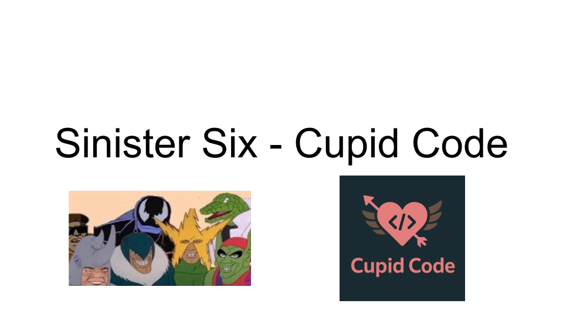
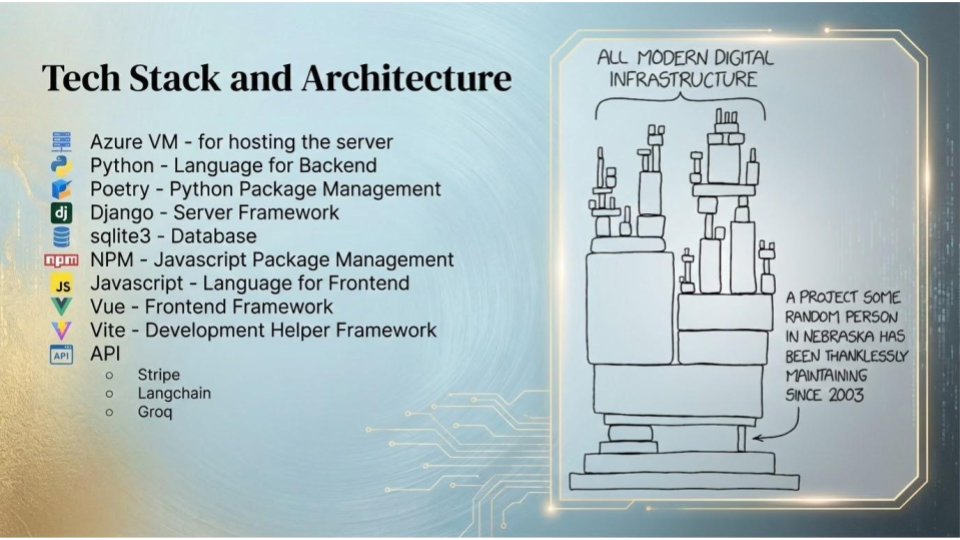
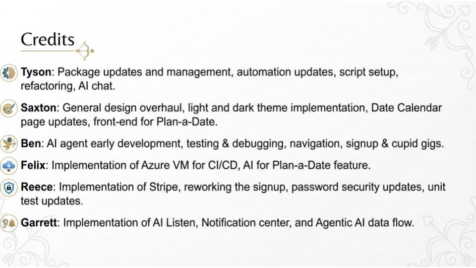
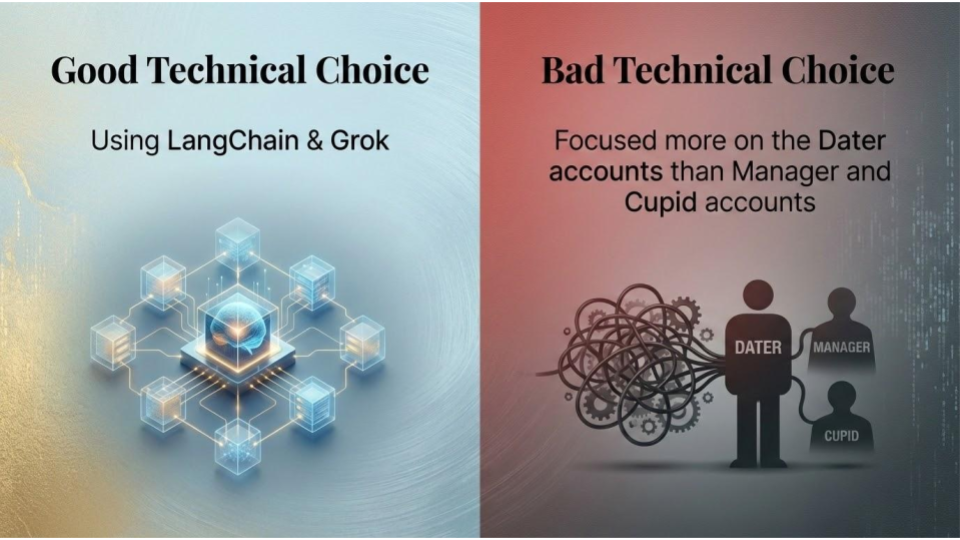
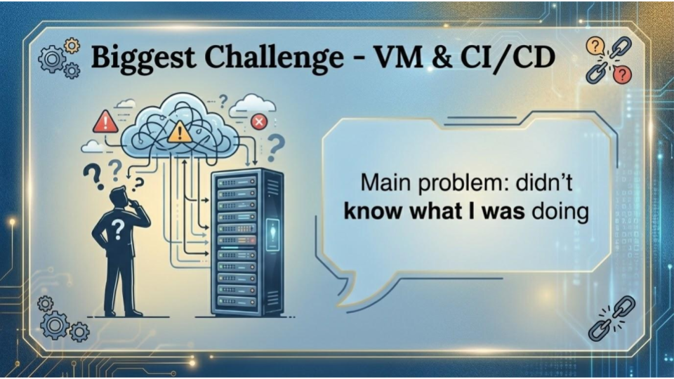

# Cupid Code Final Report

## Table of Contents

- [Introduction](#introduction)
- [Team Members](#team-members)
- [Project Description](#project-overview)
- [Project Management](#project-management)
- [Sprint Summaries](#sprint-summaries)
  - [Sprint 0](#sprint-0-garrett-woodhouse)
  - [Sprint 1](#sprint-1-tyson-buxton)
  - [Sprint 2](#sprint-2-felix-jacob)
  - [Sprint 3](#sprint-3-reece-nielson)
  - [Sprint 4](#sprint-4-ben-hickenlooper)
  - [Sprint 5](#sprint-5-saxton-calvert)
  - [Sprint 6](#sprint-6-saxton-calvert)
- [Document Final Drafts](#document-final-drafts)
- [Presentation Slides](#presentation-slides)

## Introduction

This is the final report for the Cupid Code project. 
This document will provide an overview of the project, the team members, the project overview, the project management, the sprints that were completed, the final drafts of our documents, and the final presentation slides.

## Team Members

- Tyson Buxton
- Saxton Calvert
- Ben Hickenlooper
- Felix Jacob
- Reece Nielson
- Garrett Woodhouse

## Project Overview

The Dev Team had a fantastic time working on this project, culminating in the creation of a fully functional dating app. This app allows users to create profiles, plan dates, and engage in conversations with an AI. To achieve this, the team utilized Vue for the front-end, Django for the back-end, and SQLlite for the database. The team successfully implemented all planned features, including user authentication, profile creation, and chat functionality. Furthermore, they ensured a seamless experience across devices by implementing a responsive design that works well on both desktop and mobile platforms. Overall, the team is immensely proud of their work and is eager to introduce the app to the world.

## Project Management

The project was managed using an Agile methodology with the team adopting the Scrum framework organizing their work into sprints. Regular meetings were held to review project progress, plan sprint activities, and evaluate work in progress. GitHub was utilized to track project progress, assign tasks to team members, and serve as our version control system. Additionally, Discord was used as a communication platform, enabling collaboration, file sharing, information exchange among team members, and developing a friendly team environment.

## Sprint Summaries

### Sprint 0: Garrett Woodhouse

In this sprint, we completed the Requirements Document fully, and got a deeper understanding of the codebase and documentation of the previous project. 

#### Who accepted each task? Which tasks were completed?
For this topic, everyone to whom I assigned tasks readily accepted them. All tasks were eventually completed but everyone. The task was to write the Req Doc.

#### Rejected tasks or incomplete tasks
No rejected tasks

#### Summary of the past two weeks
I think that overall, we did pretty good at working as a team on what the task was. Our understanding of the task was a limiting factor.

#### Tasks assigned to team members and hours spent
#### Tyson Buxton
##### Tasks Completed 
- Wrote up Dater user stories.
- Wrote up the defined User Roles.
- Wrote up some things the old team did not get to from their requirements.
- Did some work to try to make the Discord more effective/efficient. (making the different channels).
- Reece and Tyson reformatted the requirements document to bring it all into a consistent format.
##### Hours Spent
- 6 Hours on the requirements write up
- 2 Hours on the reformatting
- 1 Hour on setting up Discord

#### Benjamin Hickenlooper
##### Tasks Completed 
- Set up the development repository and kanban board
- Wrote the summary of previous requirements from the previous developments team
##### Hours Spent
- 2 hours setting up development and task management environments
- 3 hours writing requirements

#### Reece Nielson
##### Tasks Completed 
- Case UML diagram
- User stories for the daters
- Research code base and vue
##### Hours Spent
- 3.5 hours on the UML and User stories
- 1.5 hours on researching Vue and the codebase

#### Saxton Calvert
##### Tasks Completed 
- Review the codebase and documentation
- Wrote the preliminary draft for our requirements document
- Wrote functionality requirements
- Some Cupid user stories
- Deleting duplicate user stories
##### Hours Spent
- 6.5 hours total

#### Felix Jacob
##### Tasks Completed 
- Learned how to run the program
- Researched Vue
- Wrote the business requirements and Cupid User stories
##### Hours Spent
- 1 hour on running the program + Vue
- 5-6 hours on business requirements

#### Garrett Woodhouse
##### Tasks Completed 
- Took charge of assigning tasks to each member of the team and doing follow up
- Researched into vue
- Spent some time with Tyson + Ben to learn how to use GitHub
- Wrote the non-functional requirements
- Wrote the User requirements
- Compiled the Requirements Document at halfway, and also at the end of the sprint.
##### Hours Spent
- 2 hours learning git and Vue
- 3 hours on Non-functional requirements and User requirements
- 3 hours managing, assigning tasks, working to solve PRs
- 2 hours on Monday to make sure this document, and the Requirements Document were ready to submit.

### Sprint 1: Tyson Buxton

### Sprint 2: Felix Jacob

### Sprint 3: Reece Nielson

### Sprint 4: Ben Hickenlooper

### Sprint 5: Saxton Calvert

### Sprint 6: Saxton Calvert

## Document Final Drafts

The following links will take you to the final drafts of each of our team's documents.

- [Requirements Doc](Design/Requirements/new-requirements-team3.md)
- [High-level Design Doc](Design/HighLevel/new-high-level-team3.md)
- [Low-level Design Doc](Design/LowLevel/new-low-level-team3.md)
- [Test Design Report](Design/Testing/new_test_design.md)
- [User Manual](Manual/README.md)

## Presentation Slides

